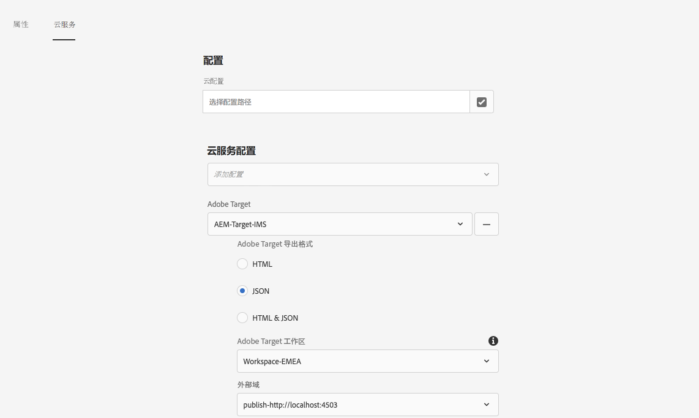
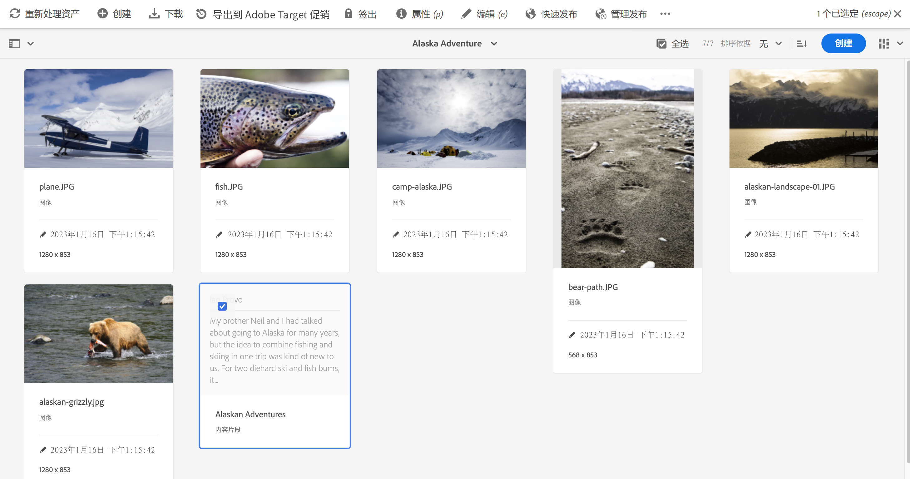
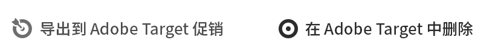

# 将内容片段导出到Adobe Target {#exporting-content-fragments-to-adobe-target}

>[!CAUTION]
>
>* AEM内容片段将导出到Adobe Target的默认工作区中。
>* 必须按照[与 Adobe Target 集成](/help/sites-cloud/integrating/integrating-adobe-target.md)下的说明将 AEM 与 Adobe Target 集成。

您可以导出 [内容片段](/help/sites-cloud/authoring/fundamentals/content-fragments.md)，在Adobe Experience Manager as a Cloud Service(AEM)中创建，到Adobe Target(Target)。 然后，可以将它们用作 Target 活动中的选件以大规模测试和个性化体验。

有一个选项可用于将内容片段导出到Adobe Target:

* JSON：支持 Headless 内容交付

<!-- * GraphQL query ??? -->

要准备将AEM内容片段导出到Adobe Target的实例，您需要：

* [与 Adobe Target 集成](/help/sites-cloud/integrating/integrating-adobe-target.md)
* [添加云配置](#add-the-cloud-configuration)
* [添加旧配置](#add-the-legacy-configuration)

之后，您可以：

* [将内容片段导出到Adobe Target](#exporting-a-content-fragment-to-adobe-target)
* [在Adobe Target中使用您的内容片段](#using-your-content-fragments-in-adobe-target)
* 还有 [删除已导出到Adobe Target的内容片段](#deleting-a-content-fragment-already-exported-to-adobe-target)

内容片段可导出到Adobe Target中的默认工作区，或导出到Adobe Target的用户定义的工作区。

>[!NOTE]
>
>Adobe Target 本身没有 Adobe Target 工作区。可以在 Adobe IMS (Identity Management System) 中定义和管理这些工作区，然后使用 Adobe Developer Console 选择它们以便跨解决方案使用。

>[!NOTE]
>
>Adobe Target 工作区可用于允许组织（组）的成员仅为该组织创建和管理选件和活动；不向其他用户授予访问权限。例如，全球关注的国家/地区特定的组织。

## 前提条件 {#prerequisites}

需要执行以下操作：

1. 您必须[将 AEM 与 Adobe Target 集成](/help/sites-cloud/integrating/integrating-adobe-target.md)。

<!-- link rewriter - targets in content-fragments-customizing don't exist yet

1. Content Fragments are exported from the AEM author instance, so you need to [Configure the AEM Link Externalizer](/help/implementing/developing/extending/content-fragments-customizing.md#configuring-the-aem-link-externalizer) on the author instance to ensure that any references within the Content Fragment are externalized for web delivery.

   >[!NOTE]
   >
   >For link rewriting not covered by the default, the [Content Fragment Link Rewriter Provider](/help/implementing/developing/extending/content-fragments-customizing.md#the-content-fragment-link-rewriter-provider-html) is available. With this, customized rules can be developed for your instance.
-->

## 添加云配置 {#add-the-cloud-configuration}

在导出片段之前，您需要将 **Adobe Target** 的&#x200B;**云配置**&#x200B;添加到片段或文件夹。这也使您能够：

* 指定要用于导出的格式选项
* 选择 Target 工作区作为目标
* 选择用于重写内容片段中引用的外部器域（可选）

可以在所需的文件夹和/或片段的&#x200B;**页面属性**&#x200B;中选择所需的选项；将根据需要继承规范。

1. 导航到 **资产** 控制台。

1. 打开相应的文件夹或片段的&#x200B;**页面属性**。

   >[!NOTE]
   >
   >如果将云配置添加到内容片段父文件夹，则该配置将由所有子文件夹继承。
   >
   >如果将云配置添加到内容片段本身，则该配置将由所有变量继承。

1. 选择&#x200B;**云服务**&#x200B;选项卡。

1. 在&#x200B;**云服务配置**&#x200B;下，从下拉列表中选择 **Adobe Target**。

   <!-- is this note appropriate? -->

   >[!NOTE]
   >
   >可以自定义内容片段选件的JSON格式。 要执行此操作，请定义客户内容片段组件，然后在组件Sling模型中注释如何导出其属性。
   >
   >请参阅核心组件： [核心组件 — 内容片段](https://experienceleague.adobe.com/docs/experience-manager-core-components/using/wcm-components/content-fragment-component.html)

1. 在 **Adobe Target** 下，选择：

   * 相应的配置
   * 所需的格式选项
   * Adobe Target 工作区
   * 如果需要 – 外部化器域

   >[!CAUTION]
   >
   >外部化器域是可选的。
   >
   > 如果您希望导出的内容指向特定的&#x200B;*发布*&#x200B;域，可配置 AEM 外部化器。有关更多详细信息，请参阅[配置 AEM 链接外部化器](/help/implementing/developing/extending/content-fragments-customizing.md#configuring-the-aem-link-externalizer)。
   >
   > 另请注意，外部器域仅与发送到Target的内容片段的内容相关，而与元数据（如查看选件内容）无关。

   例如，对于文件夹：

   <!-- need a new screenshot -->

   

1. **保存并关闭**。

## 添加旧配置 {#add-the-legacy-configuration}

<!-- This is effectively the Manually Integrating with Adobe Target {#manually-integrating-with-adobe-target} section from 6.5 -->

>[!IMPORTANT]
>
>添加新的旧版配置是仅支持内容片段导出的特殊情况。

在[添加云配置](#add-the-cloud-configuration)以使用 Adobe Launch 之后，要将 AEM 与 Adobe Target 集成，您还需要使用旧版配置手动与 Adobe Target 集成。

### 创建 Target 云配置 {#creating-a-target-cloud-configuration}

要启用 AEM 以便与 Adobe Target 交互，请创建 Target 云配置。要创建配置，您需要提供 Adobe Target 客户端代码和用户凭据。

您只需创建一次 Target 云配置，因为您可以将该配置与多个 AEM 活动关联。如果您有多个 Adobe Target 客户端代码，请为每个客户端代码创建一个配置。

您可以配置云配置以从 Adobe Target 同步片段。如果启用同步，则保存云配置后，将立即在后台从 Target 导入分段。

使用以下过程可在 AEM 中创建 Target 云配置：

1. 通过 **AEM 徽标** > **工具** > **云服务** > **旧版云服务**&#x200B;导航到&#x200B;**旧版云服务**。
例如：([http://localhost:4502/libs/cq/core/content/tools/cloudservices.html](http://localhost:4502/libs/cq/core/content/tools/cloudservices.html))

   **Adobe Experience Cloud** 概述页面随即打开。

1. 在 **Adobe Target** 部分中，单击&#x200B;**立即配置**。
1. 在&#x200B;**创建配置**&#x200B;对话框中：

   1. 为配置提供&#x200B;**标题**。
   1. 选择 **Adobe Target 配置**&#x200B;模板。
   1. 单击&#x200B;**创建**。

您现在可以选择新配置以进行编辑。

1. 此时将打开编辑对话框。

   

   <!-- Can this still occur?

   >[!NOTE]
   >
   >When configuring A4T with AEM, you may see a Configuration reference missing entry. To be able to select the analytics framework, do the following:
   >
   >1. Navigate to **Tools** &gt; **General** &gt; **CRXDE Lite**.
   >1. Navigate to **/libs/cq/analytics/components/testandtargetpage/dialog/items/tabs/items/tab1_general/items/a4tAnalyticsConfig**
   >1. Set the property **disable** to **false**.
   >1. Tap or click **Save All**.

   -->

1. 在 **Adobe Target 设置**&#x200B;对话框中，提供以下属性的值。

   * **身份验证**：默认值为 IMS（已弃用用户凭据）

   * **客户端代码**：Target 帐户的客户端代码

   * **租户 ID**：租户 ID

   * **IMS 配置**：从下拉列表中选择所需的配置

   * **API 类型**：默认值为 REST（已弃用 XML）

   * **A4T Analytics Cloud 配置**：选择用于 Target 活动目标和量度的 Analytics Cloud 配置。如果您在定位内容时使用 Adobe Analytics 作为报告源，则需要此项。

      <!-- Is this needed?
     If you do not see your cloud configuration, see note in [Configuring A4T Analytics Cloud Configuration](#configuring-a-t-analytics-cloud-configuration).
     -->

   * **使用准确定位：**&#x200B;默认情况下，此复选框处于选中状态。如果选中，云服务配置将等到上下文加载完后，再加载内容。请参阅以下注释。

   * **从 Adobe Target 同步分段：**&#x200B;选择此选项可下载 Target 中定义的分段，以便在 AEM 中使用它们。当“API 类型”属性为 REST 时，您必须选择此选项，因为内联分段不受支持，并且您始终需要从 Target 使用分段。（请注意，AEM 术语“分段”等同于 Target“受众”。）

   * **客户端库：**&#x200B;默认值为 AT.js（已弃用 mbox.js）

      >[!NOTE]
      >
      >Target 库文件 [AT.JS](https://experienceleague.adobe.com/docs/target/using/implement-target/client-side/implement-target-for-client-side-web.html) 是 Adobe Target 的新实施库，专为典型的 Web 实施和单页应用程序而设计。
      >
      >mbox.js 已被弃用，将在稍后阶段删除。
      >
      >Adobe 建议您使用 AT.js 而不是 mbox.js 作为客户端库。
      >
      >AT.js 对 mbox.js 库进行了多项改进：
      >
      >* 缩短了 Web 实现的页面加载时间
      >* 提高了安全性
      >* 改善了针对单页应用程序的实施选项
      >* AT.js 包含 target.js 具有的组件，因此不再调用 target.js

      >
      >您可以在&#x200B;**客户端库**&#x200B;下拉菜单中选择 AT.js 或 mbox.js。

   * **使用标记管理系统交付客户端库** – 选择此选项可使用 Adobe Launch 或其他标记管理系统（或 DTM，它已被弃用）中的客户端库。

   * **自定义 AT.js**：浏览以上传您的自定义 AT.js。留空可使用默认库。

      >[!NOTE]
      >
      >默认情况下，当您选择加入 Adobe Target 配置向导时，将启用“准确定位”。
      >
      >准确定位意味着，云服务配置将等到上下文加载完后，再加载内容。因此，就性能而言，准确定位可能会导致加载内容前有几毫秒的延迟。
      >
      >对于创作实例，“准确定位”始终处于启用状态。但在发布实例上，您可以通过清除云服务配置中“准确定位”旁边的复选标记来选择全局关闭准确定位 (**http://localhost:4502/etc/cloudservices.html**)。无论您在云服务配置中的设置如何，您都可以为各个组件打开和关闭“准确定位”。
      >
      >如果您&#x200B;***已经***&#x200B;创建目标组件并更改此设置，则您的更改不会影响这些组件。您必须直接对这些组件进行任何更改。

1. 单击&#x200B;**连接到 Adobe Target** 可初始化与 Target 的连接。如果连接成功，则将显示消息&#x200B;**连接成功**。单击消息上的&#x200B;**确定**，然后单击对话框上的&#x200B;**确定**。

### 添加 Target 框架 {#adding-a-target-framework}

<!-- Is this section needed? -->

配置 Target 云配置后，可以添加 Target 框架。该框架标识从可用的 [ContextHub](/help/implementing/developing/personalization/configuring-contexthub.md) 组件发送到 Adobe Target 的默认参数。Target 使用参数来确定适用于当前上下文的分段。

您可以为单个 Target 配置创建多个框架。在需要针对网站的不同部分向 Target 发送一组不同的参数时，多个框架会很有用。为需要发送的每组参数创建一个框架。将网站的每个部分与适当的框架关联。请注意，一个网页一次只能使用一个框架。

1. 在 Target 配置页面上，单击“可用配置”旁边的 **+**（加号）。

1. 在“创建框架”对话框中，指定&#x200B;**标题**，选择 **Adobe Target 框架**，然后单击&#x200B;**创建**。

   <!--  -->

   这将打开框架页面。Sidekick 提供的组件表示来自可以映射的 [ContextHub](/help/implementing/developing/personalization/configuring-contexthub.md) 信息。

   <!--  -->

1. 将表示要用于映射的数据的客户端上下文组件拖动到放置目标。或者，将 **ContextHub 存储**&#x200B;组件拖动到框架。

   >[!NOTE]
   >
   >映射时，参数通过简单字符串传递给 mbox。无法从 ContextHub 映射数组。

   例如，要使用有关站点访客的&#x200B;**配置文件数据**&#x200B;来控制 Target 活动，请将&#x200B;**配置文件数据**&#x200B;组件拖动到页面。可用于映射到 Target 参数的配置文件数据变量随即显示。

   <!--  -->

1. 通过选中相应列中的&#x200B;**共享**&#x200B;复选框，选择要对 Adobe Target 系统可见的变量。

   <!--  -->

   >[!NOTE]
   >
   >同步参数是唯一方式 – 从 AEM 到 Adobe Target。

此时将创建您的框架。要将框架复制到发布实例，请使用 sidekick 中的&#x200B;**激活框架**&#x200B;选项。

<!--
### Associating Activities With the Target Cloud Configuration  {#associating-activities-with-the-target-cloud-configuration}

Associate your [AEM activities](/help/sites-cloud/authoring/personalization/activities.md) with your Target cloud configuration so that you can mirror the activities in [Adobe Target](https://experienceleague.adobe.com/docs/target/using/experiences/offers/manage-content.html).

>[!NOTE]
>
>What types of activities are available is determined by the following:
>
>* If the **xt_only** option is enabled on the Adobe Target tenant (clientcode) used on the AEM side to connect to Adobe Target, then you can create **only** XT activities in AEM.
>
>* If the **xt_only** options is **not** enabled on the Adobe Target tenant (clientcode), then you can create **both** XT and A/B activities in AEM.
>
>**Additional note:** **xt_only** options is a setting applied on a certain Target tenant (clientcode) and can only be modified directly in Adobe Target. You cannot enable or disable this option in AEM.
-->

<!--
### Associating the Target Framework With Your Site {#associating-the-target-framework-with-your-site}

After you create a Target framework in AEM, associate your web pages with the framework. The targeted components on the pages send the framework-defined data to Adobe Target for tracking. (See [Content Targeting](/help/sites-cloud/authoring/personalization/targeted-content.md).)

When you associate a page with the framework, the child pages inherit the association.

1. In the **Sites** console, navigate to the site that you want to configure.
1. Using either [quick actions](/help/sites-cloud/authoring/getting-started/basic-handling.md#quick-actions) or [selection mode](/help/sites-cloud/authoring/getting-started/basic-handling.md#selecting-resources), select **View Properties.**
1. Select the **Cloud Services** tab.
1. Tap/click **Edit**.
1. Tap/click **Add Configuration** under **Cloud Service Configurations** and select **Adobe Target**.

  

1. Select the framework you want under **Configuration Reference**.

   >[!NOTE]
   >
   >Make sure that you select the specific **framework** that you created and not the Target cloud configuration under which it was created.

1. Tap/click **Done**.
1. Activate the root page of the website to replicate it to the publish server. (See [How To Publish Pages](/help/sites-cloud/authoring/fundamentals/publishing-pages.md).)

   >[!NOTE]
   >
   >If the framework you attached to the page was not activated yet, a wizard opens which allows you to publish it as well.
-->

## 将内容片段导出到Adobe Target {#exporting-a-content-fragment-to-adobe-target}

>[!CAUTION]
>
>对于媒体资产（例如图像），仅将引用导出到 Target。资产本身仍存储在 AEM Assets 中，并且从 AEM 发布实例进行交付。
>
>因此，需要先发布内容片段（包含所有相关资产），然后再导出到Target。

要将内容片段从AEM导出到Target（在指定云配置后），请执行以下操作：

1. 在 **资产** 控制台。
1. 选择要导出到target的内容片段。

1. 点按/单击&#x200B;**导出到 Adobe Target**。

   

   <!-- this note doesn't seem to be accurate for CFs -->

   <!--
   
   >[!NOTE]
   >
   >If the Content Fragment has already been exported, select **Update in Adobe Target**.
   
   -->

1. 根据需要点按/单击&#x200B;**导出而不发布**&#x200B;或&#x200B;**发布**。

   >[!NOTE]
   >
   >选择 **发布** 将立即发布内容片段并将其发送到Target。

1. 在确认对话框中，点按/单击&#x200B;**确定**。

   您的内容片段现在应位于Target中。

   >[!NOTE]
   >
   >可以在控制台的&#x200B;**列表视图**&#x200B;和&#x200B;**属性**&#x200B;中查看导出的[各种详细信息](/help/sites-cloud/authoring/fundamentals/content-fragments.md#details-of-your-content-fragment)。

   >[!NOTE]
   >
   >在Adobe Target中查看内容片段时， *上次修改时间* 所看到的日期是片段在AEM中的上次修改日期，而不是片段上次导出到Adobe Target的日期。

>[!NOTE]
>
>或者，您可以使用[页面信息](/help/sites-cloud/authoring/fundamentals/environment-tools.md#page-information)菜单中的类似命令从页面编辑器执行导出。

## 在Adobe Target中使用内容片段 {#using-your-content-fragments-in-adobe-target}

执行上述任务后，内容片段会显示在Target的“选件”页面上。 请查看[特定 Target 文档](https://experienceleague.adobe.com/docs/target/using/integrate/aem/fragments/content-fragments-aem.html)以了解可以实现的目标。

>[!NOTE]
>
>在Adobe Target中查看内容片段时， *上次修改时间* 所看到的日期是片段在AEM中的上次修改日期，而不是片段上次导出到Adobe Target的日期。

## 删除已导出到Adobe Target的内容片段 {#deleting-a-content-fragment-already-exported-to-adobe-target}

与导出一样，从Adobe Target中删除内容片段也可以从 **资产** 选择片段后，控制台：

如果删除已导出到Target的内容片段已在Target的选件中使用，则该片段可能会导致问题。 由于 AEM 正在交付片段内容，因此，删除片段会导致选件不可用。

<!-- if the information about deleting-if-used correct, or is it not allowed at all? -->

避免此类情况：

* 如果活动中当前未使用内容片段，则AEM允许用户删除片段，而不显示警告消息。
* 如果Target中的活动当前正在使用内容片段，则会显示一条错误消息，警告AEM用户删除片段对活动可能产生的影响。

   AEM中的错误消息不禁止用户（强制）删除内容片段。 如果内容片段被删除：

   * 包含AEM内容片段的Target选件可能显示不希望的行为

      * 由于内容片段已推送到Target，因此选件很可能仍会呈现
      * 如果还在AEM中删除了引用的资产，则内容片段中的任何引用可能无法正常工作。
   * 当然，对内容片段进行任何进一步的修改都是不可能的，因为内容片段不再存在于AEM中。

## 其他资源 {#further-resources}

有关更多信息，另请参阅：

<!--
* [Creating a Target Cloud Configuration](/help/sites-cloud/integrating/integrating-adobe-target.md#create-configuration)
-->

* [核心组件 — 内容片段](https://experienceleague.adobe.com/docs/experience-manager-core-components/using/wcm-components/content-fragment-component.html)

* [Adobe Target 开发](https://developers.adobetarget.com/)

* [Adobe Target — 在Target活动中使用AEM内容片段以帮助优化或个性化](https://experienceleague.adobe.com/docs/target/using/integrate/aem/fragments/content-fragments-aem.html)

* [Adobe Target - AEM体验片段和内容片段概述](https://experienceleague.adobe.com/docs/target/using/integrate/aem/fragments/aem-experience-and-content-fragments.html)
