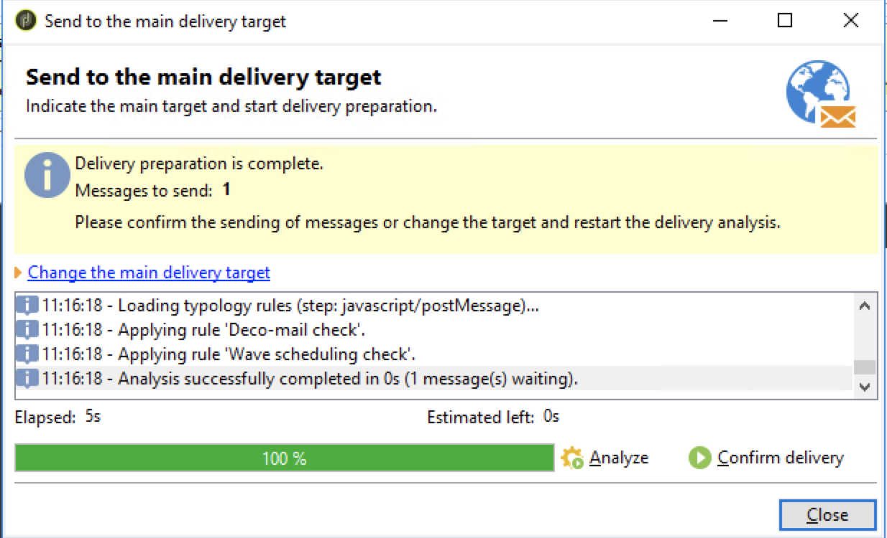

# 创建Adobe Experience Manager新闻稿 {#creating-newsletter}

在执行下面介绍的步骤之前，您需要先 [集成](/help/sites-cloud/integrating/integrating-campaign-classic.md) Adobe Campaign Classic和AEMas a Cloud Service。 配置了Adobe Campaign Classic和AEMas a Cloud Service后，您现在将了解如何创建Adobe Experience Manager新闻稿。

1. 在AEM创作实例中，单击页面左上角的Adobe Experience Manager徽标，然后选择 **站点**.
1. 选择营销活动，点击 **创建→页面**.
   
1. 选择品牌并单击 **下一个**.
1. 输入标题并单击 **创建** 和 **完成**.
1. 要创建营销活动页面，请转到 **Campaigns→AdobeDemo→主控** 单击 **创建→页面**.
   
1. 选择营销活动模板，然后单击 **下一个** 和 **完成**.
1. 输入标题，单击 **创建** 和 **完成**.
1. 转到 **Campaign→AdobeDemo→主控** ，然后选中CampaignPage复选框。 单击 **属性** 左上角。
   
1. 转到 **Cloud Service** 选项卡：
   * 从Cloud Service配置下拉列表中选择Adobe Campaign。
   * 为Adobe Campaign配置选择所需的名称。
   * **保存** 和 **关闭**.
1. 要创建Adobe Campaign Classic电子邮件页面，请转到 **Campaign→AdobeDemo→主控→CampaignPage** 单击 **创建→页面**.
1. 选择Adobe Campaign电子邮件（例如，AC 6.1）模板，然后单击 **下一个**.
1. 在创建页面中，输入新闻稿的标题，单击 **创建** 和 **完成**.
1. 转到 **Campaign→AdobeDemo→主控→CampaignPage**，选中Campaign Classic复选框并单击 **编辑** 打开电子邮件页面。
1. 根据您的要求编辑Adobe Campaign Classic电子邮件新闻稿页面。
1. 单击 **页面信息** 按钮，单击 **发布页面**.
1. 选择必须发布页面的配置。 单击&#x200B;**发布**。
   
1. 新闻稿页面已在发布实例和AEM Adobe Campaign Classic配置上发布。
   * 现在，新闻稿页面将在Adobe Campaign Classic中可见
1. 单击页面信息按钮，然后单击 **启动工作流**.
1. 选择 **批准Adobe Campaign** 作为工作流模型，然后单击 **启动工作流** 按钮。
1. 页面顶部会显示免责声明。 单击 **完成** 确认审阅，然后再次单击 **确定**.
1. 单击 **完成** 选择 **新闻稿批准** 在下一步下拉列表中，单击 **确定** 按钮。

## 创建收件人 {#creating-recipient}

1. 使用Adobe Campaign Classic客户端控制台打开Adobe Campaign Classic服务器。
1. 转到Explorer视图。
1. 在左侧的树视图中，转到Profiles &amp; Targets ，然后选择 **收件人**.
   
1. 填写收件人的详细信息。
   * 输入名字。
   * 输入姓氏。
   * 输入电子邮件。
   * 单击&#x200B;**保存**。

## 在Adobe Campaign Classic中创建电子邮件投放 {#create-delivery}

1. 使用Adobe Campaign Classic客户端控制台打开Adobe Campaign Classic服务器。
1. 转到Explorer视图。
1. 在左侧的树视图中，选择 **Campaign Management** 选择 **投放**.
1. 在右上角，单击 **新建**.
1. 选择 **包含AEM内容的电子邮件投放** 从“投放模板”下拉列表中，单击 **继续**.
1. 单击电子邮件参数下的发件人链接。
   * 输入发件人地址。
   * 输入“发件人”字段。
   * 单击&#x200B;**确定**。
1. 单击 **至** 链接，然后单击 **添加** 在“选择目标”屏幕上。
1. 选择 **收件人** 单击 **下一个**.
   
1. 选择创建的收件人 [先前](#creating-recipient) 单击 **完成**.
1. 已选择收件人。 单击&#x200B;**确定**。
1. 单击 **同步**.
1. 从列表中选择电子邮件页面，单击 **确定**.
1. 已同步电子邮件模板。 单击 **刷新内容** 如果未加载。
1. 单击 **发送** 来发送电子邮件。
1. 在下一个屏幕上，选择 **尽快投放** 然后单击 **分析**.
   
1. 现在，创建投放后，单击 **确认投放** 开始发送电子邮件。 单击&#x200B;**“是”**以确认。
   
1. 投放已开始。 单击&#x200B;**关闭**。
1. 单击 **保存** 以保存投放。
