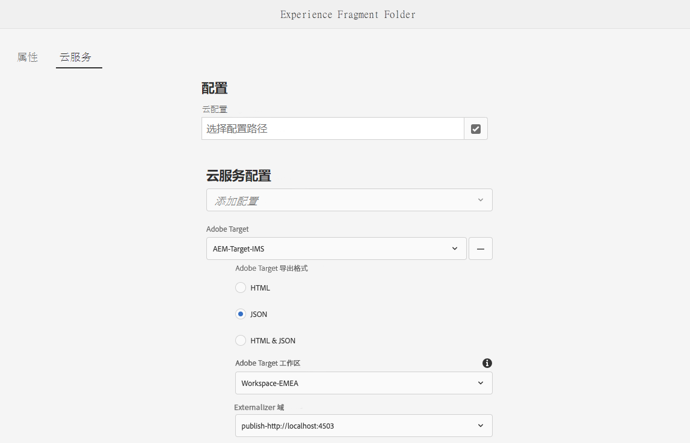

# 将体验片段导出到 Adobe Target{#exporting-experience-fragments-to-adobe-target}

>[!CAUTION]
>
>* AEM体验片段会导出到Adobe Target的默认工作区中。
>* AEM必须按照 [与Adobe Target集成](/help/sites-cloud/integrating/integrating-adobe-target.md).

您可以导出 [体验片段](/help/sites-cloud/authoring/fundamentals/experience-fragments.md)，在Adobe Experience Manager as a Cloud Service(AEM)中创建，到Adobe Target(Target)。 然后，即可在Target活动中将这些体验用作选件，以便测试和个性化大量体验。

有三个选项可用于将体验片段导出到Adobe Target:

* HTML（默认）：支持Web和混合内容交付
* JSON:支持无头内容交付
* HTML 和 JSON

要准备将AEM体验片段导出到Adobe Target的实例，您需要：

* [与 Adobe Target 集成。](/help/sites-cloud/integrating/integrating-adobe-target.md)
* [添加云配置](#add-the-cloud-configuration)
* [添加旧版配置](#add-the-legacy-configuration)

之后，您可以：

* [将体验片段导出到Adobe Target](#exporting-an-experience-fragment-to-adobe-target)
* [在Adobe Target中使用您的体验片段](#using-your-experience-fragments-in-adobe-target)
* 还有 [删除已导出到Adobe Target的体验片段](#deleting-an-experience-fragment-already-exported-to-adobe-target)

体验片段可导出到Adobe Target中的默认工作区，或导出到Adobe Target的用户定义的工作区。

>[!NOTE]
>
>Adobe Target工作区本身不存在于Adobe Target中。 这些配置文件在Adobe IMS(Identity Management系统)中进行定义和管理，然后选择它们以在使用Adobe开发人员控制台的各个解决方案中使用。

>[!NOTE]
>
>Adobe Target工作区可用于仅允许组织（组）成员为该组织创建和管理选件和活动；而不授予其他用户访问权限。 例如，全球关注的具体国家组织。

>[!NOTE]
>
>有关详细信息，另请参阅：
>
>* [Adobe Target开发](http://developers.adobetarget.com/)
>* [核心组件 — 体验片段](https://experienceleague.adobe.com/docs/experience-manager-core-components/using/introduction.html?lang=zh-Hans)
>* [Adobe Target — 如何使用Adobe Experience Manager(AEM)体验片段？](https://experienceleague.adobe.com/docs/target/using/experiences/offers/aem-experience-fragments.html?lang=en)
>* [AEM 6.5 — 手动配置与Adobe Target的集成 — 创建Target云配置](https://experienceleague.adobe.com/docs/experience-manager-65/administering/integration/target-configuring.html#creating-a-target-cloud-configuration)

## 前提条件 {#prerequisites}

需要执行各种操作：

1. 你必须 [将AEM与Adobe Target集成](/help/sites-cloud/integrating/integrating-adobe-target.md).

1. 体验片段是从AEM创作实例导出的，因此您需要 [配置AEM Link Externalizer](/help/implementing/developing/extending/experience-fragments.md#configuring-the-aem-link-externalizer) ，以确保体验片段中的任何引用外部化以用于Web交付。

   >[!NOTE]
   >
   >对于默认未涵盖的链接重写， [体验片段链接重写程序提供程序](/help/implementing/developing/extending/experience-fragments.md#the-experience-fragment-link-rewriter-provider-html) 中。 借助此功能，可以为您的实例开发自定义规则。

## 添加云配置 {#add-the-cloud-configuration}

在导出片段之前，您需要添加 **云配置** 表示 **Adobe Target** 到片段或文件夹。 这还允许您：

* 指定要用于导出的格式选项
* 选择Target工作区作为目标
* 选择外部器域以重写体验片段中的引用（可选）

在 **页面属性** 所需文件夹和/或片段的内容；将根据需要继承规范。

1. 导航到 **体验片段** 控制台。

1. 打开 **页面属性** 文件夹或片段。

   >[!NOTE]
   >
   >如果将云配置添加到体验片段父文件夹，则该配置将由所有子文件夹继承。
   >
   >如果将云配置添加到体验片段本身，则该配置将由所有变量继承。

1. 选择 **Cloud Services** 选项卡。

1. 在 **Cloud Service配置**，选择 **Adobe Target** 从下拉列表中。

   >[!NOTE]
   >
   >可以自定义体验片段选件的JSON格式。 要执行此操作，请定义客户体验片段组件，然后在组件Sling模型中注释如何导出其属性。
   >
   >请参阅核心组件： [核心组件 — 体验片段](https://experienceleague.adobe.com/docs/experience-manager-core-components/using/components/experience-fragment.html)

1. 在 **Adobe Target** 选择：

   * 相应的配置
   * 所需的格式选项
   * Adobe Target工作区
   * 如果需要 — externalizer域

   >[!CAUTION]
   >
   >外部器域是可选的。
   >
   > 当您希望导出的内容指向特定的 *发布* 域。 有关更多详细信息，请参阅 [配置AEM Link Externalizer](/help/implementing/developing/extending/experience-fragments.md#configuring-the-aem-link-externalizer).
   >
   > 另请注意，外部器域仅与发送到Target的体验片段的内容相关，而与元数据（如查看选件内容）无关。

   例如，对于文件夹：

   

1. **保存并关闭**.

## 添加旧版配置 {#add-the-legacy-configuration}

<!-- This is effectively the Manually Integrating with Adobe Target {#manually-integrating-with-adobe-target} section from 6.5 -->

>[!IMPORTANT]
>
>添加新的旧版配置是仅支持导出体验片段的特殊情况。

之后 [添加云配置](#add-the-cloud-configuration) 要使用Launch by Adobe，您还需要使用旧版配置手动与Adobe Target集成，才能最初将AEM与Adobe Target集成。

### 创建Target云配置 {#creating-a-target-cloud-configuration}

要启用AEM与Adobe Target的交互，请创建Target云配置。 要创建配置，请提供Adobe Target客户端代码和用户凭据。

您只能创建一次Target云配置，因为您可以将该配置与多个AEM促销活动关联。 如果您有多个Adobe Target客户端代码，请为每个客户端代码创建一个配置。

您可以配置云配置以同步来自Adobe Target的区段。 如果启用同步，则在保存云配置后，系统会立即从后台的Target中导入区段。

请按照以下过程在AEM中创建Target云配置：

1. 导航到 **旧版Cloud Services** 通过 **AEM徽标** > **工具** > **Cloud Services** > **旧版Cloud Services**.
例如：([http://localhost:4502/libs/cq/core/content/tools/cloudservices.html](http://localhost:4502/libs/cq/core/content/tools/cloudservices.html))

   的 **Adobe Experience Cloud** 将打开“概述”页面。

1. 在 **Adobe Target** ，单击 **立即配置**.
1. 在 **创建配置** 对话框：

   1. 为配置指定 **标题**.
   1. 选择 **Adobe Target配置** 模板。
   1. 单击&#x200B;**创建**。

您现在可以选择新配置进行编辑。

1. 将打开编辑对话框。

   

   <!-- Can this still occur?

   >[!NOTE]
   >
   >When configuring A4T with AEM, you may see a Configuration reference missing entry. To be able to select the analytics framework, do the following:
   >
   >1. Navigate to **Tools** &gt; **General** &gt; **CRXDE Lite**.
   >1. Navigate to **/libs/cq/analytics/components/testandtargetpage/dialog/items/tabs/items/tab1_general/items/a4tAnalyticsConfig**
   >1. Set the property **disable** to **false**.
   >1. Tap or click **Save All**.

   -->

1. 在 **Adobe Target设置** 对话框中，为这些属性提供值。

   * **身份验证**:这默认为IMS（已弃用用户凭据）

   * **客户端代码**:目标帐户客户端代码

   * **租户ID**:租户ID

   * **IMS配置**:从下拉列表中选择所需的配置

   * **API类型**:默认为REST（已弃用XML）

   * **A4T Analytics Cloud配置**:选择用于定位活动目标和量度的Analytics云配置。 如果您在定位内容时使用Adobe Analytics作为报表源，则需要使用此功能。

      <!-- Is this needed?
     If you do not see your cloud configuration, see note in [Configuring A4T Analytics Cloud Configuration](#configuring-a-t-analytics-cloud-configuration).
     -->

   * **使用准确定位：** 默认情况下，此复选框处于选中状态。 如果选中此选项，云服务配置将等待上下文加载后再加载内容。 请参阅以下注释。

   * **同步来自Adobe Target的区段：** 选择此选项可下载在Target中定义的区段，以在AEM中使用它们。 当API类型属性为REST时，您必须选择此选项，因为不支持内联区段，您始终需要使用Target中的区段。 (请注意，“区段”的AEM术语等同于Target“受众”。)

   * **客户端库：** 这默认为AT.js（mbox.js已弃用）

      >[!NOTE]
      >
      >目标库文件， [AT.JS](https://experienceleague.adobe.com/docs/target/using/implement-target/client-side/implement-target-for-client-side-web.html)，是适用于Adobe Target的新实施库，专为典型的Web实施和单页应用程序而设计。
      >
      >mbox.js已弃用，将在以后的阶段中删除。
      >
      >Adobe建议您使用AT.js而不是mbox.js作为客户端库。
      >
      >与mbox.js库相比，AT.js提供了以下几项改进：
      >
      >* 缩短了Web实施的页面加载时间
      >* 增强的安全性
      >* 为单页应用程序提供更好的实施选项
      >* AT.js包含target.js中包含的组件，因此不再需要调用target.js

      >
      >您可以在 **客户端库** 下拉菜单。

   * **使用标签管理系统来交付客户端库**  — 选择此选项可从Launch或其他标签管理系统（或已弃用的DTM）中使用客户端库Adobe。

   * **自定义AT.js**:浏览以上传您的自定义AT.js。 将留空以使用默认库。

      >[!NOTE]
      >
      >默认情况下，当您选择加入Adobe Target配置向导时，将启用“准确定位”。
      >
      >准确定位意味着云服务配置在加载内容之前会等待上下文加载。 因此，就性能而言，准确定位可能会在加载内容之前造成几毫秒的延迟。
      >
      >创作实例始终启用准确定位。 但是，在发布实例上，您可以通过清除云服务配置中准确定位旁边的复选标记(**http://localhost:4502/etc/cloudservices.html**)。 无论云服务配置中的设置如何，您仍可以为各个组件打开和关闭准确定位。
      >
      >如果 ***已经*** 创建目标组件后，如果更改了此设置，则所做的更改不会影响这些组件。 您必须直接对这些组件进行任何更改。

1. 单击 **连接到Adobe Target** 以初始化与Target的连接。 如果连接成功，则显示消息 **连接成功** 中。 单击 **确定** ，然后 **确定** 对话框。

   如果您无法连接到Target，请参阅 [疑难解答](#troubleshooting-target-connection-problems) 中。

### 添加Target框架 {#adding-a-target-framework}

<!-- Is this section needed? -->

配置Target云配置后，添加Target框架。 该框架可识别从可用 [ContextHub](/help/implementing/developing/personalization/configuring-contexthub.md) 组件。 Target使用参数来确定应用于当前上下文的区段。

您可以为单个Target配置创建多个框架。 当您需要为网站的不同部分向Target发送一组不同的参数时，多个框架非常有用。 为您需要发送的每组参数创建一个框架。 将网站的每个部分与相应的框架相关联。 请注意，网页一次只能使用一个框架。

1. 在Target配置页面上，单击 **+** （加号）。

1. 在创建框架对话框中，指定 **标题**，选择 **Adobe Target框架**，然后单击 **创建**.

   <!--  -->

   将打开框架页面。 Sidekick提供表示 [ContextHub](/help/implementing/developing/personalization/configuring-contexthub.md) 你可以映射的。

   <!--  -->

1. 拖动表示要用于映射到拖放目标的数据的Client Context组件。 或者，拖动 **ContextHub存储** 组件。

   >[!NOTE]
   >
   >映射时，参数会通过简单字符串传递到mbox。 无法从ContextHub映射数组。

   例如，要使用 **用户档案数据** 关于网站访客以控制Target营销活动，请将 **用户档案数据** 组件。 此时会显示可用于映射到Target参数的配置文件数据变量。

   <!--  -->

1. 通过选择 **共享** 复选框。

   <!--  -->

   >[!NOTE]
   >
   >只有从AEM到Adobe Target同步参数的一种方式。

将创建框架。 要将框架复制到发布实例，请使用 **激活框架** 选项。

<!--
### Associating Activities With the Target Cloud Configuration  {#associating-activities-with-the-target-cloud-configuration}

Associate your [AEM activities](/help/sites-cloud/authoring/personalization/activities.md) with your Target cloud configuration so that you can mirror the activities in [Adobe Target](https://experienceleague.adobe.com/docs/target/using/experiences/offers/manage-content.html).

>[!NOTE]
>
>What types of activities are available is determined by the following:
>
>* If the **xt_only** option is enabled on the Adobe Target tenant (clientcode) used on the AEM side to connect to Adobe Target, then you can create **only** XT activities in AEM.
>
>* If the **xt_only** options is **not** enabled on the Adobe Target tenant (clientcode), then you can create **both** XT and A/B activities in AEM.
>
>**Additional note:** **xt_only** options is a setting applied on a certain Target tenant (clientcode) and can only be modified directly in Adobe Target. You cannot enable or disable this option in AEM.
-->

<!--
### Associating the Target Framework With Your Site {#associating-the-target-framework-with-your-site}

After you create a Target framework in AEM, associate your web pages with the framework. The targeted components on the pages send the framework-defined data to Adobe Target for tracking. (See [Content Targeting](/help/sites-cloud/authoring/personalization/targeted-content.md).)

When you associate a page with the framework, the child pages inherit the association.

1. In the **Sites** console, navigate to the site that you want to configure.
1. Using either [quick actions](/help/sites-cloud/authoring/getting-started/basic-handling.md#quick-actions) or [selection mode](/help/sites-cloud/authoring/getting-started/basic-handling.md#selecting-resources), select **View Properties.**
1. Select the **Cloud Services** tab.
1. Tap/click **Edit**.
1. Tap/click **Add Configuration** under **Cloud Service Configurations** and select **Adobe Target**.

  

1. Select the framework you want under **Configuration Reference**.

   >[!NOTE]
   >
   >Make sure that you select the specific **framework** that you created and not the Target cloud configuration under which it was created.

1. Tap/click **Done**.
1. Activate the root page of the website to replicate it to the publish server. (See [How To Publish Pages](/help/sites-cloud/authoring/fundamentals/publishing-pages.md).)

   >[!NOTE]
   >
   >If the framework you attached to the page was not activated yet, a wizard opens which allows you to publish it as well.
-->

<!--
### Troubleshooting Target Connection Problems {#troubleshooting-target-connection-problems}

Perform the following tasks to troubleshoot problems that occur when connecting to Target:

* Make sure that the user credentials that you provide are correct.
* Make sure that the AEM instance can connect to the Target server. For example, make sure that firewall rules are not blocking outbound AEM connections, or that AEM is configured to use necessary proxies.
* Look for helpful messages in the AEM error log. The error.log file is located in the **crx-quickstart/logs** directory where AEM is installed.
* When editing the activity in Adobe Target, the URL is pointing to localhost. Work around this by setting the AEM externalizer to the correct URL.
-->

## 将体验片段导出到Adobe Target {#exporting-an-experience-fragment-to-adobe-target}

>[!CAUTION]
>
>对于媒体资产（如图像），只会将引用导出到Target。 资产本身将保留在AEM Assets中，并从AEM发布实例交付。
>
>因此，需要先发布体验片段（包含所有相关资产），然后再导出到Target。

要将体验片段从AEM导出到Target（在指定云配置后），请执行以下操作：

1. 导航到体验片段控制台。
1. 选择要导出到target的体验片段。

   >[!NOTE]
   >
   >它必须是体验片段Web变量。

1. 点按/单击 **导出到Adobe Target**.

   >[!NOTE]
   >
   >如果体验片段已导出，请选择 **在Adobe Target中更新**.

1. 点按/单击 **不发布即导出** 或 **发布** 。

   >[!NOTE]
   >
   >选择 **发布** 将立即发布体验片段并将其发送到Target。

1. 点按/单击 **确定** 在确认对话框中。

   您的体验片段现在应该位于Target中。

   >[!NOTE]
   >
   >[各种详细信息](/help/sites-cloud/authoring/fundamentals/experience-fragments.md#details-of-your-experience-fragment) 的 **列表视图** 和 **属性**.

   >[!NOTE]
   >
   >在Adobe Target中查看体验片段时， *上次修改时间* 所看到的日期是片段在AEM中的上次修改日期，而不是片段上次导出到Adobe Target的日期。

>[!NOTE]
>
>或者，您也可以使用 [页面信息](/help/sites-cloud/authoring/fundamentals/environment-tools.md#page-information) 菜单。

## 在Adobe Target中使用您的体验片段 {#using-your-experience-fragments-in-adobe-target}

执行上述任务后，体验片段会显示在Target的“选件”页面上。 请看 [特定Target文档](https://experiencecloud.adobe.com/resources/help/en_US/target/target/aem-experience-fragments.html) 了解您在那里能取得的成就。

>[!NOTE]
>
>在Adobe Target中查看体验片段时， *上次修改时间* 所看到的日期是片段在AEM中的上次修改日期，而不是片段上次导出到Adobe Target的日期。

## 删除已导出到Adobe Target的体验片段 {#deleting-an-experience-fragment-already-exported-to-adobe-target}

如果删除已导出到Target的体验片段，则该片段已在Target的选件中使用，则该体验片段可能会导致问题。 删除片段会导致选件在AEM交付片段内容时不可用。

为避免出现这种情况：

* 如果活动中当前未使用体验片段，则AEM允许用户删除片段，而不显示警告消息。
* 如果Target中的活动当前正在使用体验片段，则会显示一条错误消息，警告AEM用户删除片段对活动可能产生的影响。

   AEM中的错误消息不禁止用户（强制）删除体验片段。 如果删除了体验片段：

   * 包含AEM体验片段的Target选件可能显示不希望的行为

      * 由于体验片段HTML已推送到Target，因此选件很可能仍会呈现
      * 如果还在AEM中删除了引用的资产，则体验片段中的任何引用可能无法正常工作。
   * 当然，对体验片段进行任何进一步的修改都是不可能的，因为体验片段不再存在于AEM中。
