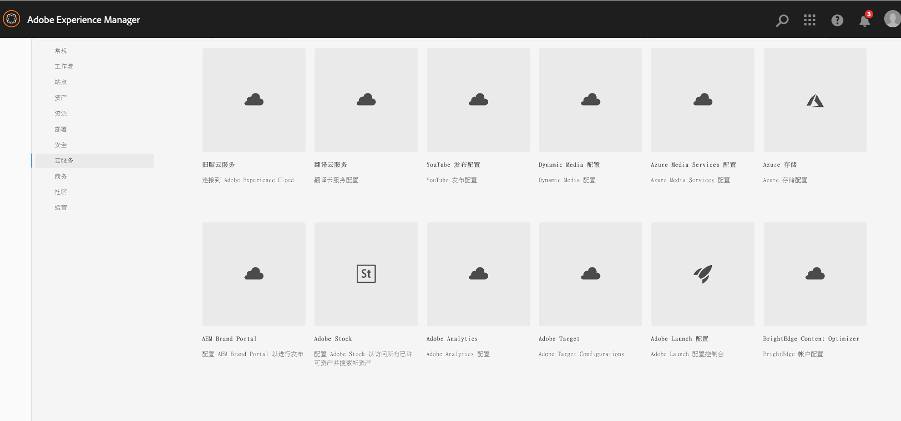
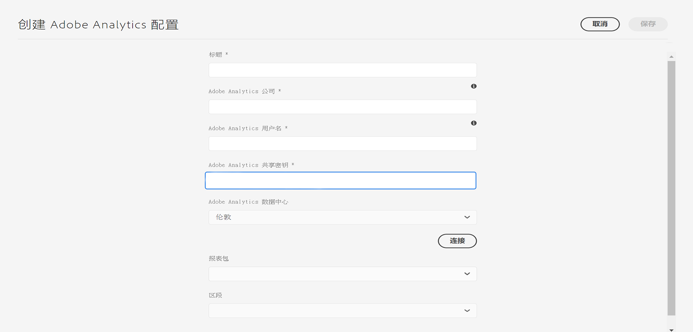

# 与 Adobe Analytics 集成{#integrating-with-adobe-analytics}

将Adobe Analytics和AEM集成为Cloud Service后，您可以跟踪网页活动。 该集成要求：

* 使用触屏UI在AEM中创建Analytics配置作为Cloud Service。
* 在[AdobeLaunch](#analytics-launch)中添加并配置Adobe Analytics作为扩展。 有关LaunchAdobe的更多详细信息，请参阅[此页面](https://experienceleague.adobe.com/docs/launch/using/intro/get-started/quick-start.html)。

与AEM的先前版本相比，AEM作为Cloud Service的Analytics配置中未提供框架支持。 现在，可以通过Launch来完成，Launch是使用Analytics功能（JS库）检测AEM网站的实际工具。 在Launch中，将创建一个资产，用于配置Adobe Analytics扩展，并创建规则以将数据发送到Adobe Analytics。 Adobe启动已取代sitecatalyst提供的分析任务。

>[!NOTE]
>
>Adobe Experience Manager作为没有现有Analytics帐户的Cloud Service客户，可以请求访问Analytics Foundation Pack以进行Experience Cloud。 此Foundation Pack提供了对Analytics的卷限制使用。

## 创建Adobe Analytics配置{#analytics-configuration}

1. 导航到&#x200B;**Tools** → **Cloud Services**。
2. 选择&#x200B;**Adobe Analytics**。
   
3. 选择&#x200B;**创建**&#x200B;按钮。
4. 填写详细信息（请参阅下文），然后单击&#x200B;**连接**。

### 配置参数{#configuration-parameters}

“Adobe Analytics配置”窗口中存在的配置字段包括：

| 属性 | 描述 |
|---|---|
| 公司 | Adobe Analytics登录公司 |
| 用户名 | Adobe Analytics API用户 |
| 密码 | Adobe Analytics密码用于身份验证 |
| 数据中心 | 您的帐户关联的Adobe Analytics数据中心（例如，San Jose， London） |
| 区段 | 用于使用当前报表包中定义的Analytics区段的选项。 将根据区段过滤Analytics报表。 有关其他详细信息，请参阅[此页面](https://experienceleague.adobe.com/docs/analytics/components/segmentation/seg-overview.html)。 |
| 报表包 | 用于发送数据和提取报表的存储库。 报表包可针对选定的网站、网站集或网站页面的子集，定义完整、独立的报表。 您可以查看从单个报表包获取的报表，并可以根据您的要求随时在配置中编辑此字段。 |

### 向站点{#add-configuration}添加配置

要将触屏UI配置应用到站点，请转到：**Sites** → **选择任意站点页面** → **属性** → **Advanced** → **Configuration** →选择配置租户。

## 使用Launch在AEM站点上集成Adobe Analytics {#analytics-launch}

Adobe Analytics可以作为Launch资产的扩展添加。 可以定义规则以执行映射和对Adobe Analytics进行后调用：

* 观看[此视频](https://experienceleague.adobe.com/docs/analytics-learn/tutorials/implementation/via-adobe-launch/basic-configuration-of-the-analytics-launch-extension.html)，了解如何在Launch中为基本站点配置Analytics扩展。

* 有关如何创建规则和将数据发送到Adobe Analytics的详细信息，请参阅[此页面](https://experienceleague.adobe.com/docs/core-services-learn/implementing-in-websites-with-launch/implement-solutions/analytics.html)。

>[!NOTE]
>
>现有（旧版）框架仍然有效，但无法在触屏UI中配置。 建议在Launch中重新构建变量映射配置。

>[!NOTE]
>
>Launch的IMS配置（技术帐户）在AEM中预配置为Cloud Service。 用户无需创建此配置。
