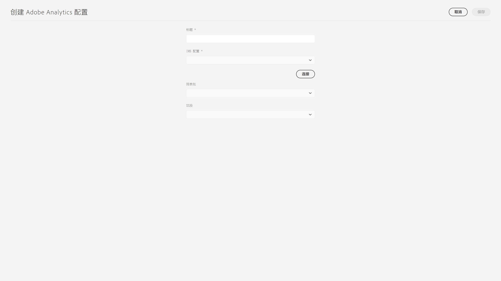

# 与 Adobe Analytics 集成{#integrating-with-adobe-analytics}

通过将 Adobe Analytics 与 AEM as a Cloud Service 集成，您可以跟踪您的网页活动。集成需要：

* 使用 Touch UI 在 AEM as a Cloud Service 中创建 Analytics 配置。请注意，要将Adobe Analytics与AEMas a Cloud Service集成，需要IMS身份验证。
* 在 [Adobe Launch](#analytics-launch) 中将 Adobe Analytics 添加为扩展并进行配置。有关 Adobe Launch 的更多详细信息，请参阅[此页面](https://experienceleague.adobe.com/docs/experience-platform/tags/get-started/quick-start.html)。

与以前版本的 AEM 相比，AEM as a Cloud Service 的 Analytics 配置中不提供框架支持。相反，此操作现在通过 Adobe Launch 完成，后者是用于通过 Analytics 功能（JS 库）检测 AEM 站点的实际工具。在 Adobe Launch 中，创建了一个属性，可以在其中配置 Adobe Analytics 扩展并创建规则以将数据发送到 Adobe Analytics。Adobe Launch 已取代由 sitecatalyst 提供的分析任务。

>[!NOTE]
>
>不具有现有 Analytics 帐户的 Adobe Experience Manager as a Cloud Service 客户可以请求对 Analytics Foundation Pack for Experience Cloud 的访问权限。此 Foundation Pack 提供了对 Analytics 的限量使用。

## 创建 Adobe Analytics 配置 {#analytics-configuration}

1. 导航到&#x200B;**工具** → **云服务**。
2. 选择 **Adobe Analytics**。
   
3. 选择&#x200B;**创建**&#x200B;按钮。
4. 填写详细信息（见下文），然后单击&#x200B;**连接**。

### 配置参数 {#configuration-parameters}

配置窗口中存在的字段如下所示：

| 属性 | 描述 |
|---|---|
| 标题 | 配置名称 |
| IMS 配置 | 选择IMS配置（请参阅下面的章节） |
| 区段 | 用于使用当前报告包中定义的 Analytics 区段的选项。将基于区段筛选 Analytics 报告。有关其他详细信息，请参阅[此页面](https://experienceleague.adobe.com/docs/analytics/components/segmentation/seg-overview.html)。 |
| 报告包 | 从中发送数据和提取报告的存储库。报告包定义针对某个所选网站、网站集合或网页子集的完整、独立的报告。您可以查看从单个报告包中获取的报告，并且可以根据您的要求随时在配置中编辑此字段。 |

### Adobe Analytics，具有IMS身份验证 {#configuration-parameters-ims}

需要IMS配置，才能将Adobe Analytics与AEMas a Cloud Service正确集成。 必须创建此配置，请参阅此 [页面](/help/sites-cloud/integrating/integration-adobe-analytics-ims.md) 了解如何创建Analytics IMS配置。

### 将配置添加到站点 {#add-configuration}

要将 Touch UI 配置应用于站点，请转至：**站点** → **选择任何站点页面** → **属性** → **高级** → **配置** → 选择配置租户。

## 使用 Adobe Launch 在 AEM Sites 上集成 Adobe Analytics {#analytics-launch}

Adobe Analytics 可以作为扩展添加到 Launch 属性中。可以定义规则来执行映射并对 Adobe Analytics 进行 POST 调用：

* 观看[本视频](https://experienceleague.adobe.com/docs/analytics-learn/tutorials/implementation/via-adobe-launch/basic-configuration-of-the-analytics-launch-extension.html)，了解如何在 Launch 中为基本站点配置 Analytics 扩展。

* 请参阅[此页面](https://experienceleague.adobe.com/docs/core-services-learn/implementing-in-websites-with-launch/implement-solutions/analytics.html)以了解有关如何创建规则并将数据发送到 Adobe Analytics 的详细信息。

>[!NOTE]
>
>已在 AEM as a Cloud Service 中预配置适用于 Launch 的 IMS 配置（技术帐户）。您不必创建此配置。

>[!NOTE]
>
>虽然现有（旧式）框架仍有效，但无法在 Touch UI 中进行配置。建议在 Launch 中重新构建变量映射配置。
