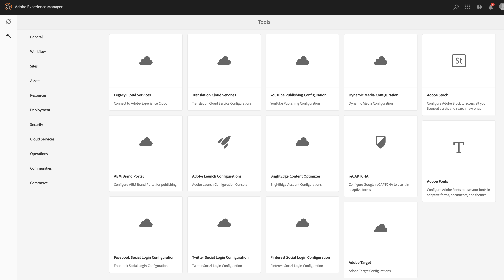

# 与 Adobe Target 集成{#integrating-with-adobe-target}

作为Adobe Marketing Cloud的一部分，Adobe Target允许您通过在所有渠道中进行定位和衡量来提高内容相关性。 将Adobe Target和AEM集成为Cloud Service需要：

* 使用触屏UI在AEM中创建Analytics配置作为Cloud Service（需要IMS配置）。
* 在Adobe Analytics启动中添加和配置Adobe [作为扩展](https://docs.adobe.com/content/help/en/launch/using/intro/get-started/quick-start.html)。

“体验定位”需要与Launch集成。 对于导出到目标的体验片段，您只需要Adobe Target配置和IMS。

>[!NOTE]
>
>Adobe Experience Manager作为没有现有目标帐户的Cloud Service客户，可以请求访问目标基础包以进行Experience Cloud。  Foundation Pack提供对目标的批量限制使用。

## 创建Adobe Target配置 {#create-configuration}

1. 导航到 **工具** → **Cloud Service**。
   
2. 选择 **Adobe Target**。
3. 单击“创 **建** ”按钮。
   
4. 填写详细信息（请参阅下面的内容），然后选 **择Connect**。
   

### IMS 配置

要将目标与AEM和Launch正确集成，必须同时为Launch和Launch配置IMS配置。 虽然在AEM中将启动的IMS配置预配置为Cloud Service，但必须创建目标IMS配置(配置目标后)。 请参 [阅此视频](https://helpx.adobe.com/experience-manager/kt/sites/using/aem-sites-target-standard-technical-video-understand.html)[和本页](https://docs.adobe.com/content/help/en/experience-manager-65/administering/integration/integration-ims-adobe-io.html) ，了解如何创建目标IMS配置。

### 编辑目标配置 {#edit-target-configuration}

要编辑目标配置，请执行以下步骤：

1. 选择现有配置，然后单击 **属性**。
2. 编辑属性。
3. 选 **择“重新连接到Adobe Target**”。
   
4. 选择&#x200B;**保存并关闭**。

### 向站点添加配置 {#add-configuration}

要将触屏UI配置应用到站点，请转至： **站点** 选择任何站点页 **→属** 性 **→高级** →配置 **→****** →选择配置租户。

## 使用Adobe Target启动在AEM站点上集成Adobe {#integrate-target-launch}

AEM优惠与Experience Platform Launch的开箱即用集成。 通过将Adobe Target扩展添加到Experience Platform Launch，您可以使用AEM网页上Adobe Target的功能。目标库将仅使用启动来呈现。

>[!NOTE]
>
>现有（旧版）框架仍然有效，但无法在触屏UI中配置。 建议在启动中重新构建变量映射配置。

>[!NOTE]
>
>现有（旧版）框架仍然有效，但无法在触屏UI中配置。 建议在启动中重新构建变量映射配置。

作为一般概述，集成步骤包括：

1. 创建启动项属性
2. 添加所需的扩展
3. 创建数据元素（用于捕获上下文集线器参数）
4. 创建页面规则
5. 构建和发布

### 创建启动项属性 {#create-property}

属性是一个容器，将填充扩展、规则和数据元素。

1. 选择“ **新建属性** ”按钮。
2. 为您的属性提供名称。
3. 在域中输入要加载启动库的IP/主机。
4. 选择“保 **存** ”按钮。
   

### 添加所需的扩展 {#add-extension}

扩展是管理核心库设置的容器。 Adobe Target扩展支持使用目标JavaScript SDK进行现代Web的客户端实现，at.js。 您需要添加 **Adobe Target****和AdobeContextHub** 扩展。

1. 选择“扩展目录”选项，并在筛选器中搜索目标。
2. 选择 **Adobe Target** at.js，然后单击“安装”选项。
   
3. Select the **Configure** button. 请注意导入了目标帐户凭据的配置窗口以及此扩展的at.js版本。
4. 选择 **保存** ，以将目标扩展添加到您的启动项属性。 您应该能够看到“已安装的扩展”目标扩展 **下列出的列表** 。
   
5. 重复上述步骤以搜索 **AdobeContextHub** extension并安装它（这是与contexthub参数集成时必需的，根据要完成的定位）。

### 创建数据元素 {#data-element}

数据元素是可以将上下文中心参数映射到的占位符。

1. 选择 **数据元素**。
2. 选择 **添加数据元素**。
3. 提供数据元素的名称并将其映射到Context Hub参数。
4. select **Save**.
   

### 创建页面规则 {#page-rule}

在“规则”中，我们定义一系列将在现场执行的操作并对其进行排序，以实现定位。

1. 添加一组操作，如屏幕截图所示。
   
2. 在“将参数添加到所有mbox”中，将之前配置的数据元素（请参阅上面的数据元素）添加到将在mbox调用中发送的参数。
   

### 构建和发布 {#build-publish}

要了解如何构建和发布，请参阅此 [页](https://docs.adobe.com/content/help/en/experience-manager-learn/aem-target-tutorial/aem-target-implementation/using-launch-adobe-io.html)。

## 经典UI和触屏UI配置之间的内容结构更改 {#changes-content-structure}

| **更改** | **经典UI配置** | **触屏UI配置** | **后果** |
|---|---|---|---|
| 目标配置的位置。 | /etc/cloudservices/testandtarget/ | /conf/tenant/settings/cloudservices/目标 | 以前在/etc/cloudservices/testandtarget下存在多个配置，但现在在租户下将存在单个配置。 |

>[!NOTE]
>
>现有客户仍支持旧版配置（没有编辑或创建新配置的选项）。 旧版配置是客户使用VSTS上传的内容包的一部分。
