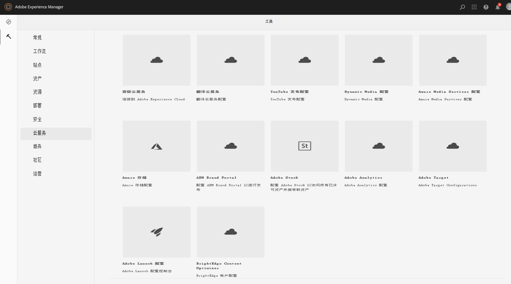
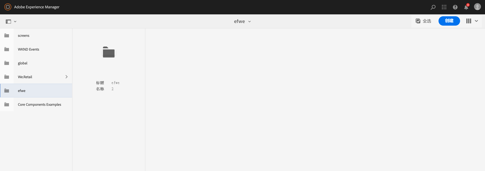
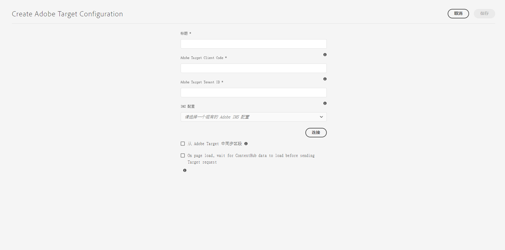
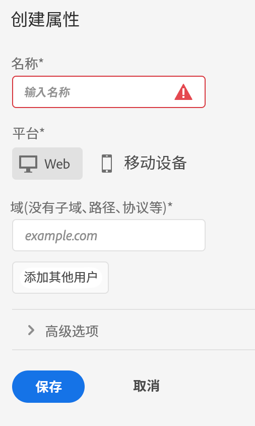
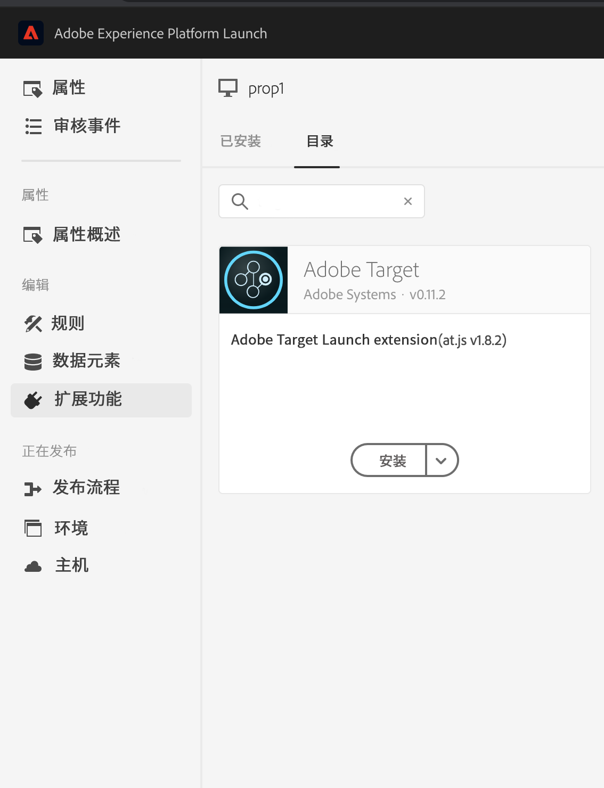
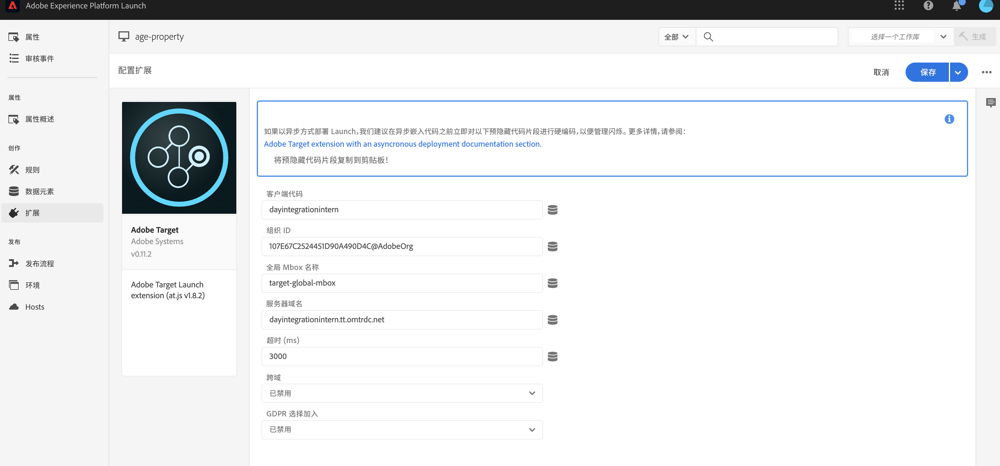
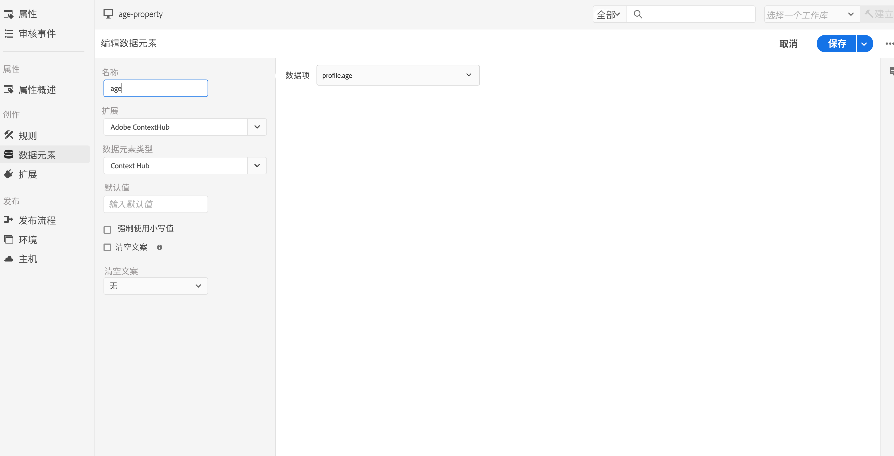
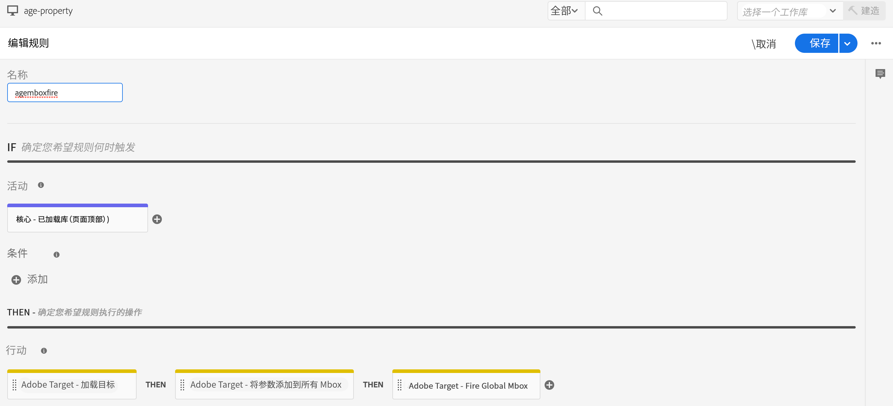
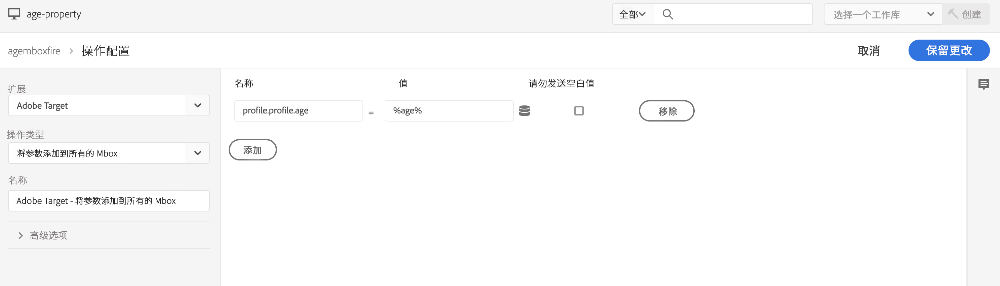

# 与 Adobe Target 集成{#integrating-with-adobe-target}

作为Adobe Marketing Cloud的一部分，Adobe Target允许您通过跨所有渠道进行定位和测量来提高内容相关性。 将Adobe Target和AEM作为Cloud Service集成需要：

* 使用触屏UI在AEM中创建Target配置作为Cloud Service（需要IMS配置）。
* 在[AdobeLaunch](https://experienceleague.adobe.com/docs/launch/using/intro/get-started/quick-start.html)中添加并配置Adobe Target作为扩展。

AdobeLaunch是管理AEM页面（JS库/标记）中Analytics和Target的客户端属性所必需的。 尽管如此，“体验定位”需要与Launch集成。 要将体验片段导出到Target，您只需要Adobe Target配置和IMS。

>[!NOTE]
>
>Adobe Experience Manager作为没有现有Target帐户的Cloud Service客户，可以请求访问Target Foundation Pack以进行Experience Cloud。 Foundation Pack提供了对Target的卷限制使用。

## 创建Adobe Target配置{#create-configuration}

1. 导航到&#x200B;**Tools** → **Cloud Services**。
   
2. 选择&#x200B;**Adobe Target**。
3. 选择&#x200B;**创建**按钮。
   
4. 填写详细信息（请参阅下文），然后选择&#x200B;**连接**。
   

### IMS 配置 {#ims-configuration}

要将Target与AEM和Launch正确集成，必须同时为Launch和Target配置IMS。 虽然Launch的IMS配置在AEM中预配置为Cloud Service，但必须创建Target IMS配置（在配置Target后）。 请参阅[此视频](https://helpx.adobe.com/experience-manager/kt/sites/using/aem-sites-target-standard-technical-video-understand.html)和[此页面](https://experienceleague.adobe.com/docs/experience-manager-65/administering/integration/integration-ims-adobe-io.html)以了解如何创建Target IMS配置。

### Adobe Target租户ID和Adobe Target客户端代码{#tenant-client}

配置Adobe Target租户ID和Adobe Target客户端代码字段时，请注意以下事项：

1. 对于大多数客户，租户ID和客户端代码是相同的。 这表示两个字段包含相同的信息和相同。 请确保在这两个字段中输入租户ID。
2. 出于旧版目的，您还可以在租户ID和客户端代码字段中输入不同的值。

在这两种情况下，请注意：

* 默认情况下，客户端代码（如果先添加）也会自动复制到租户ID字段中。
* 您可以选择更改默认的租户ID集。
* 因此，对Target的后端调用将基于租户ID，而对Target的客户端调用将基于客户端代码。

如前所述，AEM as a Cloud Service最常见的一种情况是： 无论采用哪种方式，请确保&#x200B;**两个**&#x200B;字段都包含正确的信息，具体取决于您的要求。

>[!NOTE]
>
> 如果要更改现有Target配置：
>
> 1. 重新输入租户ID。
> 2. 重新连接到Target。
> 3. 保存配置。

### 编辑目标配置{#edit-target-configuration}

要编辑Target配置，请执行以下步骤：

1. 选择现有配置，然后单击&#x200B;**属性**。
2. 编辑属性。
3. 选择&#x200B;**重新连接到Adobe Target**。
4. 选择&#x200B;**保存并关闭**。

### 向站点{#add-configuration}添加配置

要将触屏UI配置应用到站点，请转到：**Sites** → **选择任意站点页面** → **属性** → **Advanced** → **Configuration** →选择配置租户。

## 使用Launch在AEM站点上集成Adobe Target {#integrate-target-launch}

AEM提供了与Experience Platform Launch的开箱即用集成。 通过将Adobe Target扩展添加到Experience Platform Launch，您可以在AEM网页上使用Adobe Target的功能。 Target库将仅通过使用Launch来呈现。

>[!NOTE]
>
>现有（旧版）框架仍然有效，但无法在触屏UI中配置。 建议在Launch中重新构建变量映射配置。

作为一般概述，集成步骤包括：

1. 创建Launch资产
2. 添加所需的扩展
3. 创建数据元素（用于捕获ContextHub参数）
4. 创建页面规则
5. 生成和发布

### 创建Launch属性{#create-property}

资产是一个容器，其中填充了扩展、规则和数据元素。

1. 选择&#x200B;**New Property**&#x200B;按钮。
2. 为您的资产提供名称。
3. 作为域，输入要加载Launch库的IP/主机。
4. 选择&#x200B;**Save**按钮。
   

### 添加所需的扩展{#add-extension}

**** 扩展用于管理核心库设置的容器。Adobe Target扩展通过使用适用于新版Web的Target JavaScript SDK(at.js)支持客户端实施。 必须同时添加&#x200B;**Adobe Target**&#x200B;和&#x200B;**AdobeContextHub**&#x200B;扩展。

1. 选择扩展目录选项，然后在筛选器中搜索Target。
2. 选择&#x200B;**Adobe Target** at.js ，然后单击安装选项。
   
3. 选择&#x200B;**Configure**&#x200B;按钮。 请注意导入了Target帐户凭据以及此扩展的at.js版本的配置窗口。
4. 选择&#x200B;**Save**&#x200B;以将Target扩展添加到您的Launch资产中。 您应该能够看到&#x200B;**Installed Extensions**列表下列出的Target扩展。
   
5. 重复上述步骤以搜索&#x200B;**AdobeContextHub**&#x200B;扩展并安装该扩展（与ContextHub参数集成时需要执行此操作，具体取决于定位操作）。

### 创建数据元素{#data-element}

**数据** 元素是占位符，您可以将ContextHub参数映射到这些占位符。

1. 选择&#x200B;**数据元素**。
2. 选择&#x200B;**添加数据元素**。
3. 提供数据元素的名称，并将其映射到ContextHub参数。
4. 选择&#x200B;**保存**。
   

### 创建页面规则{#page-rule}

在&#x200B;**Rule**&#x200B;中，我们定义并排序在站点上执行的一系列操作，以实现定位。

1. 添加一组操作，如屏幕截图中所示。
   
2. 在Add Params to All Mboxes中，将之前配置的数据元素（请参阅上面的数据元素）添加到将在mbox调用中发送的参数中。
   

### 生成并发布{#build-publish}

要了解如何构建和发布，请参阅此[页面](https://experienceleague.adobe.com/docs/experience-manager-learn/aem-target-tutorial/aem-target-implementation/using-launch-adobe-io.html)。

## 经典UI和触屏UI配置之间的内容结构更改{#changes-content-structure}

| **更改** | **经典UI配置** | **触屏UI配置** | **后果** |
|---|---|---|---|
| Target配置的位置。 | /etc/cloudservices/testandtarget/ | /conf/tenant/settings/cloudservices/target | 以前，在/etc/cloudservices/testandtarget下存在多个配置，但现在租户下存在单个配置。 |

>[!NOTE]
>
>现有客户仍支持旧版配置（无法选择编辑或创建新配置）。 旧版配置将包含在使用VSTS的客户上传的内容包中。
