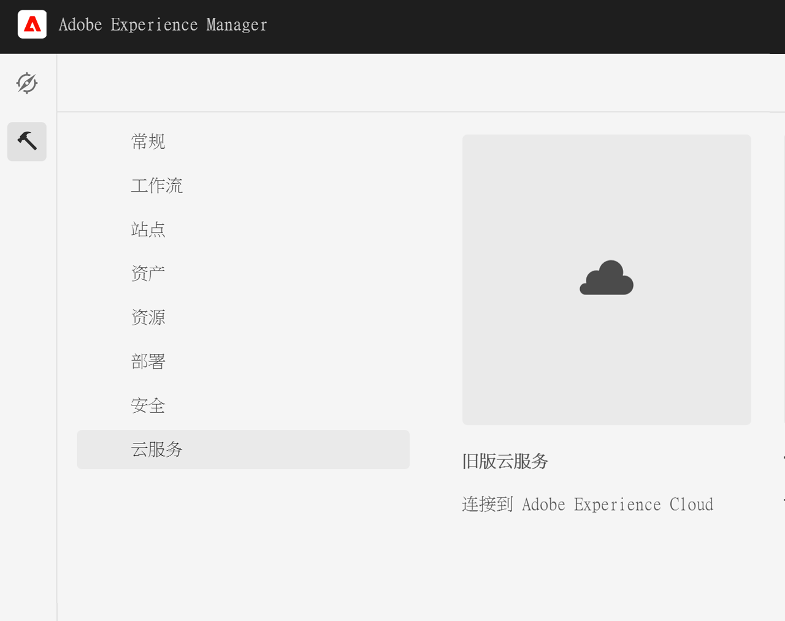
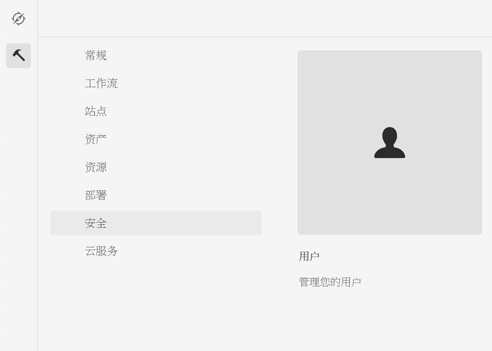

# 与Adobe Campaign Classic集成 {#integrating-campaign-classic}

通过与Adobe Campaign集成，您可以在AEMas a Cloud Service中直接管理电子邮件投放、内容和表单。 需要在Adobe Campaign Classic和AEMas a Cloud Service中执行配置步骤，才能在解决方案之间实现双向通信。

请注意，AEM as a Cloud Service和Adobe Campaign Classic也可以单独使用。 例如，营销人员可以在Adobe Campaign中创建营销活动和使用定位，而内容创建者则可以在AEMas a Cloud Service中处理设计。

## 集成工作流 {#integration-workflow}

以下章节详细介绍了如何集成解决方案。 这需要在Adobe Campaign Classic和AEMas a Cloud Service中执行配置步骤。 因此，您将学习如何：

* [创建操作员用户](#create-operator)
* [为集成配置AEMas a Cloud Service](#aem-configuration)
* [配置Campaign远程用户](#configure-user)
* [设置Adobe Campaign Classic外部帐户](#acc-setup)

### 前提条件 {#prerequisites}

**Adobe Campaign Classic**

要执行集成，您需要一个工作的Adobe Campaign Classic实例，包括一个数据库。 如果您需要有关如何设置和配置Adobe Campaign Classic的其他详细信息，请阅读 [Adobe Campaign Classic文档](https://experienceleague.adobe.com/docs/campaign-classic/using/campaign-classic-home.html) 特别是《安装和配置指南》。 请记住，要执行下面列出的操作，您还需要具有管理员角色。

**AEM as a Cloud Service**

您需要 [AEMas a Cloud Service](https://experienceleague.adobe.com/docs/experience-manager-cloud-service/content/overview/introduction.html) 解决方案。

### 在Adobe Campaign Classic中创建操作员用户 {#create-operator}

从开始菜单打开Adobe Campaign Classic客户端控制台并登录。 应会显示主页。

1. 单击 **资源管理器** 以打开资源管理器视图。
   
1. 在左侧的树视图中，导航到 **管理 — >访问管理 — >运算符**.
1. 双击 `aemserver` 运算符列表中的条目。
1. 切换到 **编辑** 选项卡。 为aemserver设置密码。
   
1. 单击 **访问权限** ，然后单击 **编辑访问参数** 链接。
1. 在“Encryption（加密）”下，选择“Public network（公共网络）”作为授权的连接区域。 单击&#x200B;**确定**。
   
1. 单击&#x200B;**保存**。
1. 注销。
1. 例如，转到Adobe Campaign Classic v7安装位置 `C:\Program Files\Adobe\Adobe Campaign Classic v7\conf` 打开 `serverConf.xml` 作为管理员。
   * 搜索 **安全区**.
   * 设置以下参数 `allowHTTP="true"` `sessionTokenOnly="true"` `allowUserPassword="true"`.
   * 保存文件。
1. 确保安全区域不会被 `config-<server name>.xml` 文件(C:\Program Files\Adobe\Adobe Campaign Classic v7\conf\config_acc-test.xml)。
   * 如果配置文件包含单独的安全区设置，请更改 `allowUserPassword` 属性为true。
1. 如果要更改Adobe Campaign Classic服务器端口，请将8080替换为所需的端口(例如：80)。

>[!NOTE]
>
>默认情况下，未为运算符配置安全区域。 要使用AEMas a Cloud Service连接到Adobe Campaign，必须选择一个（请参阅上面的步骤）。 我们强烈建议创建专用于AEM的安全区域，以避免出现任何安全问题。

### 配置AEM as a Cloud Service {#aem-configuration}

1. 登录到cloud manager并启动AEMas a Cloud Service创作实例。
1. 转到 **工具→Cloud Service→旧版Cloud Service**.
   
1. 向下滚动到Adobe Campaign，然后单击 **立即配置** 链接。
   * 输入标题。
   * 输入名称。
   * 单击&#x200B;**创建**。
1. 在编辑组件屏幕上
   * 输入用户名，请参阅 [创建操作员用户](#create-operator).
   * 输入密码。
   * 输入Adobe Campaign Classic服务器API端点(例如， `http://3.22625.51:80`)。
   * 单击 **连接到Adobe Campaign**.
   * 单击&#x200B;**确定**。

   >[!NOTE]
   >
   >请确保您的Adobe Campaign服务器可在Internet上访问，因为AEMas a Cloud Service无法访问专用网络。
1. 请检查链接外部器配置中的发布实例。
您可以通过检查 [开发人员控制台](https://experienceleague.adobe.com/docs/experience-manager-learn/cloud-service/debugging/debugging-aem-as-a-cloud-service/developer-console.html#osgi-services).
如果不正确，请在相应的实例git存储库中进行更改，然后使用 [云管理器](https://experienceleague.adobe.com/docs/experience-manager-cloud-service/content/implementing/using-cloud-manager/deploy-code.html).

```
Service 3310 - [com.day.cq.commons.Externalizer] (pid: com.day.cq.commons.impl.ExternalizerImpl)",
"  from Bundle 420 - Day Communique 5 Commons Library (com.day.cq.cq-commons), version 5.12.16",
"    component.id: 2149",
"    component.name: com.day.cq.commons.impl.ExternalizerImpl",
"    externalizer.contextpath: ",
"    externalizer.domains: [local https://author-p17558-e33255-cmstg.adobeaemcloud.com, author https://author-p17558-e33255-cmstg.adobeaemcloud.com,
     publish https://publish-p17558-e33255-cmstg.adobeaemcloud.com]",
"    externalizer.encodedpath: false",
"    externalizer.host: ",
"    feature-origins: [com.day.cq:cq-quickstart:slingosgifeature:cq-platform-model_quickstart_author:6.6.0-V23085]",
"    service.bundleid: 420",
"    service.description: Creates absolute URLs",
"    service.scope: bundle",
"    service.vendor: Adobe Systems Incorporated",
```

>[!NOTE]
>
>还必须从Adobe Campaign服务器访问发布实例。

### 配置Adobe Campaign远程用户 {#configure-user}

您需要为campaign-remote用户设置密码。 必须将Adobe Campaign Classic与AEM as a Cloud Service连接。

1. 转到 **AEM→Tools→Security→Users**.
   
1. 搜索 `campaign-remote` 用户，然后单击该页面。
1. 单击Change Password
   * 输入新密码两次。
   * 输入AEM密码。
   * 单击&#x200B;**保存**。

### 配置Adobe Campaign Classic外部帐户 {#acc-setup}

您还必须配置外部帐户才能将Adobe Campaign Classic与AEMas a Cloud Service实例连接。

1. 使用客户端控制台登录Adobe Campaign Classic服务器。
1. 转到“资源管理器”视图。
1. 在左侧的树视图中，转到 **管理→平台→外部帐户**.
1. 在右上方的列表视图中，单击AEM实例。
1. 在AEM实例配置中
   * 例如，输入AEMas a Cloud Service作者IP/FQN `https://author-p17558-e33255-cmstg.adobeaemcloud.com`.
   * 输入用户和帐户。
   * 输入您在AEMas a Cloud Service实例中设置的campaign-remote用户的密码（请参阅上面的步骤）。
   * 选择 **已启用** 复选框。
   * 单击&#x200B;**保存**。

   >[!NOTE]
   >
   >必须从Adobe Campaign Classic服务器实例访问AEM创作服务器IP/FQN。 此外，请勿在AEM创作服务器IP/FQN中添加反斜线字符。

配置了Adobe Campaign Classic和AEMas a Cloud Service后，集成现已完成。 此外，您还可以通过阅读以下内容了解如何创建Adobe Experience Manager新闻稿 [本页](/help/sites-cloud/integrating/creating-newsletter.md).
