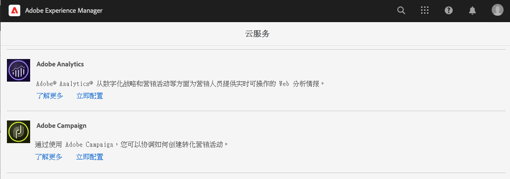
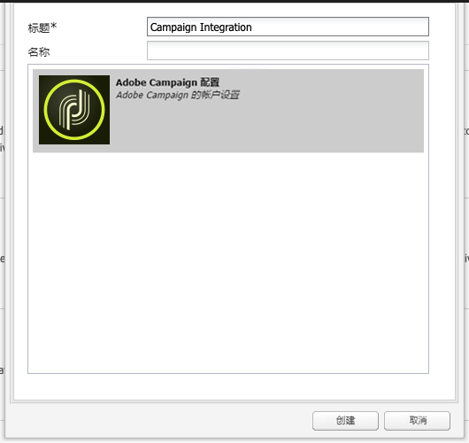
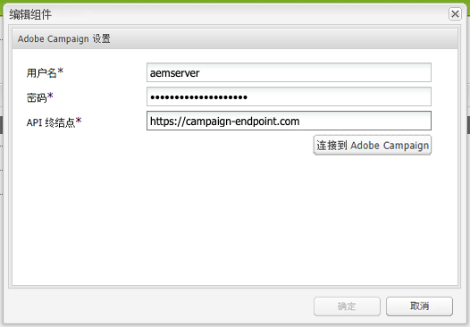

# 与Adobe Campaign Classic集成 {#integrating-campaign-classic}

通过将AEMas a Cloud Service与Adobe Campaign集成，您可以在AEMas a Cloud Service中直接管理电子邮件投放、内容和表单。 需要在Adobe Campaign Classic和AEMas a Cloud Service中执行配置步骤，才能在解决方案之间实现双向通信。

此集成允许单独使用AEM as a Cloud Service Adobe Campaign Classic和。 营销人员可以在Adobe Campaign中创建营销活动和使用定位，而内容创建者可以并行处理AEMas a Cloud Service中的内容设计。 利用集成，可通过Campaign定位和交付AEM中营销活动的内容和设计。

## 集成步骤 {#integration-steps}

在AEM和Campaign之间集成需要在两个解决方案中执行多个步骤。

1. [在Campaign中安装AEM集成包。](#install-package)
1. [在Campaign中为AEM创建运算符](#create-operator)
1. [在AEM中配置Campaign集成](#campaign-integration)
1. [配置AEM Externalizer](#externalizer)
1. [在AEM中配置campaign-remote用户](#configure-user)
1. [在Campaign中配置AEM外部帐户](#acc-setup)

本文档将详细指导您完成这些步骤中的每个步骤

## 前提条件 {#prerequisites}

* 管理员对Adobe Campaign Classic的访问权限
   * 要执行集成，您需要一个工作的Adobe Campaign Classic实例，包括已配置的数据库。
   * 如果您需要有关如何设置和配置Adobe Campaign Classic的其他详细信息，请参阅 [Adobe Campaign Classic文档，](https://experienceleague.adobe.com/docs/campaign-classic/using/campaign-classic-home.html) 特别是《安装和配置指南》。

* 管理员对AEMas a Cloud Service的访问权限

## 在Campaign中安装AEM集成包 {#install-package}

的 **AEM集成** Adobe Campaign中的包包含连接到AEM所需的许多标准配置。

1. 以管理员身份，使用客户端控制台登录Adobe Campaign实例。

1. 选择 **工具** > **高级** > **导入资源包……**.

   

1. 单击 **安装标准包** 然后单击 **下一个**.

1. 检查 **AEM集成** 包。

   

1. 单击 **下一个**，然后 **开始** 以开始安装。

   

1. 单击 **关闭** 安装完成后。

集成包现已安装完成。

## 在Campaign中为AEM创建运算符 {#create-operator}

集成包会自动创建 `aemserver` 运算符(AEM用来连接到Adobe Campaign)。 您必须为此运算符定义安全区域并设置其密码。

1. 使用客户端控制台以管理员身份登录Adobe Campaign。

1. 选择 **工具** -> **资源管理器** 菜单栏。

1. 在资源管理器中，导航到 **管理** > **访问管理** > **运算符** 节点。

1. 选择 `aemserver` 运算符。

1. 在 **编辑** ，请选择 **访问权限** 子选项卡，然后单击 **编辑访问参数……** 链接。

   

1. 选择适当的安全区域，并根据需要定义受信任的IP掩码。

1. 单击&#x200B;**保存**。

1. 从Adobe Campaign客户端注销。

1. 在Adobe Campaign服务器的文件系统上，导航到Campaign安装位置并编辑 `serverConf.xml` 文件。 此文件通常位于：
   * `C:\Program Files\Adobe\Adobe Campaign Classic v7\conf` 在窗口中。
   * `/usr/local/neolane/nl6/conf/eng` 在Linux中。

1. 搜索 `securityZone` 并确保为AEM运算符的安全区域设置了以下参数。

   * `allowHTTP="true"`
   * `sessionTokenOnly="true"`
   * `allowUserPassword="true"`。

1. 保存文件。

1. 确保安全区域不会被 `config-<server name>.xml` 文件。

   * 如果配置文件包含单独的安全区设置，请更改 `allowUserPassword` 属性 `true`.

1. 如果要更改Adobe Campaign Classic服务器端口，请将 `8080` 的端口。

>[!CAUTION]
>
>默认情况下，未为运算符配置安全区域。 要使AEM连接到Adobe Campaign，您必须选择一个区域，如前面的步骤中所述。
>
>Adobe强烈建议创建专用于AEM的安全区，以避免出现任何安全问题。 有关此主题的更多信息，请参阅 [Adobe Campaign Classic文档。](https://experienceleague.adobe.com/docs/campaign-classic/using/installing-campaign-classic/additional-configurations/security-zones.html)

1. 在Campaign客户端中，返回到 `aemserver` 运算符并选择 **常规** 选项卡。

1. 单击 **重置密码……** 链接。

1. 指定密码并将其存储在安全位置以供将来使用。

1. 单击 **确定** 保存 `aemserver` 运算符。

## 在AEM中配置Campaign集成 {#campaign-integration}

AEM使用 [您在Campaign中已设置的运算符](#create-operator) 以便与Campaign通信

1. 以管理员身份登录到AEM创作实例。

1. 从全局导航侧边栏中，选择 **工具** > **Cloud Services** > **旧版Cloud Services** > **Adobe Campaign**，然后单击 **立即配置**.

   

1. 在对话框中，通过输入 **标题** 单击 **创建**.

   

1. 将打开一个新窗口和对话框以编辑配置。 提供必要的信息。

   * **用户名**  — 这是 [在上一步中创建的Adobe Campaign AEM集成包运算符。](#create-operator) 默认情况下， `aemserver`.
   * **密码**  — 这是的密码 [在上一步中创建的Adobe Campaign AEM集成包运算符。](#create-operator)
   * **API端点**  — 这是Adobe Campaign实例URL。

   

1. 选择 **连接到Adobe Campaign** 验证连接，然后单击 **确定**.

AEM现在可以与Adobe Campaign通信。

>[!NOTE]
>
>确保您的Adobe Campaign服务器可通过Internet访问。 AEMas a Cloud Service无法访问专用网络。

## 配置AEM外部器 {#externalizer}

外部器是AEM中的OSGi服务，可将资源路径转换为外部和绝对URL，AEM提供Campaign可使用的内容时需要此URL。

1. 以管理员身份登录AEM创作实例。
1. 通过检查 [开发人员控制台。](https://experienceleague.adobe.com/docs/experience-manager-learn/cloud-service/debugging/debugging-aem-as-a-cloud-service/developer-console.html#osgi-services)
1. 如果不正确，请在相应的实例git存储库中进行必要的更改，然后 [使用cloud manager部署配置。](/help/implementing/cloud-manager/deploy-code.md)

```text
Service 3310 - [com.day.cq.commons.externalizer] (pid: com.day.cq.commons.impl.externalizerImpl)",
"  from Bundle 420 - Day Communique 5 Commons Library (com.day.cq.cq-commons), version 5.12.16",
"    component.id: 2149",
"    component.name: com.day.cq.commons.impl.externalizerImpl",
"    externalizer.contextpath: ",
"    externalizer.domains: [local https://author-p17558-e33255-cmstg.adobeaemcloud.com, author https://author-p17558-e33255-cmstg.adobeaemcloud.com,
     publish https://publish-p17558-e33255-cmstg.adobeaemcloud.com]",
"    externalizer.encodedpath: false",
"    externalizer.host: ",
"    feature-origins: [com.day.cq:cq-quickstart:slingosgifeature:cq-platform-model_quickstart_author:6.6.0-V23085]",
"    service.bundleid: 420",
"    service.description: Creates absolute URLs",
"    service.scope: bundle",
"    service.vendor: Adobe Systems Incorporated",
```

>[!NOTE]
>
>必须从Adobe Campaign服务器访问发布实例。

## 在AEM中配置campaign-remote用户 {#configure-user}

为了使Campaign与AEM通信，您需要为 `campaign-remote` 用户。

1. 以管理员身份登录AEM。
1. 在主导航控制台上，单击 **工具** 中。
1. 然后，单击 **安全性** -> **用户** 打开用户管理控制台。
1. 找到 `campaign-remote` 用户。
1. 选择 `campaign-remote` 用户和单击 **属性** 以编辑用户。
1. 在 **编辑用户设置** 窗口，单击 **更改密码**.
1. 为用户提供新密码，并在安全位置记下该密码以供将来使用。
1. 单击 **保存** 保存密码更改。
1. 单击 **保存并关闭** 保存对 `campaign-remote` 用户。

## 在Campaign中配置AEM外部帐户 {#acc-setup}

When [安装 **AEM集成** Campaign中的软件包，](#install-package) 为AEM创建外部帐户。 通过配置此外部帐户，Adobe Campaign可以连接到AEMas a Cloud Service，从而实现解决方案之间的双向通信。

1. 使用客户端控制台以管理员身份登录Adobe Campaign。

1. 选择 **工具** -> **资源管理器** 菜单栏。

1. 在资源管理器中，导航到 **管理** > **平台** > **外部帐户** 节点。

   

1. 找到外部AEM帐户。 默认情况下，其值为：

   * **类型** - AEM
   * **标签** - AEM实例
   * **内部名称** - aemInstance

1. 在 **常规** ，输入您在 [设置campaign-remote用户密码](#set-campaign-remote-password) 中。

   * **服务器** - AEM作者服务器地址
      * 必须从Adobe Campaign Classic服务器实例访问AEM作者服务器。
      * 确保服务器地址已执行 **not** 以尾随斜杠结尾。
   * **帐户**  — 默认情况下， `campaign-remote` 您在AEM中设置的用户 [设置campaign-remote用户密码](#set-campaign-remote-password) 中。
   * **密码**  — 此密码与 `campaign-remote` 您在AEM中设置的用户 [设置campaign-remote用户密码](#set-campaign-remote-password) 中。

1. 选择 **已启用** 复选框。

1. 单击&#x200B;**保存**。

Adobe Campaign现在可以与AEM通信。

## 后续步骤 {#next-steps}

配置了Adobe Campaign Classic和AEMas a Cloud Service后，集成现已完成。

您现在可以通过继续 [本文档。](/help/sites-cloud/authoring/campaign/creating-newsletters.md)
