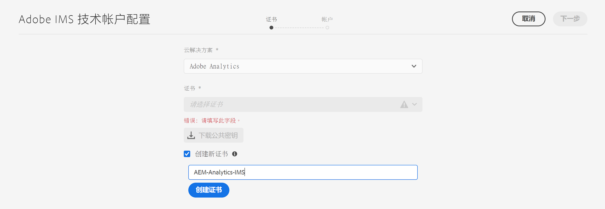
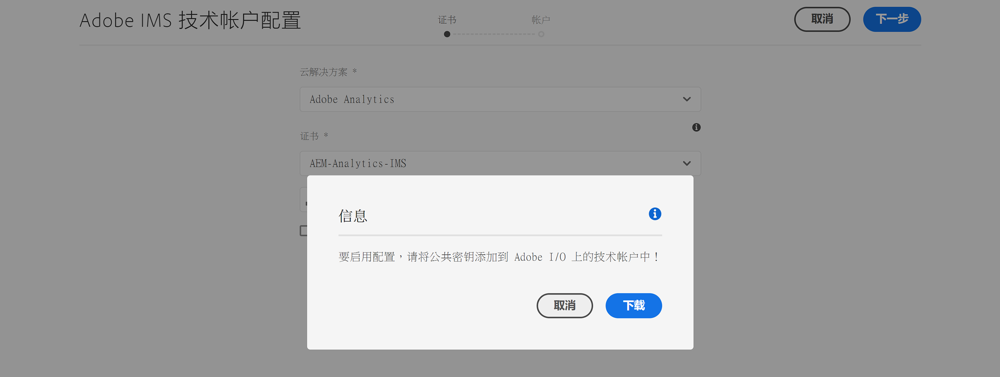
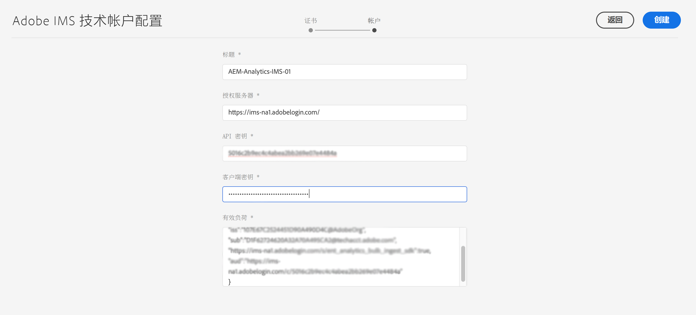
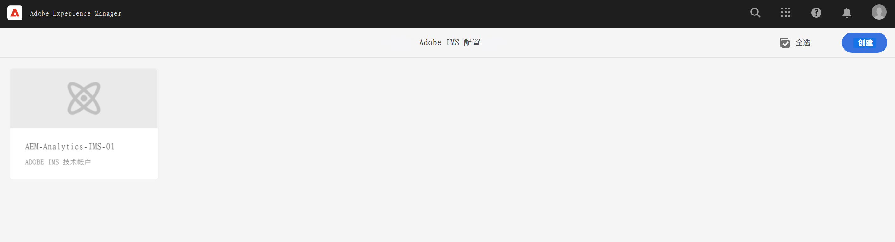
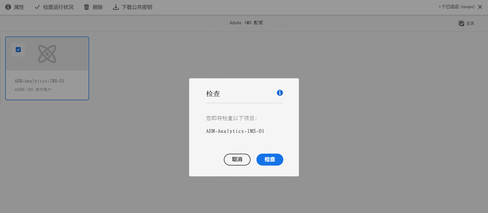

# 与 Adobe Analytics 集成时使用的 IMS 配置 {#ims-configuration-for-integration-with-adobe-analytics}

通过 Analytics Standard API 将 Adobe Experience Manager as a Cloud Service (AEMaaCS) 与 Adobe Analytics 集成需要配置 Adobe IMS (Identity Management System)。配置是通过 Adobe Developer Console 实现的。

>[!NOTE]
>
>AEMaaCS 2022.2.0 中新增了对 Adobe Analytics Standard API 2.0 的支持。此版本的 API 支持 IMS 身份验证。
>
>API 选择由用于 AEM/Analytics 集成的身份验证方法驱动。
>
>[迁移到 2.0 API](https://developer.adobe.com/analytics-apis/docs/2.0/guides/migration/) 下还提供了更多信息。

## 前提条件 {#prerequisites}

开始此过程之前：

* [Adobe 支持部门](https://helpx.adobe.com/cn/contact/enterprise-support.ec.html)必须针对以下项目配置您的帐户：

   * Adobe Console
   * Adobe Developer Console
   * Adobe Analytics 和
   * Adobe IMS (Identity Management System)

* 您组织的系统管理员应使用 Admin Console 将您组织中所需的开发人员添加到相关的产品配置文件中。

   * 这将向特定开发人员提供使用 Adobe Developer Console 启用集成的权限。
   * 有关更多详细信息，请参阅[管理开发人员](https://helpx.adobe.com/cn/enterprise/admin-guide.html/enterprise/using/manage-developers.ug.html)。

## 配置 IMS 配置 – 生成公钥 {#configuring-ims-generating-a-public-key}

配置的第一阶段是在 AEM 中创建 IMS 配置并生成公钥。

1. 在 AEM 中，打开&#x200B;**工具**&#x200B;菜单。
1. 在&#x200B;**安全性**&#x200B;部分中，选择 **Adobe IMS 配置**。
1. 选择&#x200B;**创建**，打开 **Adobe IMS 技术帐户配置**。
1. 使用&#x200B;**云配置**&#x200B;下的下拉列表，选择 **Adobe Analytics**。
1. 激活&#x200B;**新建证书**&#x200B;并输入新别名。
1. 选择&#x200B;**创建证书**&#x200B;来确认。

   

1. 选择&#x200B;**下载**（或&#x200B;**下载公钥**）将文件下载到本地驱动器，以便在[为 Adobe Analytics 与 AEM 的集成配置 IMS](#configuring-ims-adobe-analytics-integration-with-aem) 时方便使用。

   >[!CAUTION]
   >
   >将此配置保持开放状态，供[在 AEM 中完成 IMS 配置](#completing-the-ims-configuration-in-aem)时再次使用。

   

## 为 Adobe Analytics 与 AEM 的集成配置 IMS {#configuring-ims-adobe-analytics-integration-with-aem}

使用 Adobe Developer Console，您需要使用 Adobe Analytics（供 AEM 使用）创建项目（集成），然后分配所需的权限。

### 创建项目 {#creating-the-project}

打开 Adobe Developer Console 以使用 Adobe Analytics（将由 AEM 使用）创建项目：

1. 为项目打开 Adobe Developer Console：

   [https://developer.adobe.com/console/projects](https://developer.adobe.com/console/projects)

1. 将显示您拥有的任何项目。选择&#x200B;**新建项目** – 位置和使用将取决于：

   * 如果您不具有任何项目，**新建项目**将位于底部中心。
      
   * 如果您已拥有项目，这些项目将列出，**新建项目**将位于右上方。
      

1. 依次选择 **添加到项目**&#x200B;和 **API**：

   

1. 依次选择 **Adobe Analytics** 和&#x200B;**下一步**：

   >[!NOTE]
   >
   >如果您已订阅 Adobe Analytics，但它并未列出，您应查看[先决条件](#prerequisites)。

   

1. 选择&#x200B;**服务帐户 (JWT)** 作为身份验证类型，然后选择&#x200B;**下一步**：

   

1. **上传公钥**，完成后，选择&#x200B;**下一步**：

   

1. 查看凭据，然后选择&#x200B;**下一步**：

   

1. 选择所需的产品配置文件，然后选择&#x200B;**保存配置的 API**：

   

1. 这将确认配置。

### 将权限分配给集成 {#assigning-privileges-to-the-integration}

您现在必须将所需权限分配给集成：

1. 打开 Adobe **Admin Console**：

   * [https://adminconsole.adobe.com](https://adminconsole.adobe.com/)

1. 导航到&#x200B;**产品**（顶部工具栏），然后选择 **Adobe Analytics – &lt;*your-tenant-id*>**（从左侧面板）。
1. 选择&#x200B;**产品配置文件**，然后从提供的列表中选择所需的工作区。例如，默认工作区。
1. 选择 **API 凭据**，然后选择所需的集成配置。
1. 选择&#x200B;**编辑者**&#x200B;作为&#x200B;**产品角色**；而不是选择&#x200B;**观察者**。

## 为 Adobe Developer Console 集成项目存储的详细信息 {#details-stored-for-the-ims-integration-project}

从“Adobe Developer Console – 项目”中，您可以查看所有集成项目的列表：

* [https://developer.adobe.com/console/projects](https://developer.adobe.com/console/projects)

选择特定项目条目以显示有关配置的更多详细信息。其中包括：

* 项目概述
* 见解
* 凭据
   * 服务帐户 (JWT)
      * 凭据详细信息
      * 生成 JWT
* APIS
   * 例如，Adobe Analytics

要在基于 IMS 的 AEM 中完成 Adobe Analytics 的集成，您需要其中的一些项。

## 在 AEM 中完成 IMS 配置 {#completing-the-ims-configuration-in-aem}

通过返回到 AEM，您可以添加针对 Analytics 的 IMS 集成中所需的值来完成 IMS 配置：

1. 返回到 [AEM 中打开的 IMS 配置](#configuring-ims-generating-a-public-key)。
1. 选择&#x200B;**下一步**。

1. 在这里，您可以使用 [Adobe Developer Console 中项目配置的详细信息](#details-stored-for-the-ims-integration-project)：

   * **标题**：您的文本。
   * **授权服务器**：复制并粘贴以下&#x200B;**有效负载**&#x200B;部分的 `aud` 行的内容，例如，下面的示例中的 `https://ims-na1.adobelogin.com`
   * **API 密钥**：从[项目概述](#details-stored-for-the-ims-integration-project)的&#x200B;**凭据**&#x200B;部分中复制此密钥
   * **客户端密码**：在[“服务帐户 (JWT)”部分的“客户端密码”选项卡](#details-stored-for-the-ims-integration-project)生成此密码并进行复制
   * **有效负载**：从[“服务帐户 (JWT)”部分的“生成 JWT”选项卡](#details-stored-for-the-ims-integration-project)复制有效负载

   

1. 选择&#x200B;**创建**&#x200B;来确认。

1. 您的 Adobe Analytics 配置将显示在 AEM 控制台中。

   

## 确认 IMS 配置 {#confirming-the-ims-configuration}

要确认配置是否按预期运行，请执行以下操作：

1. 打开：

   * `https://localhost<port>/libs/cq/adobeims-configuration/content/configurations.html`

   例如：

   * `https://localhost:4502/libs/cq/adobeims-configuration/content/configurations.html`

1. 选择您的配置。
1. 从工具栏中选择&#x200B;**检查运行状况**，然后选择&#x200B;**查看**。

   

1. 如果成功，您将看到一条确认消息。

## 完成与 Adobe Analytics 的集成 {#complete-the-integration-with-adobe-analytics}

您现在可以使用此 IMS 配置来完成[与 Adobe Analytics 的集成](/help/sites-cloud/integrating/integrating-adobe-analytics.md)。

<!--
## Configuring the Adobe Analytics Cloud Service {#configuring-the-adobe-analytics-cloud-service}

The configuration can now be referenced for a Cloud Service to use the Analytics Standard API:

1. Open the **Tools** menu. Then, within the **Cloud Services** section, select **Legacy Cloud Services**.
1. Scroll down to **Adobe Analytics** and select **Configure now**.

   The **Create Configuration** dialog will open.

1. Enter a **Title** and, if you want, a **Name** (if left blank this will be generated from the title).

   You can also select the required template (if more than one is available).

1. Confirm with **Create**.

   The **Edit Component** dialog will open.

1. Enter the details in the **Analytics Settings** tab:

    * **Authentication**: IMS

    * **IMS Configuration**: select the name of the IMS Configuration

1. Click **Connect to Analytics** to initialize the connection with Adobe Analytics.

   If the connection is successful, the message **Connection successful** is displayed.

1. Select **OK** on the message.

1. Complete other parameters as required, followed by **OK** on the dialog to confirm the configuration.

1. You can now proceed to [Adding an Analytics Framework](/help/sites-administering/adobeanalytics-connect.md) to configure parameters that will be sent to Adobe Analytics. 
-->
