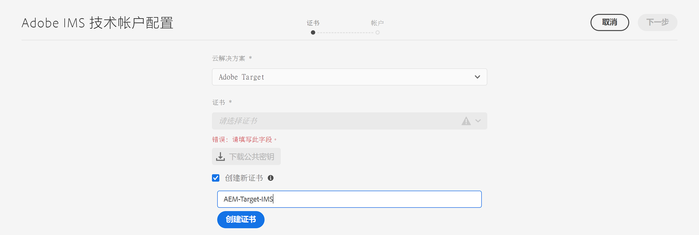
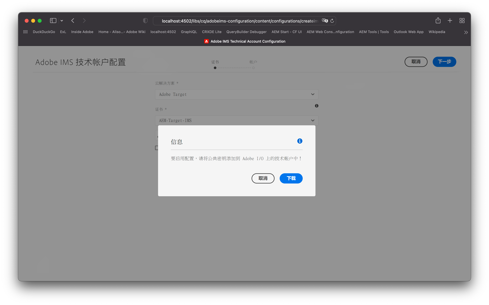
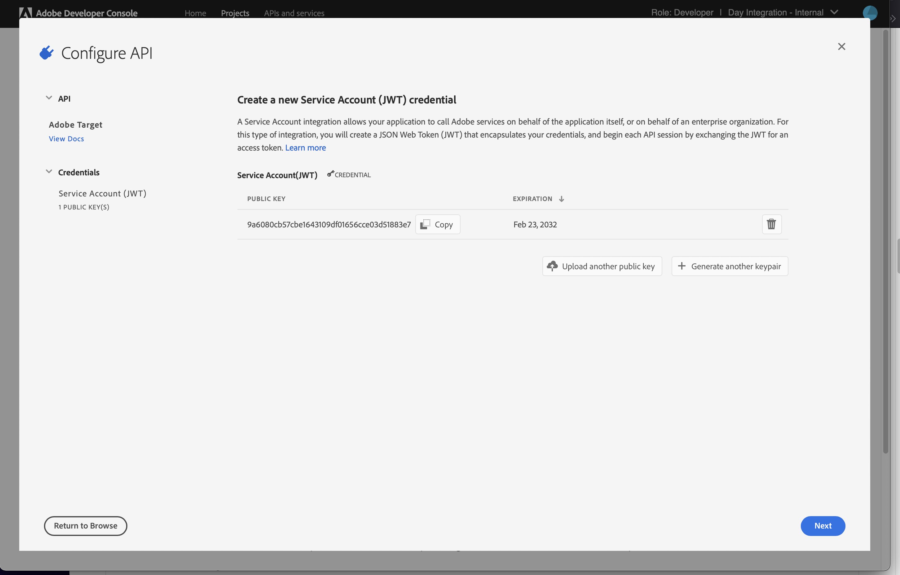
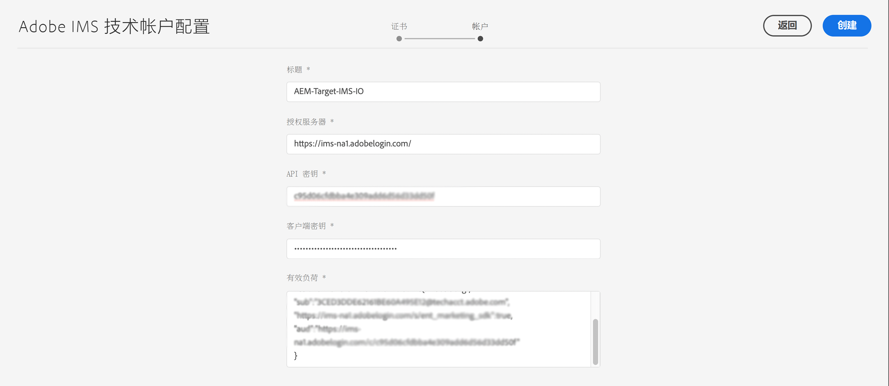
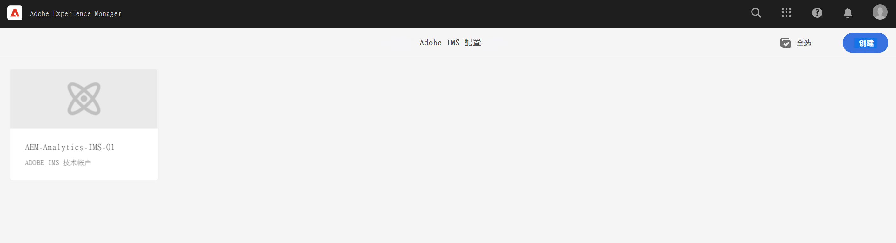
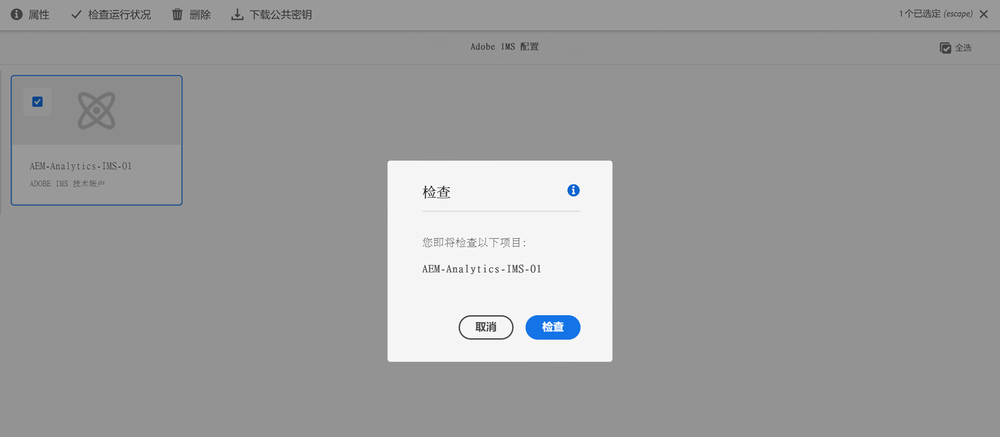

# 与 Adobe Target 集成时使用的 IMS 配置{#ims-configuration-for-integration-with-adobe-target}

通过 Target Standard API 将 AEM 与 Adobe Target 集成需要配置 Adobe IMS (Identity Management System)。配置是通过 Adobe Developer Console 实现的。

>[!NOTE]
>
>AEMaaCS 中新增了对 Adobe Target Standard API 的支持。Target Standard API 使用 IMS 身份验证。
>
>API 选择由用于 AEM/Target 集成的身份验证方法驱动。

## 前提条件 {#prerequisites}

开始此过程之前：

* [Adobe 支持部门](https://helpx.adobe.com/cn/contact/enterprise-support.ec.html)必须针对以下项目配置您的帐户：

   * Adobe Console
   * Adobe Developer Console
   * Adobe Target 和
   * Adobe IMS (Identity Management System)

* 您组织的系统管理员应使用 Admin Console 将您组织中所需的开发人员添加到相关的产品配置文件中。

   * 这将向特定开发人员提供使用 Adobe Developer Console 启用集成的权限。
   * 有关更多详细信息，请参阅[管理开发人员](https://helpx.adobe.com/cn/enterprise/admin-guide.html/enterprise/using/manage-developers.ug.html)。

## 配置 IMS 配置 – 生成公钥 {#configuring-an-ims-configuration-generating-a-public-key}

配置的第一阶段是在 AEM 中创建 IMS 配置并生成公钥。

1. 在 AEM 中，打开&#x200B;**工具**&#x200B;菜单。
1. 在&#x200B;**安全性**&#x200B;部分中，选择 **Adobe IMS 配置**。
1. 选择&#x200B;**创建**，打开 **Adobe IMS 技术帐户配置**。
1. 使用&#x200B;**云配置**&#x200B;下的下拉列表，选择 **Adobe Target**。
1. 激活&#x200B;**新建证书**&#x200B;并输入新别名。
1. 选择&#x200B;**创建证书**&#x200B;来确认。

   

1. 选择&#x200B;**下载**（或&#x200B;**下载公钥**）以将文件下载到本地驱动器，以便在[为 Adobe Target 与 AEM 的集成配置 IMS](#configuring-ims-adobe-target-integration-with-aem) 时方便使用。

   >[!CAUTION]
   >
   >将此配置保持开放状态，供[在 AEM 中完成 IMS 配置](#completing-the-ims-configuration-in-aem)时再次使用。

   

## 为 Adobe Target 与 AEM 的集成配置 IMS {#configuring-ims-adobe-target-integration-with-aem}

将 Adobe Developer Console 项目与 AEM 将使用的 Adobe Target 集成，然后分配所需的权限。

### 创建项目 {#creating-the-project}

打开 Adobe Developer Console 以使用 Adobe Target（将由 AEM 使用）创建项目：

1. 为项目打开 Adobe Developer Console：

   [https://developer.adobe.com/console/projects](https://developer.adobe.com/console/projects)

1. 将显示您拥有的任何项目。选择&#x200B;**新建项目** – 位置和使用将取决于：

   * 如果您不具有任何项目，**新建项目**将位于底部中心。
      
   * 如果您已拥有项目，这些项目将列出，**新建项目**将位于右上方。
      

1. 依次选择 **添加到项目**&#x200B;和 **API**：

   

1. 依次选择 **Adobe Target** 和&#x200B;**下一步**：

   >[!NOTE]
   >
   >如果您已订阅 Adobe Target，但它并未列出，您应查看[先决条件](#prerequisites)。

   

1. **上传公钥**，完成后，选择&#x200B;**下一步**：

   

1. 查看凭据，然后选择&#x200B;**下一步**：

   

1. 选择所需的产品配置文件，然后选择&#x200B;**保存配置的 API**：

   >[!NOTE]
   >
   >显示的产品配置文件取决于您是否拥有：
   >
   >* Adobe Target Standard – 仅&#x200B;**默认工作区**&#x200B;可用
   >* Adobe Target Premium – 列出了所有可用的工作区，如下所示

   

1. 这将确认创建。

<!--
1. The creation will be confirmed, you can now **Continue to integration details**; these are needed for [Completing the IMS Configuration in AEM](#completing-the-ims-configuration-in-aem).

   
-->

<!-- could not verify - only saw Adobe Target Classic -->

### 将权限分配给集成 {#assigning-privileges-to-the-integration}

您现在必须将所需权限分配给集成：

1. 打开 Adobe **Admin Console**：

   * [https://adminconsole.adobe.com](https://adminconsole.adobe.com/)

1. 导航到&#x200B;**产品**（顶部工具栏），然后选择 **Adobe Target – &lt;*your-tenant-id*>**（从左侧面板）。
1. 选择&#x200B;**产品配置文件**，然后从提供的列表中选择所需的工作区。例如，默认工作区。
1. 选择 **API 凭据**，然后选择所需的集成配置。
1. 选择&#x200B;**编辑者**&#x200B;作为&#x200B;**产品角色**；而不是选择&#x200B;**观察者**。

## 为 Adobe Developer Console 集成项目存储的详细信息 {#details-stored-for-the-ims-integration-project}

从“Adobe Developer Console 项目”控制台中，您可以查看所有集成项目的列表：

* [https://developer.adobe.com/console/projects](https://developer.adobe.com/console/projects)

选择&#x200B;**查看**（特定项目条目右侧）以显示有关配置的更多详细信息。其中包括：

* 项目概述
* 见解
* 凭据
   * 服务帐户 (JWT)
      * 凭据详细信息
      * 生成 JWT
* APIS
   * 例如，Adobe Target

要在基于 IMS 的 AEM 中完成 Adobe Target 的集成，您需要其中的一些项。

## 在 AEM 中完成 IMS 配置 {#completing-the-ims-configuration-in-aem}

通过返回到 AEM，您可以添加针对 Target 的 IMS 集成中所需的值来完成 IMS 配置：

1. 返回到 [AEM 中打开的 IMS 配置](#configuring-an-ims-configuration-generating-a-public-key)。
1. 选择&#x200B;**下一步**。

1. 在这里，您可以使用 [Adobe Developer Console 中项目配置的详细信息](#details-stored-for-the-ims-integration-project)：

   * **标题**：您的文本。
   * **授权服务器**：复制并粘贴以下&#x200B;**有效负载**&#x200B;部分的 `aud` 行的内容，例如，下面的示例中的 `https://ims-na1.adobelogin.com`
   * **API 密钥**：从项目[概述](#details-stored-for-the-ims-integration-project)部分中复制此密钥
   * **客户端密码**：在项目[概述](#details-stored-for-the-ims-integration-project)部分中生成此密码并进行复制
   * **有效负载**：从[生成 JWT](#details-stored-for-the-ims-integration-project) 部分中复制此有效负载

   

1. 选择&#x200B;**创建**&#x200B;来确认。

1. 您的 Adobe Target 配置将显示在 AEM 控制台中。

   

## 确认 IMS 配置 {#confirming-the-ims-configuration}

要确认配置是否按预期运行，请执行以下操作：

1. 打开：

   * `https://localhost<port>/libs/cq/adobeims-configuration/content/configurations.html`

   例如：

   * `https://localhost:4502/libs/cq/adobeims-configuration/content/configurations.html`

1. 选择您的配置。
1. 从工具栏中选择&#x200B;**检查运行状况**，然后选择&#x200B;**查看**。

   

1. 如果成功，您将看到一条确认消息。

## 完成与 Adobe Target 的集成 {#complete-the-integration-with-adobe-target}

您现在可以使用此 IMS 配置来完成[与 Adobe Target 的集成](/help/sites-cloud/integrating/integrating-adobe-target.md)。

<!--

## Configuring the Adobe Target Cloud Service {#configuring-the-adobe-target-cloud-service}

The configuration can now be referenced for a Cloud Service to use the Target Standard API:

1. Open the **Tools** menu. Then, within the **Cloud Services** section, select **Legacy Cloud Services**.
1. Scroll down to **Adobe Target** and select **Configure now**.

   The **Create Configuration** dialog will open.

1. Enter a **Title** and, if you want, a **Name** (if left blank this will be generated from the title).

   You can also select the required template (if more than one is available).

1. Confirm with **Create**.

   The **Edit Component** dialog will open.

1. Enter the details in the **Adobe Target Settings** tab:

    * **Authentication**: IMS

    * **Client Code**: See the [Tenant ID and Client Code](#tenant-client) section.

    * **Tenant ID**: the Adobe IMS Tenant ID. See also the [Tenant ID and Client Code](#tenant-client) section.

      >[!NOTE]
      >
      >For IMS this value needs to be taken from Target itself. You can log into Target and extract the Tenant ID from the URL.
      >
      >For example, if the URL is:
      >
      >`https://experience.adobe.com/#/@yourtenantid/target/activities`
      >
      >Then you would use `yourtenantid`.

    * **IMS Configuration**: select the name of the IMS Configuration

    * **API Type**: REST

    * **A4T Analytics Cloud Configuration**: Select the Analytics cloud configuration that is used for target activity goals and metrics. You need this if you are using Adobe Analytics as the reporting source when targeting content.   

      <!--
      If you do not see your cloud configuration, see note in [Configuring A4T Analytics Cloud Configuration](/help/sites-administering/target-configuring.md#configuring-a-t-analytics-cloud-configuration).
      -- >

    * **Use accurate targeting**: By default this check box is selected. If selected, the cloud service configuration will wait for the context to load before loading content. See note that follows.

    * **Synchronize segments from Adobe Target**: Select this option to download segments that are defined in Target to use them in AEM. You must select this option when the API Type property is REST, because inline segments are not supported and you always need to use segments from Target. (Note that the AEM term of 'segment' is equivalent to the Target 'audience'.)

    * **Client library**: Select whether you want the AT.js client library, or mbox.js (deprecated).

    * **Use Tag Management System to deliver client library**: Use DTM (deprecated), Adobe Launch or any other tag management system.

    * **Custom AT.js**: Leave blank if you checked the Tag Management box or to use the default AT.js. Alternatively upload your custom AT.js. Only appears if you have selected AT.js.

   <!--
   >[!NOTE]
   >
   >[Configuration of a Cloud Service to use the Target Classic API](/help/sites-administering/target-configuring.md#manually-integrating-with-adobe-target) has been deprecated (uses the Adobe Recommendations Settings tab).
   -- >

1. Click **Connect to Adobe Target** to initialize the connection with Adobe Target.

   If the connection is successful, the message **Connection successful** is displayed.

1. Select **OK** on the message, followed by **OK** on the dialog to confirm the configuration.

1. You can now proceed to [Adding a Target Framework](/help/sites-administering/target-configuring.md#adding-a-target-framework) to configure ContextHub or ClientContext parameters that will be sent to Target. Note this may not be required for exporting AEM Experience Fragments to Target.

### Tenant ID and Client Code {#tenant-client}

With [Adobe Experience Manager as a Cloud Service](/help/release-notes/release-notes-cloud/release-notes-current.md), the Client Code field had been added to the Target configuration window.

When configuring the Tenant ID and Client Code fields, please be aware of that for most customers, the **Tenant ID** and the **Client Code** are the same. This means that both fields contain the same information and are identical. Make sure you enter the Tenant ID in both fields.

>[!NOTE]
>
>For legacy purposes, you can also enter different values in the Tenant ID and the Client Code fields.

In both cases, be aware that:

* By default, the Client Code (if added first) will also be automatically copied into the Tenant ID field.
* You have the option to change the default Tenant ID set.
* Accordingly, the backend calls to Target will be based on the **Tenant ID** and the client side calls to Target will be based on the **Client Code**.

As stated previously, the default case is the most common for AEM as a Cloud Service. Either way, make sure **both** fields contain the correct information depending on your requirements.

>[!NOTE]
>
> If you want to change an existing Target Configuration:
>
> 1. Re-enter the Tenant ID.
> 2. Re-connect to Target.
> 3. Save the configuration.
-->
