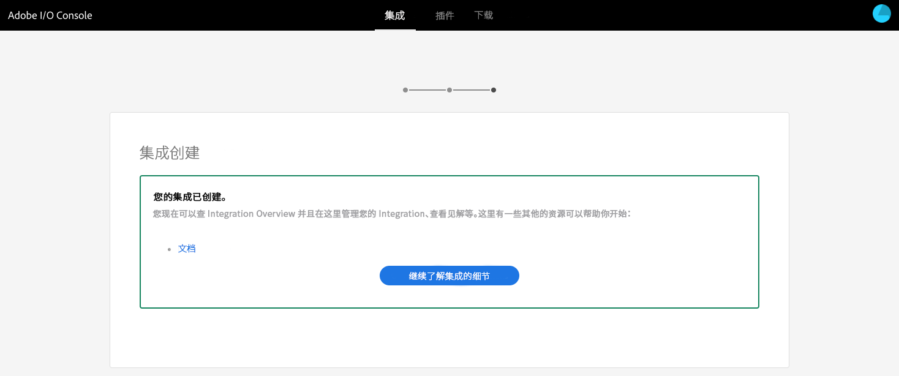

# 与Adobe Target集成时使用的IMS配置{#ims-configuration-for-integration-with-adobe-target}

要通过Target Standard API将AEM与Adobe Target集成，需要配置Adobe IMS(Identity Management系统)。 配置可通过Adobe开发人员控制台实现。

>[!NOTE]
>
>AEMaCS中新增了对Adobe Target Standard API的支持。 Target Standard API使用IMS身份验证。
>
>API选择由用于AEM/Target集成的身份验证方法驱动。

## 前提条件 {#prerequisites}

在开始此过程之前：

* [Adobe支持](https://helpx.adobe.com/cn/contact/enterprise-support.ec.html) 必须为您的帐户配置：

   * Adobe控制台
   * Adobe Developer Console
   * Adobe Target和
   * Adobe IMS(Identity Management系统)

* 贵组织的系统管理员应使用Admin Console将组织中所需的开发人员添加到相关的产品配置文件中。

   * 这为特定开发人员提供了使用Adobe开发人员控制台启用集成的权限。
   * 有关更多详细信息，请参阅 [管理开发人员](https://helpx.adobe.com/enterprise/admin-guide.html/enterprise/using/manage-developers.ug.html).

## 配置IMS配置 — 生成公钥 {#configuring-an-ims-configuration-generating-a-public-key}

配置的第一步是在AEM中创建IMS配置并生成公钥。

1. 在AEM中，打开 **工具** 菜单。
1. 在 **安全性** 部分选择 **Adobe IMS配置**.
1. 选择 **创建** 打开 **Adobe IMS技术帐户配置**.
1. 使用下拉菜单 **云配置**，选择 **Adobe Target**.
1. 激活 **创建新证书** 并输入新别名。
1. 使用确认 **创建证书**.

   

1. 选择 **下载** (或 **下载公钥**)将文件下载到本地驱动器，以便在 [为Adobe Target与AEM集成配置IMS](#configuring-ims-adobe-target-integration-with-aem).

   >[!CAUTION]
   >
   >保持此配置处于打开状态，在 [在AEM中完成IMS配置](#completing-the-ims-configuration-in-aem).

   

## 为Adobe Target与AEM集成配置IMS {#configuring-ims-adobe-target-integration-with-aem}

Adobe开发人员控制台项目（集成）与AEM将使用的Adobe Target ，然后分配所需的权限。

### 创建项目 {#creating-the-project}

打开Adobe开发人员控制台，以使用AEM将使用的Adobe Target创建项目：

1. 打开项目的Adobe开发人员控制台：

   [https://developer.adobe.com/console/projects](https://developer.adobe.com/console/projects)

1. 您所有的项目都将显示出来。 选择 **创建新项目**  — 位置和使用情况取决于：

   * 如果您还没有任何项目， **创建新项目** 中间，底部。
      
   * 如果您已经拥有现有项目，则将列出这些项目，并 **创建新项目** 右上方。
      

1. 选择 **添加到项目** 后跟 **API**:

   

1. 选择 **Adobe Target**，则 **下一个**:

   >[!NOTE]
   >
   >如果您订阅了Adobe Target，但未在列表中看到它，则应查看 [先决条件](#prerequisites).

   

1. **上传您的公钥**，完成后，继续 **下一个**:

   

1. 查看凭据，并继续 **下一个**:

   

1. 选择所需的产品配置文件，然后继续 **保存配置的API**:

   >[!NOTE]
   >
   >显示的产品配置文件取决于您是否具有：
   >
   >* Adobe Target Standard — 仅 **默认工作区** 可用
   >* Adobe Target Premium — 列出了所有可用工作区，如下所示

   

1. 将确认创建。

<!--
1. The creation will be confirmed, you can now **Continue to integration details**; these are needed for [Completing the IMS Configuration in AEM](#completing-the-ims-configuration-in-aem).

   
-->

<!-- could not verify - only saw Adobe Target Classic -->

### 为集成分配权限 {#assigning-privileges-to-the-integration}

您现在必须为集成分配所需的权限：

1. 打开Adobe **Admin Console**:

   * [https://adminconsole.adobe.com](https://adminconsole.adobe.com/)

1. 导航到 **产品** （顶部工具栏），然后选择 **Adobe Target - &lt;*your-tenant-id*>** （从左侧面板）。
1. 选择 **产品配置文件**，则会从显示的列表中找到所需的工作区。 例如，默认工作区。
1. 选择 **API凭据**，则是所需的集成配置。
1. 选择 **编辑器** 作为 **产品角色**;而不是 **观察者**.

## 存储的Adobe开发人员控制台集成项目的详细信息 {#details-stored-for-the-ims-integration-project}

从Adobe开发人员控制台项目控制台中，您可以看到所有集成项目的列表：

* [https://developer.adobe.com/console/projects](https://developer.adobe.com/console/projects)

选择 **查看** （位于特定项目条目的右侧）以显示有关配置的更多详细信息。 这些功能包括：

* 项目概述
* 分析
* 凭据
   * 服务帐户(JWT)
      * 凭据详细信息
      * 生成JWT
* API
   * 例如，Adobe Target

其中一些功能需要基于IMS完成AEM中Adobe Target的集成。

## 在AEM中完成IMS配置 {#completing-the-ims-configuration-in-aem}

返回到AEM后，您可以通过从Target的IMS集成添加所需值来完成IMS配置：

1. 返回到 [在AEM中打开IMS配置](#configuring-an-ims-configuration-generating-a-public-key).
1. 选择&#x200B;**下一步**。

1. 在此，您可以使用 [有关Adobe开发人员控制台中项目配置的详细信息](#details-stored-for-the-ims-integration-project):

   * **标题**:你的短信。
   * **授权服务器**:从 `aud` 行 **负载** ，例如 `https://ims-na1.adobelogin.com` 在以下示例中
   * **API密钥**:从项目中复制此代码 [概述](#details-stored-for-the-ims-integration-project) 部分
   * **客户端密钥**:在项目中生成此代码 [概述](#details-stored-for-the-ims-integration-project) 部分和复制
   * **负载**:从 [生成JWT](#details-stored-for-the-ims-integration-project) 部分

   

1. 选择&#x200B;**创建**&#x200B;来确认。

1. 您的Adobe Target配置将显示在AEM控制台中。

   

## 确认IMS配置 {#confirming-the-ims-configuration}

要确认配置可按预期运行，请执行以下操作：

1. 打开：

   * `https://localhost<port>/libs/cq/adobeims-configuration/content/configurations.html`

   例如：

   * `https://localhost:4502/libs/cq/adobeims-configuration/content/configurations.html`

1. 选择您的配置。
1. 选择 **检查运行状况** ，然后 **检查**.

   

1. 如果成功，您将看到一条确认消息。

## 完成与Adobe Target的集成 {#complete-the-integration-with-adobe-target}

您现在可以使用此IMS配置来完成 [与Adobe Target集成](/help/sites-cloud/integrating/integrating-adobe-target.md).

<!--

## Configuring the Adobe Target Cloud Service {#configuring-the-adobe-target-cloud-service}

The configuration can now be referenced for a Cloud Service to use the Target Standard API:

1. Open the **Tools** menu. Then, within the **Cloud Services** section, select **Legacy Cloud Services**.
1. Scroll down to **Adobe Target** and select **Configure now**.

   The **Create Configuration** dialog will open.

1. Enter a **Title** and, if you want, a **Name** (if left blank this will be generated from the title).

   You can also select the required template (if more than one is available).

1. Confirm with **Create**.

   The **Edit Component** dialog will open.

1. Enter the details in the **Adobe Target Settings** tab:

    * **Authentication**: IMS

    * **Client Code**: See the [Tenant ID and Client Code](#tenant-client) section.

    * **Tenant ID**: the Adobe IMS Tenant ID. See also the [Tenant ID and Client Code](#tenant-client) section.

      >[!NOTE]
      >
      >For IMS this value needs to be taken from Target itself. You can log into Target and extract the Tenant ID from the URL.
      >
      >For example, if the URL is:
      >
      >`https://experience.adobe.com/#/@yourtenantid/target/activities`
      >
      >Then you would use `yourtenantid`.

    * **IMS Configuration**: select the name of the IMS Configuration

    * **API Type**: REST

    * **A4T Analytics Cloud Configuration**: Select the Analytics cloud configuration that is used for target activity goals and metrics. You need this if you are using Adobe Analytics as the reporting source when targeting content.   

      <!--
      If you do not see your cloud configuration, see note in [Configuring A4T Analytics Cloud Configuration](/help/sites-administering/target-configuring.md#configuring-a-t-analytics-cloud-configuration).
      -- >

    * **Use accurate targeting**: By default this check box is selected. If selected, the cloud service configuration will wait for the context to load before loading content. See note that follows.

    * **Synchronize segments from Adobe Target**: Select this option to download segments that are defined in Target to use them in AEM. You must select this option when the API Type property is REST, because inline segments are not supported and you always need to use segments from Target. (Note that the AEM term of 'segment' is equivalent to the Target 'audience'.)

    * **Client library**: Select whether you want the AT.js client library, or mbox.js (deprecated).

    * **Use Tag Management System to deliver client library**: Use DTM (deprecated), Adobe Launch or any other tag management system.

    * **Custom AT.js**: Leave blank if you checked the Tag Management box or to use the default AT.js. Alternatively upload your custom AT.js. Only appears if you have selected AT.js.

   <!--
   >[!NOTE]
   >
   >[Configuration of a Cloud Service to use the Target Classic API](/help/sites-administering/target-configuring.md#manually-integrating-with-adobe-target) has been deprecated (uses the Adobe Recommendations Settings tab).
   -- >

1. Click **Connect to Adobe Target** to initialize the connection with Adobe Target.

   If the connection is successful, the message **Connection successful** is displayed.

1. Select **OK** on the message, followed by **OK** on the dialog to confirm the configuration.

1. You can now proceed to [Adding a Target Framework](/help/sites-administering/target-configuring.md#adding-a-target-framework) to configure ContextHub or ClientContext parameters that will be sent to Target. Note this may not be required for exporting AEM Experience Fragments to Target.

### Tenant ID and Client Code {#tenant-client}

With [Adobe Experience Manager as a Cloud Service](/help/release-notes/release-notes-cloud/release-notes-current.md), the Client Code field had been added to the Target configuration window.

When configuring the Tenant ID and Client Code fields, please be aware of that for most customers, the **Tenant ID** and the **Client Code** are the same. This means that both fields contain the same information and are identical. Make sure you enter the Tenant ID in both fields.

>[!NOTE]
>
>For legacy purposes, you can also enter different values in the Tenant ID and the Client Code fields.

In both cases, be aware that:

* By default, the Client Code (if added first) will also be automatically copied into the Tenant ID field.
* You have the option to change the default Tenant ID set.
* Accordingly, the backend calls to Target will be based on the **Tenant ID** and the client side calls to Target will be based on the **Client Code**.

As stated previously, the default case is the most common for AEM as a Cloud Service. Either way, make sure **both** fields contain the correct information depending on your requirements.

>[!NOTE]
>
> If you want to change an existing Target Configuration:
>
> 1. Re-enter the Tenant ID.
> 2. Re-connect to Target.
> 3. Save the configuration.
-->
