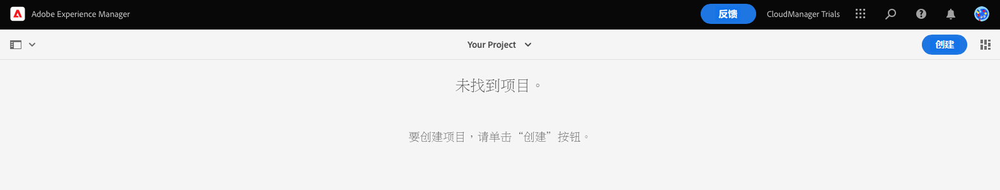
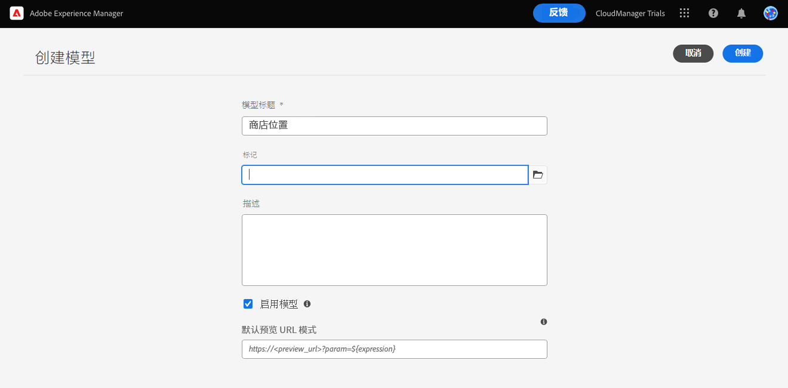
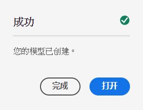
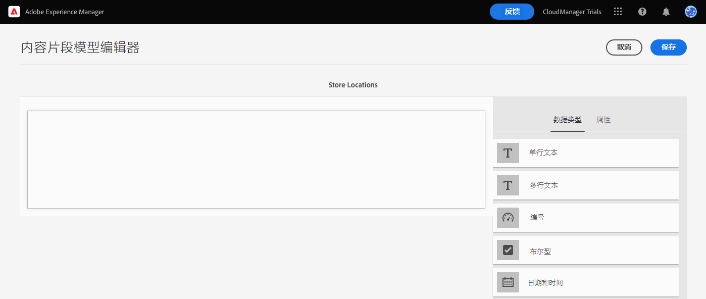
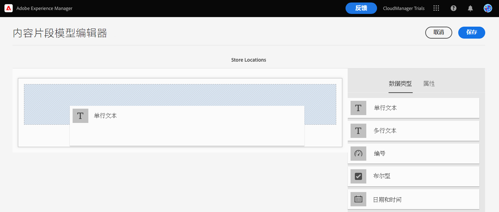
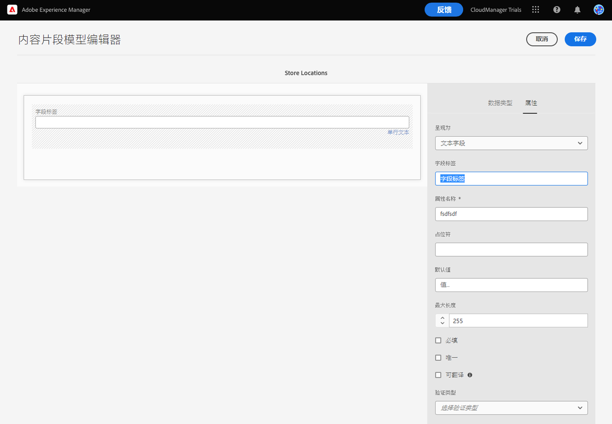
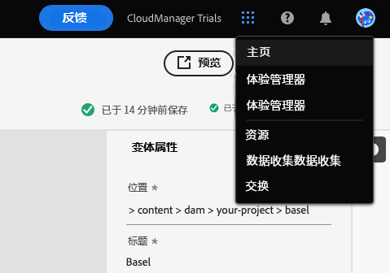

# 为您的应用程序创建内容结构 {#content-structure}

您可使用内容片段设计、创建、管理和发布独立于页面的内容。通过使用内容片段，您可以准备可在多个位置和多个渠道上使用且非常适合于 Headless 投放的内容。内容片段模型可用于定义此内容的结构，要管理您的 Headless 内容，必须先创建这些模型。

为了帮助您了解如何执行此操作，AEM 试用的本模块将通过一个快速的交互式导览（首先创建模型，然后添加其结构）引导您完成这一过程。本文档旨在对产品内导览进行补充，其中涵盖了相同的步骤，并会在适当时链接到其他资源。

>[!CONTEXTUALHELP]
>id="aemcloud_sites_trial_admin_content_fragments_overview"
>title="为您的应用程序创建内容结构"
>abstract="跟着我们的交互式指南系列，您将学习如何创建作为无头内容基础的结构（也称为内容片段模型）。"

>[!CONTEXTUALHELP]
>id="aemcloud_sites_trial_admin_content_fragments_overview_guide"
>title="启动模型编辑器"
>abstract="构建内容片段模型首先在模型管理工作流中创建模型项，然后使用内容片段模型编辑器向其中添加结构元素。  单击下方以在新选项卡中启动该功能，然后按照此学习文档创建您的第一个内容片段模型。"
>additional-url="https://video.tv.adobe.com/v/328618" text="介绍视频的占位符"

## 内容片段模型控制台 {#content-fragment-model-console}

从内容片段模型控制台开始操作。可以将内容片段模型控制台视为您的模型库。可使用该控制台创建新的模型和管理现有模型。您的控制台最初是空的，让我们创建一个新模型！

如果您想在应用程序内指南之外自行导航到内容片段模型控制台，可以使用页面左上角的 Adobe 图标来找到它。这将打开 AEM 全局导航。在此处，您可以选择&#x200B;**工具**&#x200B;选项卡，然后选择&#x200B;**常规** -> **内容片段模型**。

>[!TIP]
>
>如果您想详细了解 AEM 中的导航，请参阅本文档的[“其他资源”部分](#additional-resources)，了解有关 AEM 基本处理的更多信息。

## 创建模型 {#create-model}

在进入内容片段模型控制台后，您可以创建一个新模型来表示您自己的 Headless 内容。

1. 在内容片段模型控制台中，单击屏幕右上角的&#x200B;**创建**&#x200B;按钮开始创建内容片段模型。

1. 这将启动创建模型向导，该向导引导您完成内容片段模型的创建。

   

   提供必要信息。

   * **模型标题** – 这是模型的简短描述，通常指明了模型的用途。
   * **启用模型** – 此选项默认处于选中状态，必须选中它才能稍后基于此模型创建内容片段。

   您也可以选择为模型添加更长的&#x200B;**描述**，并添加&#x200B;**标记**&#x200B;以便稍后在内容片段模型控制台中为您的用户分类和区分模型。

   >[!TIP]
   >
   >如果您想了解如何通过标记来整理内容，请参阅本文档的[“其他资源”部分](#additional-resources)，了解有关在 AEM 中添加标记的更多信息。

1. 填充必填字段后，单击左上角的&#x200B;**创建**&#x200B;以创建模型。

1. **成功**&#x200B;对话框用于确认模型已创建。

   

1. 您还需要先定义模型的数据结构，之后才能使用模型。单击对话框中的&#x200B;**打开**，可打开它并继续定义模型。

## 将字段添加到模型 {#configure-model}

内容片段模型本质上是内容片段的架构。即，它定义了模型包含的字段/数据类型。

借助内容片段模型编辑器，您可以使用拖放界面为内容片段模型定义字段。

1. 从屏幕右侧的&#x200B;**数据类型**&#x200B;面板中拖动一个字段，并将该字段置于内容片段模型上。提供了多种数据类型以供选择，例如单行文本、多行文本、数字和对其他片段的参考。

   

   >[!TIP]
   >
   >如果您想了解有关对您可用的数据类型的更多信息，请参阅本文档的[“其他资源”部分](#additional-resources)，了解详细的内容片段模型文档。

1. 放置数据类型后，**数据类型**&#x200B;列将自动变为&#x200B;**属性**&#x200B;选项卡，您可以在其中定义刚刚放置的数据类型的详细信息。

   

   模型的属性可能包括字段名称、字段类型、字段长度、是否为必填字段等。

1. 使用所选数据类型的&#x200B;**属性**&#x200B;选项卡定义属性，例如默认值、最大长度、是否为必填字段等。

   >[!TIP]
   >
   >如果您想了解有关对您可用的属性的更多信息，请参阅本文档的[“其他资源”部分](#additional-resources)，了解详细的内容片段模型文档。

1. 添加内容片段模型所需的所有字段后，单击窗口右上角的&#x200B;**保存**。

1. 这将保存模型并返回到内容片段模型控制台，您可以在其中添加更多必要模型。

## 您已了解如何创建内容片段模型 {#conclusion}

在本模块中，您已了解如何创建内容片段模型来表示 Headless 数据的结构。首先，您创建了模型，然后用在模型中填充数据类型及其相关属性，从而为 Headless 内容定义架构。

现在，您已拥有自己的内容片段模型，可以使用该模型来创建内容片段了。[创建新内容](create-content.md)模块详细介绍了如何使用您的新内容片段模型来创建 Headless 内容。

您可以通过单击导航栏右上角的&#x200B;**解决方案**&#x200B;按钮并选择 **Experience Manager** 来返回到试用主屏幕。

## 其他资源 {#additional-resources}

有关内容片段和 AEM 的更多信息，请考虑查看本附加文档。

* [基本处理](/help/sites-cloud/authoring/getting-started/basic-handling.md) – 介绍新用户如何导航和使用 AEM 的文档
* [使用标记](/help/sites-cloud/authoring/features/tags.md) – 有关说明如何在 AEM 中使用标记来整理内容的文档
* [内容片段](/help/assets/content-fragments/content-fragments.md) – 内容片段概述以及有关内容片段的完整文档的链接
* [内容片段模型](/help/assets/content-fragments/content-fragments-models.md) – 有关内容片段模型的完整文档
* [内容片段模型 - 数据类型](/help/assets/content-fragments/content-fragments-models.md#data-types) – 有关对内容片段模型可用的各种数据类型的详细信息
* [内容片段模型 - 属性](/help/assets/content-fragments/content-fragments-models.md#data-types) – 有关对内容片段模型数据类型可用的各种属性的详细信息
