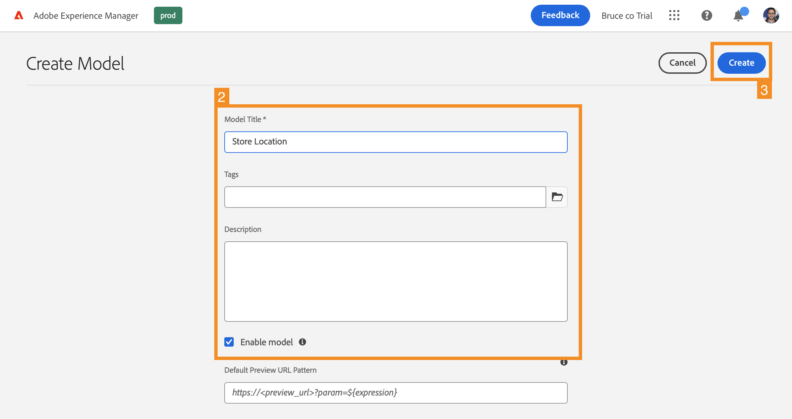

# 为您的应用程序创建内容结构 {#content-structure}

>[!CONTEXTUALHELP]
>id="aemcloud_sites_trial_admin_content_fragments_overview"
>title="为您的应用程序创建内容结构"
>abstract="跟着该交互式指南系列，您将学习如何创建作为无头内容基础的结构（也称为内容片段模型）。"

>[!CONTEXTUALHELP]
>id="aemcloud_sites_trial_admin_content_fragments_overview_guide"
>title="启动模型控制台"
>abstract="让我们探讨如何在 Adobe Experience Manager as a Cloud Service 中为您的内容创建一个可重复使用的架构，即内容片段模型。观看视频以了解为什么这一步很重要。  单击下方按钮在新选项卡中启动该模块，然后遵循该指南。"
>additional-url="https://video.tv.adobe.com/v/3413261" text="内容结构介绍视频"

>[!CONTEXTUALHELP]
>id="aemcloud_sites_trial_admin_content_fragments_overview_guide_footer"
>title="恭喜！您学习了如何创建内容片段模型来表示无头数据的结构，并迈出了以缩放和标准方式交付全渠道内容的第一步。"
>abstract=""

## 创建模型 {#create-model}

内容片段模型控制台将在新选项卡中打开。将内容片段模型控制台视为您的模型库，您可以在其中创建新模型和管理现有模型。

1. 单击屏幕右上角的&#x200B;**创建**&#x200B;按钮以开始创建内容片段模型。

1. 创建模型向导启动，并会指导您进行创建。提供必要信息。

   * **模型标题** – 这是模型的简短描述，通常指明了该模型的用途。
   * **启用模型** – 此选项默认处于选中状态，必须选中它才能基于此模型创建内容片段。

1. 填充必填字段后，单击左上角的&#x200B;**创建**&#x200B;以创建模型。

1. **成功**&#x200B;对话框用于确认模型已创建。单击对话框中的&#x200B;**打开**&#x200B;以在一个新选项卡的编辑器中打开新的内容片段模型。然后继续下一步，将数据字段添加到您的模型中。

## 将字段添加到模型 {#configure-model}

您需要先定义模型的数据结构，之后才能使用模型。内容片段模型编辑器是您配置用于定义模型内容的数据类型和属性的地方。

1. 从编辑器右侧的&#x200B;**数据类型**&#x200B;面板中拖动一个字段，并将该字段放置到您的内容片段模型上。

1. 放置数据类型后，**数据类型**&#x200B;列将自动变为&#x200B;**属性**&#x200B;选项卡，您可以在其中定义刚刚放置的数据类型的详细信息。

1. 添加内容片段模型所需的所有字段后，单击窗口右上角的&#x200B;**保存**。

1. 模型将进行保存，并且您将返回到内容片段模型控制台。

