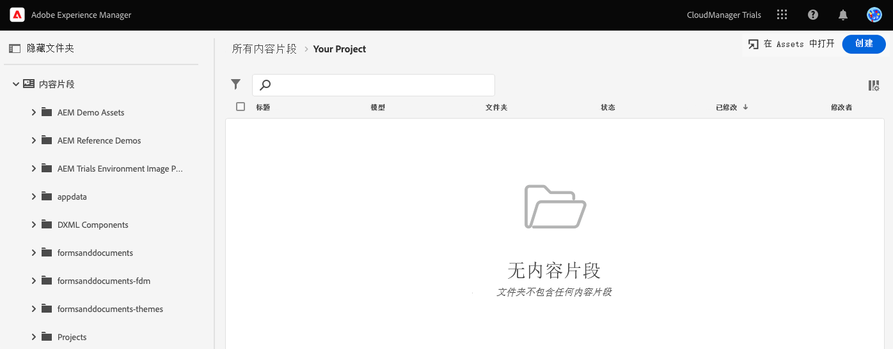
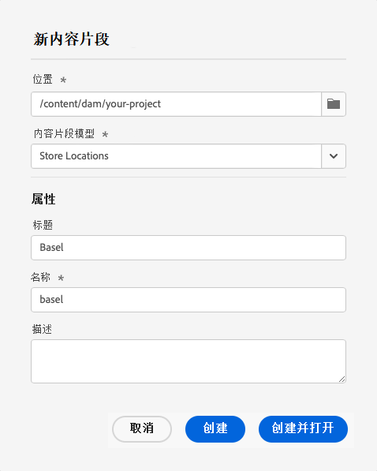
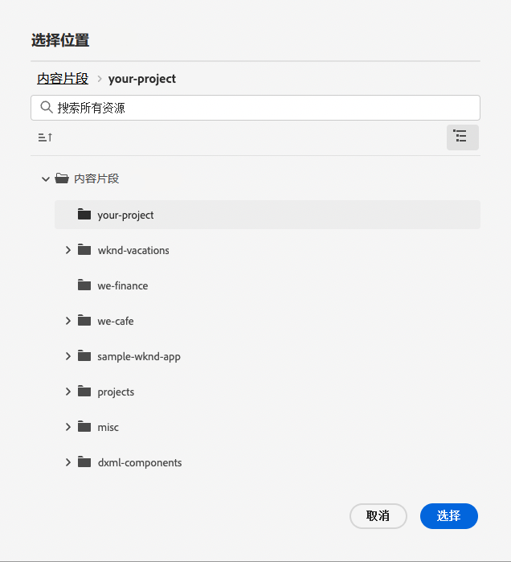
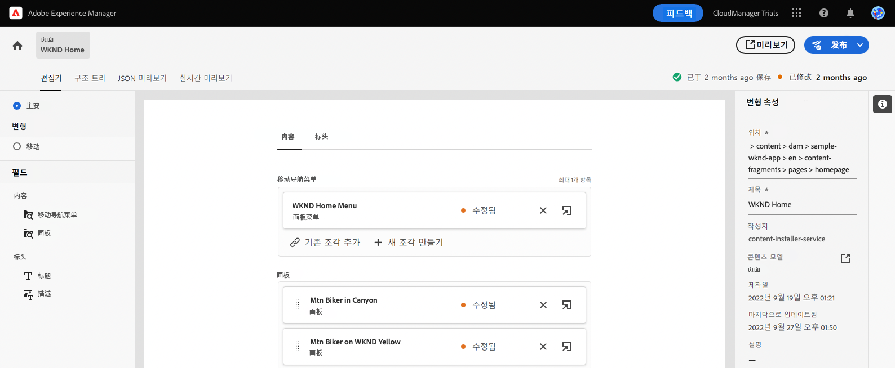
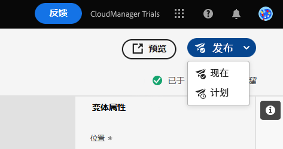
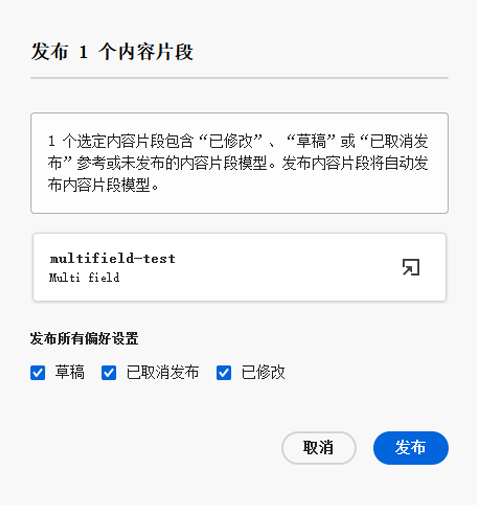
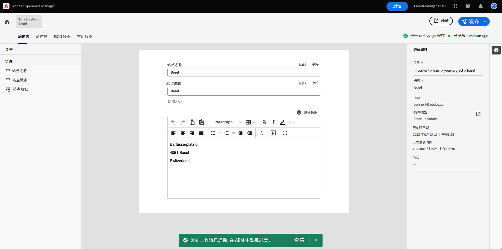
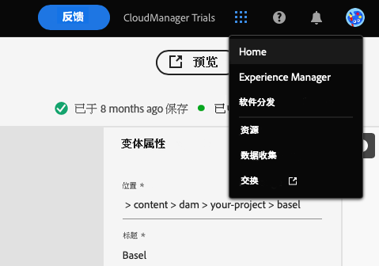

# 创建 Headless 内容 {#create-content}

通过遵循产品内学习模块，了解如何使用[您之前创建的内容片段模型](content-structure.md)来创建可用于页面创作或作为 Headless 内容基础的内容。本文档旨在对交互式导览进行补充，其中涵盖了相同的步骤，并会在适当时链接到其他资源。

## 内容片段 {#introduction}

在 AEM as a Cloud Service 中，内容片段是基于由内容片段模型定义的结构的 Headless 内容片段。您可以从内容片段控制台中开始创建自己的内容片段。可以将内容片段控制台视为您的 Headless 内容库。可使用该控制台创建新的内容片段和管理现有片段。您的控制台最初是空的，让我们创建一个新片段！

如果您想在应用程序内指南之外自行导航到内容片段控制台，可以使用页面左上角的 Adobe 图标来找到它。这将打开 AEM 全局导航。从该位置，选择&#x200B;**导航**&#x200B;选项卡，然后选择&#x200B;**内容片段**。

>[!TIP]
>
>如果您想详细了解 AEM 中的导航，请参阅本文档的[“其他资源”部分](#additional-resources)，了解有关 AEM 基本处理的更多信息。

## 创建内容片段 {#create-fragment}

内容片段表示您的 Headless 内容。但只能基于预定义的内容结构来创建它们。您之前创建的内容片段模型将用作该结构。

1. 点按或单击控制台右上角的&#x200B;**创建**&#x200B;按钮，打开&#x200B;**新建内容片段**&#x200B;对话框，并开始创建新的内容片段。

   

1. 如果您遵循应用程序内指南，则将自动填充&#x200B;**位置**。

   1. 如果您不遵循该指南，请使用路径浏览器选择项目文件夹。

   1. 在&#x200B;**新建内容片段**&#x200B;对话框中，点按或单击&#x200B;**位置**&#x200B;字段中的&#x200B;**选择位置**&#x200B;按钮（看起来像文件夹的图标）。

      
   * 或者，在单击&#x200B;**创建**&#x200B;之前，在内容片段控制台的左侧导航面板中选择路径。

1. 在&#x200B;**内容片段模型**&#x200B;下拉列表中，选择您之前创建的内容片段模型。

1. 为内容片段添加&#x200B;**标题**。

1. 点按或单击&#x200B;**创建并打开**。

## 内容片段编辑器 {#edit-fragment}

保存新的内容片段后，内容片段编辑器将打开，您可以在其中提供片段的实际内容。

1. 该编辑器显示您在所选模型中定义的字段。您可以在此处编辑这些字段以完成您的内容片段。您的进度将自动保存。

   

1. 如果内容片段模型包含多个字段，可以使用该编辑器左侧的&#x200B;**变量**&#x200B;面板快速跳转到任意字段。此处将标记有错误的字段。

1. 您需要发布内容片段才能使其可供外部应用程序使用。点按或单击该编辑器右上角的&#x200B;**发布**&#x200B;按钮。

1. 从下拉列表中选择&#x200B;**立即**。您也可以安排稍后发布内容片段。

   

   >[!TIP]
   >
   >如果您想了解有关在 AEM 中发布内容的更多信息，请参阅本文档的[“其他资源”部分](#additional-resources)来详细了解发布。

1. AEM 会自动执行参考检查，确保已为您的内容片段发布所有必要资源。在此情况下，您还需要发布已创建的模型。点按或单击&#x200B;**发布**。

   

1. 已在横幅中确认发布。

   

## 您已了解如何创建内容片段！ {#conclusion}

在本模块中，您已了解如何基于之前创建的模型创建内容片段。这就是内容作者创建结构化 Headless 内容的方式。

现已创建并发布您的内容，您现在可以借助 AEM API 通过 GraphQL 提取该内容。您将在[通过 GraphQL API 提取内容](extract-content.md)模块中了解这一点。

您可以通过单击导航栏右上角的&#x200B;**解决方案**&#x200B;按钮并选择 **Experience Manager** 来返回到试用主屏幕。

## 其他资源 {#additional-resources}

有关内容片段和 AEM 的更多信息，请考虑查看本附加文档。

* [基本处理](/help/sites-cloud/authoring/getting-started/basic-handling.md) – 介绍新用户如何导航和使用 AEM 的文档
* [管理内容片段 – 发布和引用](/help/assets/content-fragments/content-fragments-managing.md#publishing-and-referencing-a-fragment) – 有关如何在 AEM 中发布内容的详细信息
* [内容片段](/help/assets/content-fragments/content-fragments.md) – 内容片段概述以及有关内容片段的完整文档的链接
* [管理内容片段](/help/assets/content-fragments/content-fragments-managing.md) – 如何创建和管理内容片段
