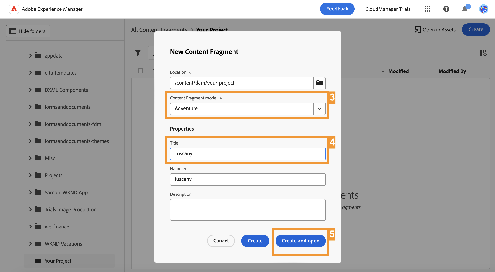

# 创建 Headless 内容 {#create-content}

>[!CONTEXTUALHELP]
>id="aemcloud_sites_trial_admin_content_fragments_create_content"
>title="创建 Headless 内容"
>abstract="使用您在前一单元中创建的模型学习如何创建可用于创作页面或作为 Headless 内容的基础的内容。"

>[!CONTEXTUALHELP]
>id="aemcloud_sites_trial_admin_content_fragments_create_content_guide"
>title="启动内容片段控制台"
>abstract="创建可在您的应用程序和网站上无缝运行的一致、高质量的内容可以带来出色的客户体验。本模块将指导您使用内容片段控制台创建第一个 Headless 内容。<br><br>单击下方按钮在新选项卡中启动该模块，然后遵循该指南。"

>[!CONTEXTUALHELP]
>id="aemcloud_sites_trial_admin_content_fragments_create_content_guide_footer"
>title="做得好！在本模块中，您已了解如何基于之前创建的模型创作 Headless 内容作为内容片段。您现在了解内容团队如何独立于开发周期为应用程序和网站创建和管理内容。"
>abstract=""

## 创建内容片段 {#create-fragment}

内容片段代表 Headless 内容，并且基于预定义的结构，即内容片段模型。您已经在之前的模块中创建了一个模型。

在本单元中，您使用内容片段控制台根据该模型创建内容片段。可以将内容片段控制台视为您的 Headless 内容库。使用它来创建新的内容片段并管理现有的片段。

内容片段控制台用于跨投放渠道、独立于上下文创建和编辑 Headless 内容，对于许多创作案例，这是最有效的方法。在后面的模块中，我们将会探索如何在上下文中和就地编辑 Headless 内容。

1. 选择该控制台右上角的&#x200B;**创建**&#x200B;按钮。

1. 随后将打开&#x200B;**新建内容片段**&#x200B;对话框，可从中开始创建内容片段。自动为&#x200B;**位置**&#x200B;填充会保存新内容的位置。

1. 在&#x200B;**内容片段模型**&#x200B;下拉列表中，选择您之前创建的&#x200B;**冒险**&#x200B;内容片段模型。

1. 添加 `Tuscany` 作为内容片段的描述性&#x200B;**标题**。这是为了在控制台中识别您的片段。

1. 选择&#x200B;**创建并打开**。



>[!TIP]
>
>根据您的浏览器设置，新的浏览器选项卡可能会被弹出窗口阻止程序禁止。如果您的新片段在单击&#x200B;**创建并打开**&#x200B;后没有打开，请检查您的浏览器设置。

## 将内容添加到内容片段 {#add-content}

保存并打开新内容片段后，内容片段编辑器将在新选项卡上打开。您可以在此处添加新片段的内容。

1. 内容片段编辑器显示您在所选模型中定义的字段。在这里，您可以向每个字段添加内容以完成内容片段。您的进度将自动保存。

1. 输入 `Tuscan Adventure`，为您的片段提供&#x200B;**标题**。

1. 通过粘贴以下文本为您的片段提供&#x200B;**描述**。

   ```text
   Visiting Tuscany on a bicycle is about experiencing the old world charm of Italy on your own terms. Your efforts on the climbs of Italy's rolling hills during this tour are rewarded with sunny Mediterranean landscapes and unmatched Italian hospitality. Tuscany's natural wonders have always been a well of inspiration for arts and culture. Find out why as you explore the Italian countryside and coastline on bicycle.
   ```

1. 输入 `$700`，为您的片段提供&#x200B;**价格**。

1. 点按或点击&#x200B;**图像**&#x200B;字段中的&#x200B;**添加资源**，提供代表行程的&#x200B;**图像**。

1. 在资源弹出窗口中，选择&#x200B;**浏览资源**&#x200B;以从资源库中的现有资源中进行选择。

   

1. **选择资源**&#x200B;对话框会打开。使用左侧面板中的树导航器，导航到“**所有资源**”>“**aem-演示资源**”>“**en**”>“**冒险**”>“**单车-托斯卡纳**”。

1. **单车-托斯卡纳**&#x200B;文件夹的内容显示在右侧。选择图像 `ADOBESTOCK_141786166.JPEG`。

1. 选择&#x200B;**选择**。

   

1. 所选图像显示在内容片段中。该编辑器将自动保存更改。

1. 添加完内容后，选择编辑器右上角的&#x200B;**发布**&#x200B;按钮。这使您的内容片段可供外部应用程序使用。然后，从下拉列表中选择&#x200B;**立即**。您也可以安排稍后发布内容片段。

   

1. 随后将显示&#x200B;**发布内容片段**&#x200B;对话框。AEM 会自动执行参考检查，确保已为您的内容片段发布所有必要资源。在此情况下，您还需要发布已创建的模型。选择&#x200B;**发布**。

   

1. 已在横幅中确认发布。

您的内容已发布并准备好作为内容片段传送到您的应用程序或网站。
