# 自定义React示例应用程序中的内容 {#customize-app}

AEM的无头试用版随附了一个简单的React应用程序，以展示无头内容。 在此模块中，您将学习如何预览该应用程序并通过交换图像并为其创建购物时刻来修改其内容。

应用程序本身基于内容片段的结构。 使用AEM中的内容片段编辑器，您可以修改应用程序内容。 为了帮助您了解如何完成此操作，AEM Trials的此模块将带您快速、交互地浏览一下整个过程。 本文档是交互式导览的补充，涵盖相同的步骤，并酌情链接到其他资源。

## 内容片段编辑器 {#fragment-editor}

您可以在示例应用程序的内容片段编辑器中开始操作。

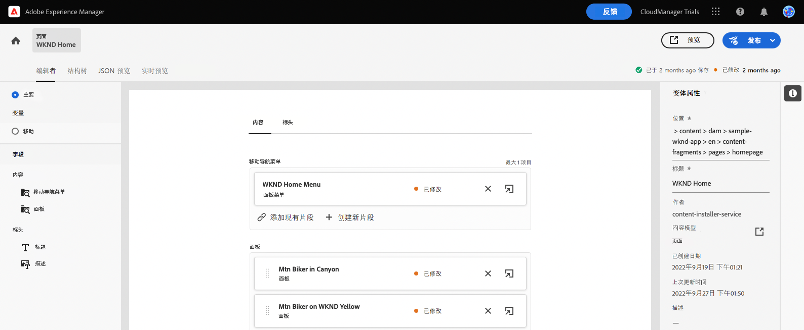

如果您希望自己在应用程序内指南之外导航到内容片段编辑器，可以使用页面左上角的Adobe图标找到该编辑器。 此时将打开AEM的全局导航。 从此处，您选择 **导航** 选项卡，然后 **内容片段**.

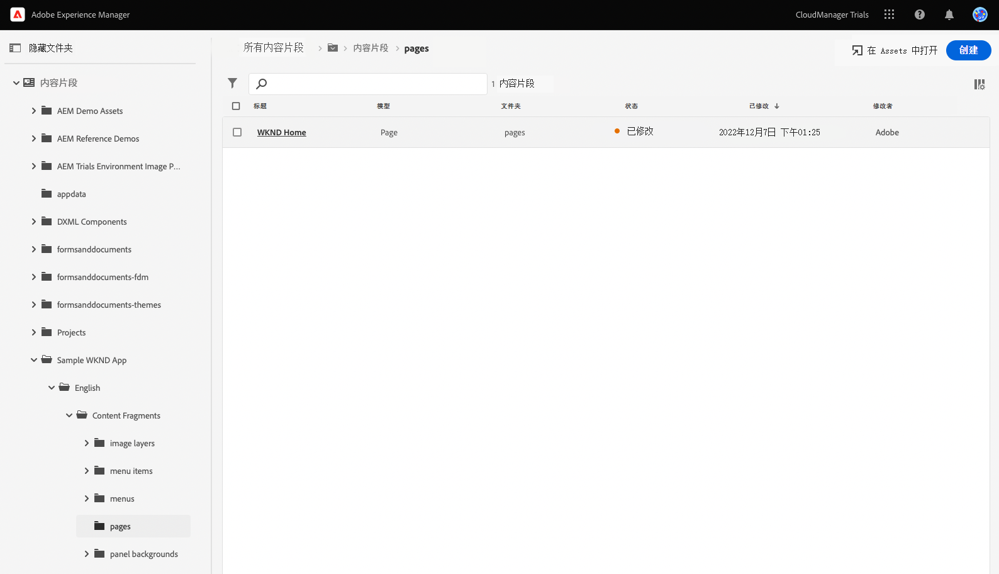

这将打开内容片段控制台。 从此处，您可以使用左侧面板中的内容树导航到应用程序内容的位置。 在本例中，在 **内容片段** -> **WKND应用程序示例** -> **英语** -> **内容片段** -> **页面**.

点按或单击 **WKND主页** 内容树右侧控制台中显示的页面片段，用于启动应用程序内容的编辑器。

>[!TIP]
>
>如果您想进一步了解在AEM中导航的信息，请参阅 [“其他资源”部分](#additional-resources) 的文档，以了解有关AEM基本操作的更多信息。

## 预览应用程序 {#preview}

在开始修改应用程序之前，请先通过预览应用程序的当前状态来熟悉该应用程序。 点按或单击 **预览** 按钮。

将在新选项卡中打开演示应用程序。

该应用本身是一个简单的电子商务应用，适用于虚构的WKND户外生活方式品牌在React中实施。 单击以导览示例内容。

返回到内容片段编辑器的选项卡以继续。

## 在应用程序中编辑文本 {#edit-app}

如前所述，应用程序本身由内容片段组成。 这些片段在结构中链接在一起以创建应用程序。

内容片段编辑器将应用程序的基本布局显示为页面。 本页是内容片段，它本身是其他片段的集合。 的 **面板** 表示应用程序的不同页面，每个页面都是其自身的内容片段。 通过修改这些片段，您可以更改应用程序的内容。

1. 点按或单击 **美国峡谷摩天摩托车** 在 **面板** 中。

   

1. 编辑器将打开山地摩托车的标题面板。 每个面板都由层组成，这些层表示应用程序页面中的不同内容。

   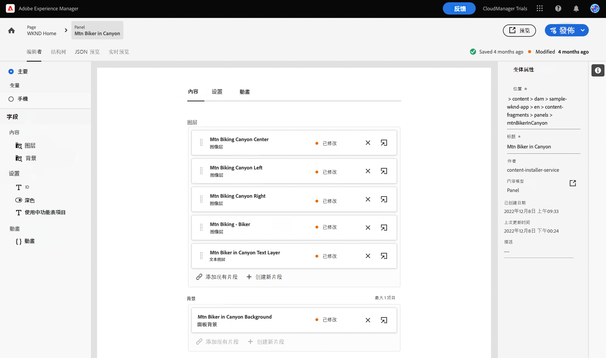

1. 选择文本层 **峡谷文本层中的Mtn自行车手**. 此操作将在编辑器中打开层的详细信息。 层由多个内容片段组成。

   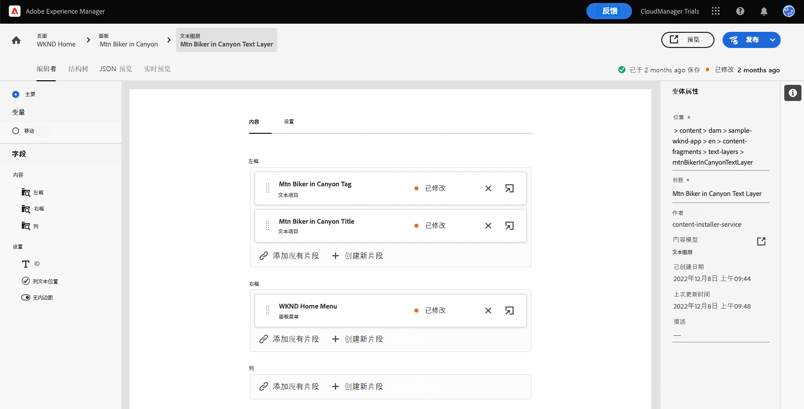

1. 选择 **峡谷标题中的Mtn自行车手** 文本项目。 这将打开内容片段编辑器，其中显示此片段的内容并允许您对其进行修改。

   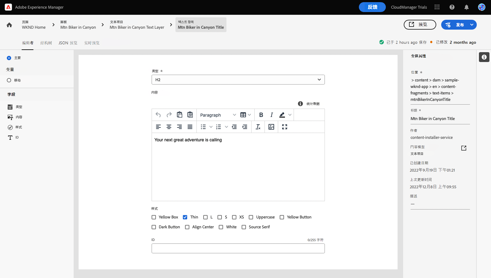

1. 将文本从 `Your next great adventure is calling` to `Choose your own adventure`. 更改由编辑器自动保存。

1. 单击预览可查看所做的更改。 将在新选项卡中打开演示应用程序。

   

返回到内容片段编辑器的选项卡以继续模块。

## 更改应用程序的主图像 {#change-image}

现在，您已修改应用程序中的一些文本，请尝试更改应用程序的主图像。 首先，您需要找到该内容。

编辑器左上角的痕迹导航显示您在内容层次结构中的位置。

1. 点按或单击 **美国峡谷摩天摩托车** ，以返回到该页面。

   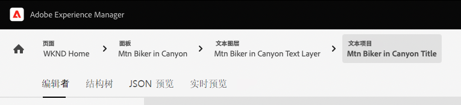

1. 通过应用程序的各个层返回到面板。 这些图层不仅表示文本内容。 它们表示您的应用程序中的所有内容。 因此，您也可以使用内容片段编辑器交换图像。

   

1. 选择 **Mtn Biking — 骑自行车者** 图像层。 这将打开内容片段编辑器，其中显示此片段的内容并允许您对其进行修改。

   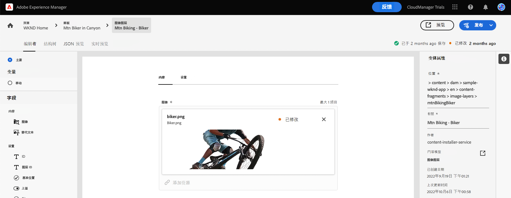

1. 点按或单击 **X** 删除骑行者图像。 该图像会消失，并且编辑器显示错误，因为该图像是此内容片段模型的必需数据。

   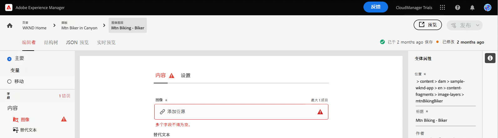

1. 点按或单击 **添加资产** 并在 **sample-wknd-app** > **en** > **图像文件**. 使用 **选择资产** 对话框来导航内容层次结构。

   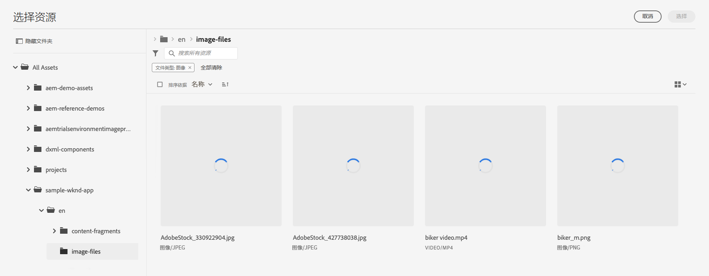

1. 过滤文本 `yellow`. 使用 **搜索所有资产** 字段 **选择资产** 窗口。 输入搜索文本，然后按Enter键或返回以搜索。

   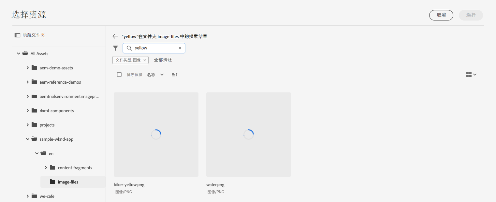

1. 点按或单击以选择 `biker-yellow.png` 图像，然后点按或单击 **选择**.

   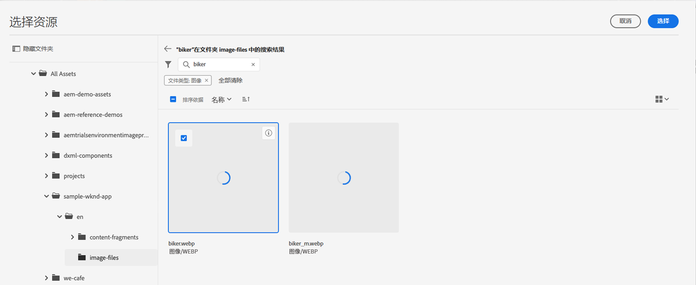

1. 自行车手的图像被替换为所选图像。 编辑器会自动保存更改。

   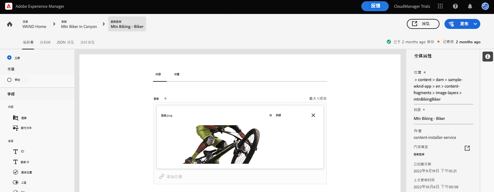

## 创建购物时刻 {#create-moment}

现在，您更新了自行车手的图像，就可以为自行车手的黄色短裤添加购物瞬间。

1. 首先，返回到页面片段的内容片段编辑器。 编辑器左上角的痕迹导航显示您在内容层次结构中的位置。 点按或单击 **WKND主页** ，以返回到该页面。

   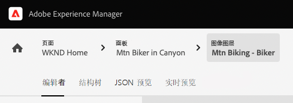

1. 选择 **WKND黄色的Mtn摩托车** 的上界。

   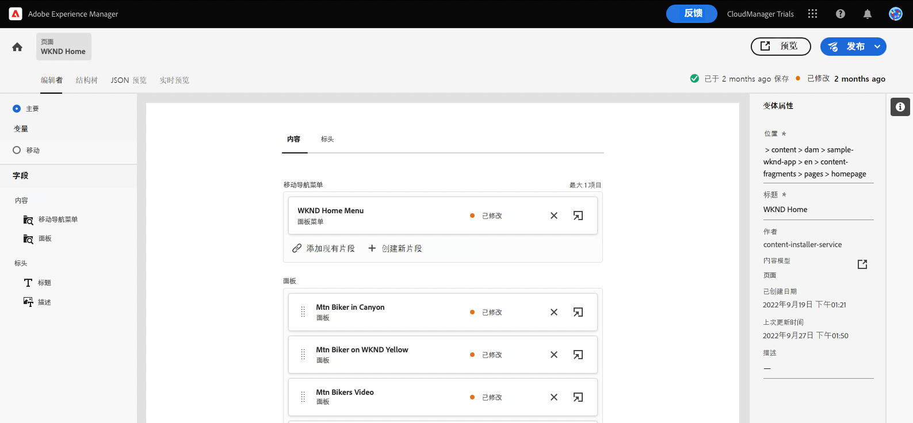

1. 你现在可以看到构成骑行者图像的图层。 通过选择 **Mtn Biking — 购物** 图层。

   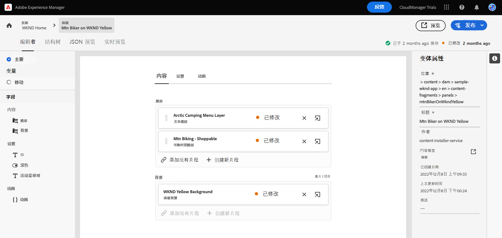

1. 要创建购物时刻，您必须创建一个表示该时刻的新内容片段。 点按或单击 **+创建新片段** 按钮为骑行者的短裤添加购物瞬间。

   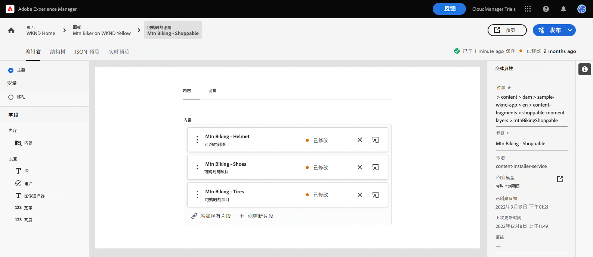

1. 由于内容片段表示结构化的无头数据，因此无论您何时创建内容片段，都必须首先选择要基于其的模型。 选择 **可购瞬间项目** 模型 **内容片段模型** 下拉菜单。

   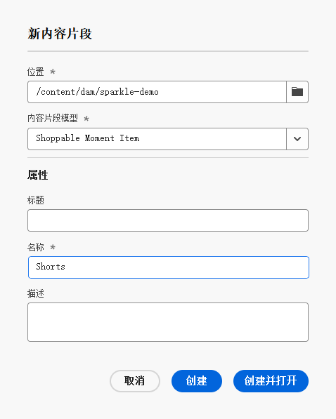

1. 为将表示此新购物瞬间的内容片段指定一个名称。 例如，输入 `Shorts` 到 **名称** 字段。

   

1. 点按或单击 **创建并打开**.

1. 将打开新内容片段的编辑器。
   * 请在 **文本** 字段，如 `Yellow shorts`.
   * 设置一个X和Y，即应覆盖此购物瞬间的位置。
      * **X**: `-18`
      * **Y**: `-28`
   * 对片段所做的更改将由编辑器自动保存

   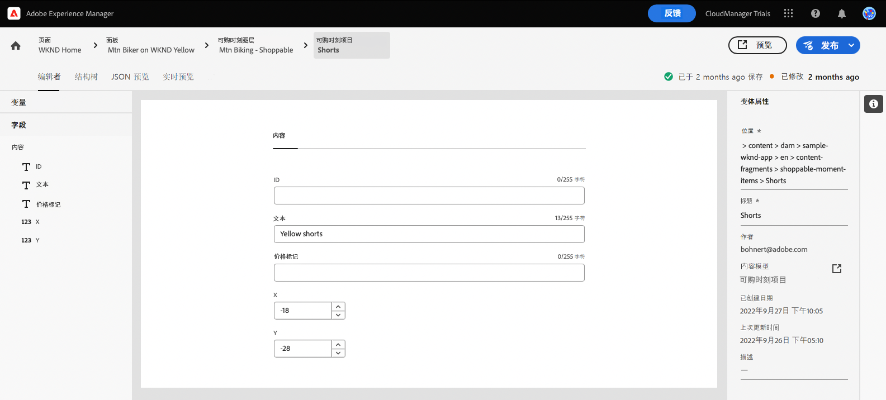

1. 点按或单击 **预览** 以测试此定位并根据需要进行调整。

   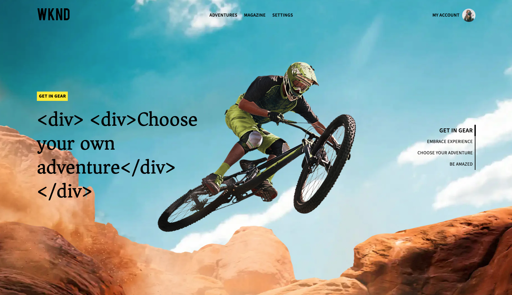

## 您已学会自定义示例React应用程序！ {#conclusion}

在本模块中，您学习了如何自定义示例React应用程序。 首先，您学习了如何编辑现有文本。 然后，将图像与该图像的另一个实例进行交换。 最后，您看到了如何创建和定位购物瞬间项目。

请务必查看 [“其他资源”部分](#additional-resources) 有关使用AEM及其内容片段的其他资源。

如果您想了解如何创建内容片段和无标题内容以供自定义应用程序使用，则可以首先查看模块 [为应用程序创建内容结构。](content-structure.md)

您可以通过单击返回到试用版主屏幕 **解决方案** 按钮，然后选择 **Experience Manager**.

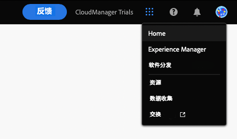

## 其他资源 {#additional-resources}

有关内容片段和AEM的更多信息，请考虑查看此附加文档。

* [内容片段模型](/help/assets/content-fragments/content-fragments-models.md)  — 有关内容片段模型的完整文档
* [内容片段](/help/assets/content-fragments/content-fragments.md)  — 内容片段概述以及指向有关内容片段的完整文档的链接
* [基本操作](/help/sites-cloud/authoring/getting-started/basic-handling.md)  — 有关如何导航和为新用户使用AEM的文档
