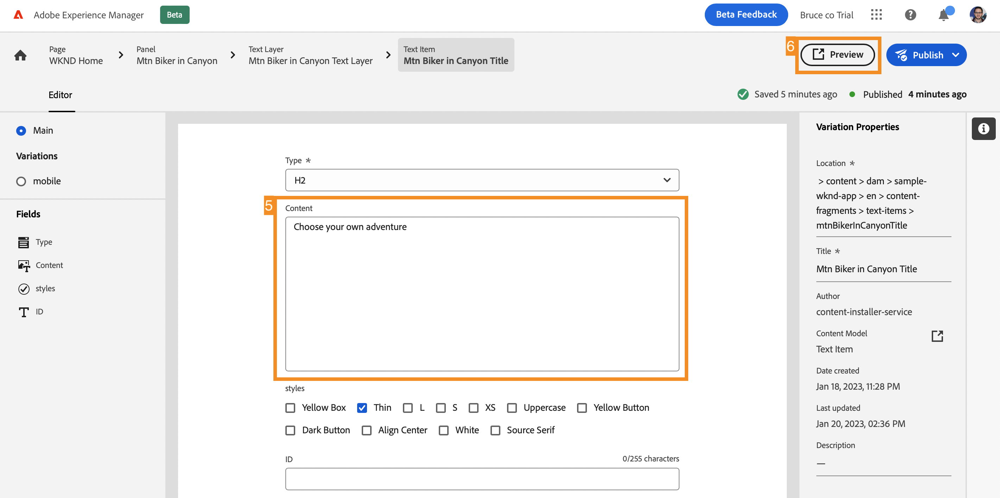

# 在示例 React 应用程序中自定义内容 {#customize-app}

>[!CONTEXTUALHELP]
>id="aemcloud_sites_trial_admin_content_fragments_react_app"
>title="在示例 React 应用程序中自定义内容"
>abstract="您的 AEM Headless 试用版集成了一个示例 React 应用程序，您可以对其进行自定义。"

>[!CONTEXTUALHELP]
>id="aemcloud_sites_trial_admin_content_fragments_react_app_guide"
>title="启动内容片段编辑器"
>abstract="现在让我们探讨 Headless 内容创作的工作原理。您的 AEM Headless 试用版集成了示例 React 应用程序，因此您可以看到任何人无需开发时间即可轻松独立管理内容。  通过单击下方以在新选项卡中启动此模块，然后遵循本指南进行操作。"

>[!CONTEXTUALHELP]
>id="aemcloud_sites_trial_admin_content_fragments_react_app_guide_footer"
>title="在本模块中，您已了解如何自定义示例 React 应用程序。  上市时间：加速！ 开发周期：减少！  现在您了解了对于由 AEM 的 Headless 功能提供支持的网站和应用程序来说，管理 Headless 内容是多么的轻而易举。"
>abstract=""

## 预览应用程序 {#preview}

您可以在内容片段编辑器中，从已加载的 AEM Headless 试用版随附的示例应用程序开始。该示例应用程序由通过 GraphQL 交付的内容片段提供支持。使用内容片段编辑器，通过预览示例应用程序来熟悉编辑器。

1. 选择编辑器屏幕右上角的&#x200B;**预览**&#x200B;按钮。

1. 演示应用程序将在新选项卡中打开。该应用程序适用于虚构的 WKND 户外生活方式品牌。向下滚动页面以浏览示例内容。

1. 返回到内容片段编辑器的浏览器选项卡以继续。

## 在应用程序中编辑标题 {#edit-app}

内容片段编辑器将应用程序的基本版面显示为页面内容片段。**面板**&#x200B;表示应用程序的不同页面，每个页面都是自己的内容片段。通过修改这些片段，可以更改应用程序的内容。

1. 在&#x200B;**面板**&#x200B;部分中选择&#x200B;**峡谷中的山地车手**。

   

1. 编辑器将打开山地车手应用程序的标题面板。每个面板都由图层组成，其代表构成该体验的不同图像和文本。

1. 选择文本层&#x200B;**峡谷中的山地车手**&#x200B;以在编辑器中打开该层的细节。该层由多个内容片段组成，这些片段控制的是应用程序面板中显示的文本。

1. 选择&#x200B;**“峡谷中的山地车手”标题**&#x200B;文本项。这将打开内容片段编辑器，其中显示该片段的内容并允许您进行修改。

1. 将文本从 `Your next great adventure is calling` 更改为 `Choose your own adventure`。编辑器将自动保存此更改。

1. 在窗口的右上角选择&#x200B;**预览**&#x200B;以查看您的更改。演示应用程序的预览内容将在新选项卡中打开。

   

在集成到 AEM Headless CMS 中后更新 React 应用程序中的内容就是这么容易。

## 在应用程序中更换图像 {#change-image}

现在，您已修改应用程序中的标题，请试一试更改图像。

1. 从预览返回到内容片段编辑器的浏览器选项卡。

1. 您需要返回到内容片段编辑器中的正确位置。该编辑器左上角的痕迹导航将显示您在内容层次结构中所处的位置。在痕迹导航中选择&#x200B;**峡谷中的山地车手**&#x200B;以返回该页面。

   

1. 选择&#x200B;**山地自行车 - 车手**&#x200B;图像图层。这将打开内容片段编辑器

1. 选择 **X** 以删除车手图像。该图像消失，由于图像是此内容片段模型所需的数据，因此编辑器显示一个错误。

   

1. 选择&#x200B;**添加资源**，然后在弹出菜单中选择&#x200B;**浏览资源**。

1. 随后将打开&#x200B;**选择资源**&#x200B;对话框，并自动为您选择路径 **sample-wknd-app** > **en** > **image-files**。

1. 选择图像 `biker-yellow.png`，然后选择&#x200B;**选择**。

1. 车手图像已替换为所选图像。该编辑器将自动保存更改。

1. 在窗口的右上角选择&#x200B;**预览**&#x200B;以查看您的更改。演示应用程序的预览内容将在新选项卡中打开。在浏览器上单击刷新，您应该会在应用程序中看到带有黄色短裤的新车手图像。

使用 AEM Headless CMS 可以轻松更新应用程序中的图像和资源。

## 在应用中添加对新内容片段的引用 {#create-moment}

现在您已经更新了车手的图像，让我们来看看如何通过创建和引用新的内容片段来向应用程序添加新内容吧。您将向应用程序的第二个面板添加由“可购物时刻”内容片段管理的产品标注。

1. 从预览选项卡返回到内容片段编辑器的浏览器选项卡。

1. 您需要返回到内容片段编辑器中的正确位置。该编辑器左上角的痕迹导航将显示您在内容层次结构中所处的位置。在痕迹导航中选择 **WKND 主页**&#x200B;以返回该页面。

1. 选择 **WKND 上的山地车手（黄色）**&#x200B;面板。

1. 选择&#x200B;**山地自行车 - 可购物**&#x200B;图层。

1. 要在此面板上创建标注，请创建一个可购物时刻内容片段。选择 **+ 创建新片段**&#x200B;按钮。

   

1. 您必须首先选择新内容片段所基于的模型。从&#x200B;**内容片段模型**&#x200B;下拉列表中选择&#x200B;**购物时刻项目**&#x200B;模型。

1. 为内容片段提供一个名称。例如，在&#x200B;**名称**&#x200B;字段中输入 `Shorts`。

1. 选择&#x200B;**创建并打开**。

   

1. 这将为新的内容片段打开编辑器。

1. 在&#x200B;**文本**&#x200B;字段中为购物时刻命名，例如 `Yellow shorts`。

1. 为 **X** 和 **Y** 设置值。这是此标注应覆盖在面板上的位置。编辑器将自动保存对片段进行的更改。

   * **X**：`-5`
   * **Y**：`-10`

1. 在窗口的右上角选择&#x200B;**预览**&#x200B;以查看您的更改。演示应用程序的预览内容将在新选项卡中打开。单击浏览器上的刷新以测试定位并根据需要在编辑器中进行调整。

   

现在您了解了如何在应用程序中创建新内容并将其作为内容片段进行引用，而无需任何开发周期。
