# 通过 GraphQL API 提取内容 {#extract-content}

在针对 Headless 的 AEM 试用中，您目前已[创建自己的内容片段模型](content-structure.md)，并创建了自己的 Headless 内容作为[内容片段。](create-content.md)现在，您可以了解如何使用内容片段和 GraphQL API 作为 Headless 内容管理系统来发布您的内容。

GraphQL 提供了基于查询的 API，可让外部客户端应用程序使用单个 API 调用，在 AEM 中仅查询所需的内容。

首先，您将了解如何运行两种不同类型的查询：**list** 和 **byPath** 查询。之后，您将了解如何从您之前创建的内容片段中检索内容。本文档旨在对交互式导览进行补充，其中涵盖了相同的步骤，并会在适当时链接到其他资源。

>[!TIP]
>
>如果您想了解有关 GraphQL API 的更多详细信息，请参阅本模块末尾的[“其他资源”部分](#additional-resources)，查看 GraphQL API 指南。

>[!CONTEXTUALHELP]
>id="aemcloud_sites_trial_admin_content_fragments_graphql"
>title="使用 GraphQL API 提取内容"
>abstract="在本模块中，您将学习如何使用内容片段和 GraphQL API 作为无头内容管理系统。"

## GraphQL Explorer {#graphql-explorer}

您可以在 GraphQL Explorer 中开始操作。在此处，您可以针对 Headless 内容构建和运行查询。

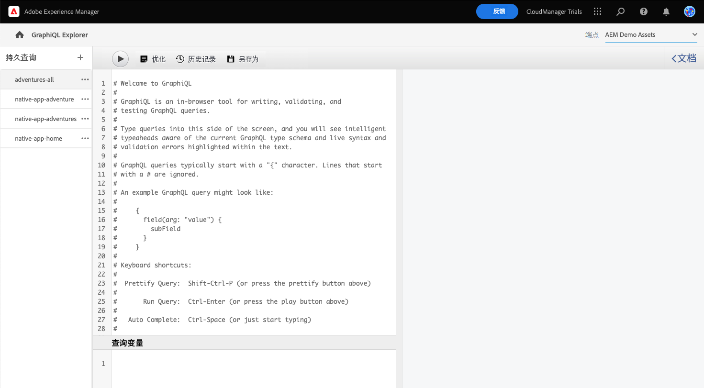

如果您想在应用程序内指南之外自行导航到 GraphQL Explorer，可以使用页面左上角的 Adobe 图标来找到它。这将打开 AEM 全局导航。在此处，您可以选择&#x200B;**工具**&#x200B;选项卡，然后选择&#x200B;**常规** -> **GraphQL 查询编辑器**。

>[!TIP]
>
>如果您想详细了解 AEM 中的导航，请参阅本文档的[“其他资源”部分](#additional-resources)，了解有关 AEM 基本处理的更多信息。

AEM 试用版附带了一个已预加载内容的端点，您可以从中提取内容用于测试。

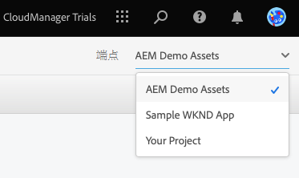

从该编辑器右上角的&#x200B;**端点**&#x200B;下拉菜单中选择 **AEM Demo Assets** 端点（如果未选择）。

## 复制和运行列表查询 {#list-query}

从一个简单的列表查询开始，以便了解 AEM as a Cloud Service 的 GraphQL API 的工作原理。此列表查询示例将返回使用特定内容片段模型的所有内容的列表。库存和类别页面通常使用此查询格式。

1. 复制以下代码片段。

   ```text
   {
       adventureList {
         items {
            _path
            adventureTitle
            adventurePrice
            adventureTripLength
            adventurePrimaryImage {
              ... on ImageRef {
               _path
               mimeType
               width
               height
             }
           }
         }
      }
    }
   ```

1. 然后，通过粘贴复制的代码来替换查询编辑器中的现有内容。

   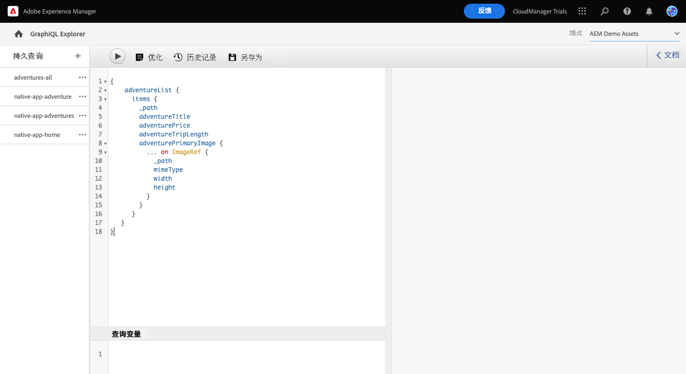

1. 粘贴后，单击查询编辑器左上角的&#x200B;**播放**&#x200B;按钮以执行查询。

1. 在查询成功执行后，结果将显示在右侧面板中，位于查询编辑器的旁边。如果查询不正确，右侧面板中将显示错误。

   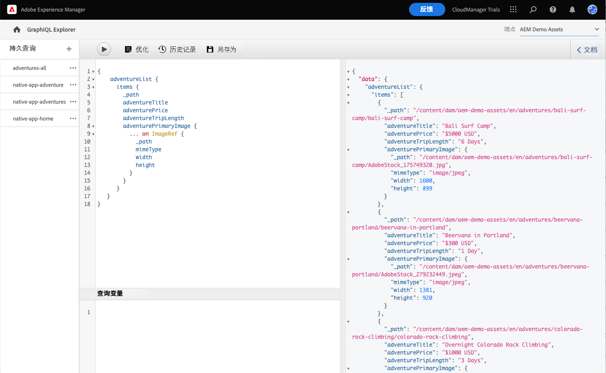

您刚刚验证了针对所有内容片段的完整列表的列表查询。此过程可帮助确保响应符合应用程序的预期，其结果说明了您的应用程序和网站将如何检索在 AEM 中创建的内容。

各种用于显示内容的渠道和平台现在可以使用此查询或类似查询来检索 Headless 内容。

## 复制和运行 byPath 查询 {#bypath-query}

运行 byPath 查询可让您检索特定内容片段的资源。产品详细信息页面和专注于一组特定内容的页面通常需要此类查询。

1. 复制以下代码片段。

   ```text
    {
     adventureByPath(
       _path: "/content/dam/aem-demo-assets/en/adventures/bali-surf-camp/bali-surf-camp"
     ) {
       item {
         _path
         adventureTitle
         adventureDescription {
           json
         }
         adventurePrimaryImage {
           ... on ImageRef {
             _path
             width
             height
           }
         }
       }
     }
   }
   ```

1. 然后，通过粘贴复制的代码来替换查询编辑器中的现有内容。

   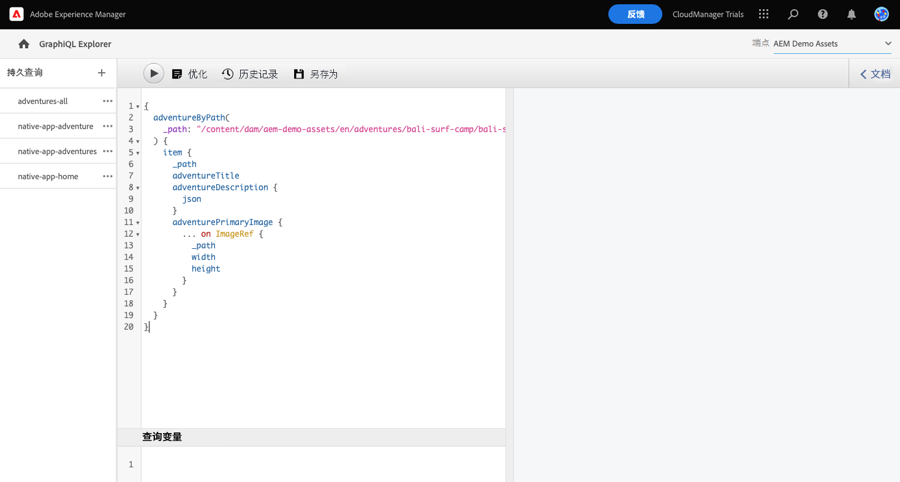

1. 粘贴后，单击查询编辑器左上角的&#x200B;**播放**&#x200B;按钮以执行查询。

1. 在查询成功执行后，结果将显示在右侧面板中，位于查询编辑器的旁边。如果查询不正确，右侧面板中将显示错误。

1. 在查询成功执行后，结果将显示在右侧面板中，位于查询编辑器的旁边。如果查询不正确，右侧面板中将显示错误。

   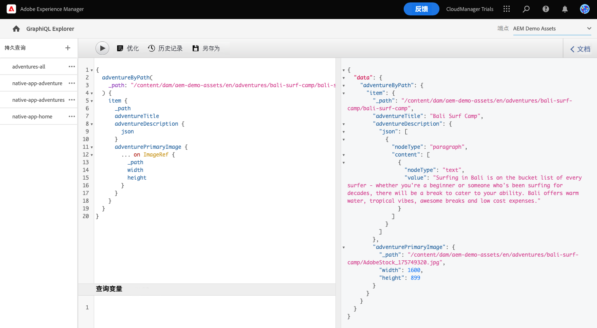

您刚刚验证了针对所有内容片段的完整列表的列表查询。此过程可帮助确保响应符合应用程序的预期，其结果说明了您的应用程序和网站将如何检索在 AEM 中创建的内容。

各种用于显示内容的渠道和平台现在可以使用此查询或类似查询来检索 Headless 内容。

## 对您的内容运行查询 {#own-queries}

现在，您已运行两种主要类型的查询，可以开始为您自己创建的内容设置和运行查询了。

1. 要对您自己的内容片段运行查询，请将端点从 **AEM 示范资产**&#x200B;文件夹更改为&#x200B;**您的项目**&#x200B;文件夹。

   

1. 首先，选择并删除查询编辑器中的所有现有内容。然后，键入左方括号 `{` 并按 Ctrl + 空格键或 Option + 空格键，可获取内容片段模型中定义的模型的自动完成列表。从该列表中选择您创建的以 `List` 结尾的模型。

   

1. 为您选择的内容片段模型定义查询应包含的项目。再次键入左方括号 `{`，然后按 Ctrl + 空格键或 Option + 空格键获取自动完成列表。从该列表中选择 `items`。

   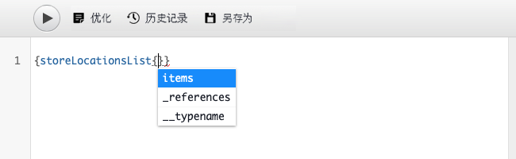

1. 为您选择的内容片段模型定义查询应包含的字段。再次，键入左方括号 `{`，然后按 Ctrl + 空格键或 Option + 空格键，可获取内容片段模型中可用字段的自动完成列表。在该列表中选择所需的模型中的字段。

   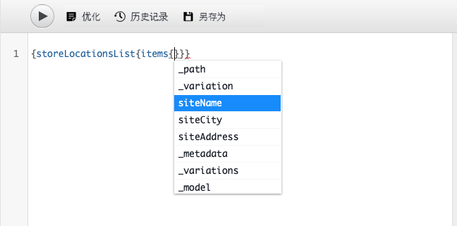

1. 用逗号 (`,`) 或空格分隔多个字段，然后再次按 Ctrl + 空格键或 Option + 空格键选择其他字段。

1. 在工作时，您可以点按或单击&#x200B;**美化**&#x200B;按钮来自动格式化您的代码，使其更易读取。

   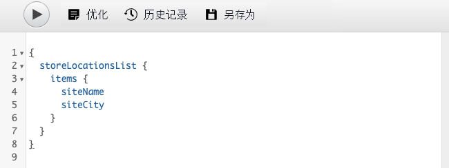

1. 完成后，点按或单击该编辑器左上角的&#x200B;**播放**&#x200B;按钮以运行查询。

   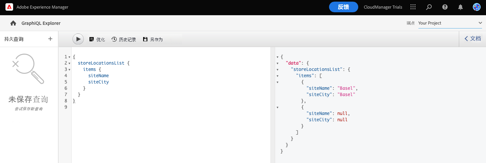

这就是将您的内容交付给全渠道数字体验的方式。请参阅[“其他资源”部分](#additional-resources)以获取更多示例查询，并了解还可以使用 GraphQL API 完成哪些工作。

## 您已了解如何查询内容！ {#conclusion}

干得不错！您已了解两种基本类型的查询以及如何查询您自己的内容。请务必查看[“其他资源”部分](#additional-resources)以获取更多示例查询，并了解还可以使用 GraphQL API 完成哪些工作。

如果您想了解如何在自定义 React 应用程序中使用提取的内容，请务必查看[在示例 React 应用程序中自定义内容](customize-app.md)模块。

您可以通过单击导航栏右上角的&#x200B;**解决方案**&#x200B;按钮并选择 **Experience Manager** 来返回到试用主屏幕。

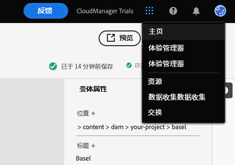

## 其他资源 {#additional-resources}

有关内容片段和 AEM 的更多信息，请考虑查看本附加文档。

* [GraphQL API 指南](https://experienceleague.adobe.com/docs/experience-manager-learn/getting-started-with-aem-headless/graphql/multi-step/explore-graphql-api.html)
* [基本处理](/help/sites-cloud/authoring/getting-started/basic-handling.md) – 介绍新用户如何导航和使用 AEM 的文档
* [了解如何将 GraphQL 与 AEM 结合使用 – 示例内容和查询](https://experienceleague.adobe.com/docs/experience-manager-cloud-service/content/headless/graphql-api/sample-queries.html)
