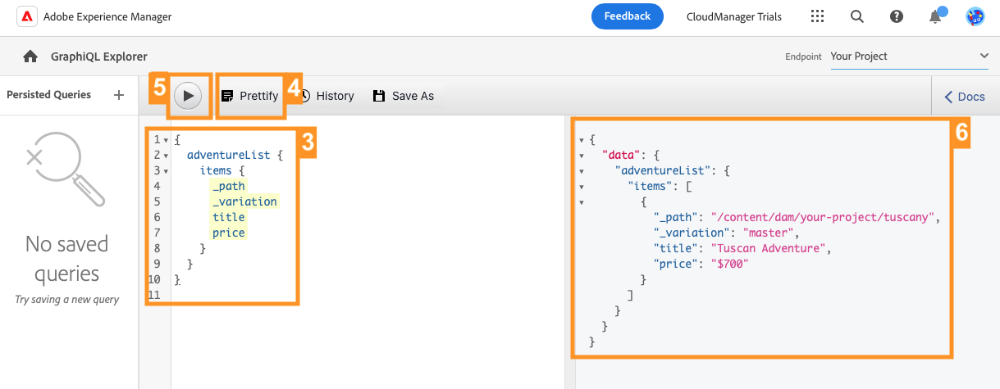

# 通过 GraphQL API 提取内容 {#extract-content}

>[!CONTEXTUALHELP]
>id="aemcloud_sites_trial_admin_content_fragments_graphql"
>title="使用 GraphQL API 提取内容"
>abstract="在本模块中，您将学习如何使用内容片段和 GraphQL API 作为无头内容管理系统。"

>[!CONTEXTUALHELP]
>id="aemcloud_sites_trial_admin_content_fragments_graphql_guide"
>title="启动 GraphQL 资源管理器"
>abstract="GraphQL 提供了基于查询的 API，可让外部客户端应用程序使用单个 API 调用，在 AEM 中仅查询所需的内容。按照本模块学习如何运行两种不同类型的查询。之后，您将了解如何从上一个模块中创建的内容片段中检索内容。<br><br>单击下方在新选项卡中启动该模块。"

>[!CONTEXTUALHELP]
>id="aemcloud_sites_trial_admin_content_fragments_graphql_guide_footer"
>title="做得好！您已了解两种基本类型的查询以及如何查询您自己的内容。现在您了解了如何使用 AEM GraphQL API 创建高效的查询，并且以应用程序期望的格式交付内容。"
>abstract=""

## 查询示例内容列表 {#list-query}

在一个新选项卡中对 GraphQL Explorer 开始操作。在这里，您可以针对无头内容构建和验证查询，然后再使用它们为您的应用程序或网站中的内容提供支持。

1. 您的 AEM Headless 试用版附带了一个已预加载内容片段的端点，您可以从中提取内容用于测试。确保在编辑器右上角的&#x200B;**端点**&#x200B;下拉菜单中选定 **AEM 演示资源**&#x200B;端点。

1. 为预加载的 **AEM 演示资产**&#x200B;端点的列表查询复制以下代码片段。列表查询会返回使用特定内容片段模型的所有内容的列表。库存和类别页面通常使用此查询格式。

   ```text
   {
    adventureList {
     items {
       _path
       title
       price
       tripLength
       primaryImage {
         ... on ImageRef {
           _path
           mimeType
           width
           height
         }
       }
     }
    }
   }
   ```

1. 通过粘贴复制的代码来替换查询编辑器中的现有内容。

1. 粘贴后，单击查询编辑器左上角的&#x200B;**播放**&#x200B;按钮以执行查询。

1. 结果会显示在右侧面板中，位于查询编辑器的旁边。如果查询不正确，右侧面板中将显示错误。

   

您刚刚验证了针对所有内容片段的完整列表的列表查询。此过程可帮助确保响应符合应用程序的预期，其结果说明了您的应用程序和网站将如何检索在 AEM 中创建的内容。

>[!NOTE]
>
>如果您无法选择 **AEM演示资产** 下拉菜单中的端点，请联系Adobe客户关怀团队或通过 [AEM试用Slack渠道。](https://adobe-dx-support.slack.com/)

## 查询特定的示例内容 {#bypath-query}

运行 byPath 查询可让您检索特定内容片段的内容。产品详细信息页面和专注于一组特定内容的页面通常需要此类查询。

1. 为预加载的 **AEM 演示资产**&#x200B;端点的 byPath 查询复制以下代码片段。

   ```text
    {
     adventureByPath(
       _path: "/content/dam/aem-demo-assets/en/adventures/bali-surf-camp/bali-surf-camp"
     ) {
       item {
         _path
         title
         description {
           json
         }
         primaryImage {
           ... on ImageRef {
             _path
             width
             height
           }
         }
       }
     }
   }
   ```

1. 通过粘贴复制的代码来替换查询编辑器中的现有内容。

1. 粘贴后，单击查询编辑器左上角的&#x200B;**播放**&#x200B;按钮以执行查询。

1. 结果会显示在右侧面板中，位于查询编辑器的旁边。如果查询不正确，右侧面板中将显示错误。

   

您刚刚通过验证 byPath 查询来检索由该片段的路径标识的特定内容片段。

## 查询自己的内容 {#own-queries}

现在，您已运行两种主要类型的查询，现在可以开始查询您自己的内容了。

1. 要对您自己的内容片段运行查询，请将端点从 **AEM 演示资源**&#x200B;文件夹更改为&#x200B;**您的项目**&#x200B;文件夹。

1. 删除查询编辑器中的所有现有内容。然后，键入左方括号 `{` 并按 Ctrl + 空格键或 Option + 空格键，可获取端点中定义的模型的自动完成列表。从选项中选择您创建的以 `List` 结尾的模型。如果您遵循上一模块中的示例，则应会找到 `adventureList` 在自动完成列表中。

   

1. 为您选择的内容片段模型定义查询应包含的项目。再次键入左方括号 `{`，然后按 Ctrl + 空格键或 Option + 空格键获取自动完成列表。从选项中选择 `items`。

1. 点按或单击&#x200B;**美化**&#x200B;按钮来自动设置代码格式，使其更易阅读。

1. 完成后，点按或单击该编辑器左上角的&#x200B;**播放**&#x200B;按钮以运行查询。编辑器会自动完成 `items`，以黄色短暂突出显示，并运行查询。

1. 结果会显示在右侧面板中，位于查询编辑器的旁边。

   

这就是将您的内容交付给全渠道数字体验的方式。

## 持久化查询 {#persisted-queries}

持久化查询是将GraphQL API公开给客户端应用程序的首选机制。 保留查询后，可以使用GET请求对其进行请求并缓存以便快速检索。

您将创建一个持久查询，其中包含您要从客户端应用程序中使用的数据。

1. 您将之前创建的数据用作内容片段，因此请确保 **您的项目** 终结点在 **端点** 下拉菜单。

1. 复制以下代码片段。

   ```text
      {
      adventureList {
       items {
         title
         description {
           plaintext
         }
         price
         image {
           ... on ImageRef {
             _publishUrl
             mimeType
           }
         }
       }
     }
   }
   ```

1. 通过粘贴复制的代码来替换查询编辑器中的现有内容。

   >[!NOTE]
   >
   >如果您没有使用与上一模块中所述相同的字段描述，则需要更新此查询中的字段名称。
   >
   >按照以前所述，使用GraphQL自动完成（Ctrl+空格键或Option+空格键）功能，以帮助识别可用属性。

1. 粘贴后，单击查询编辑器左上角的&#x200B;**播放**&#x200B;按钮以执行查询。

1. 结果会显示在右侧面板中，位于查询编辑器的旁边。如果查询不正确，右侧面板中将显示错误。

   

1. 如果对查询满意，请单击 **另存为** 按钮来保留查询。

1. 在 **查询名称** 弹出窗口，为查询提供名称 `adventure-list`.

1. 点按或单击 **另存为**.

   

1. 屏幕底部的横幅消息确认后，查询将会保留。 现在，查询还会显示在窗口中保留查询的左侧面板中。

1. 为了让持久查询公开可用，它需要发布，就像需要发布内容片段一样。 单击 **发布** 按钮来发布查询。

1. 通过横幅通知确认发布。

现在，您有一个新的持久化查询，该查询将仅包含您定义的特定属性和格式。
