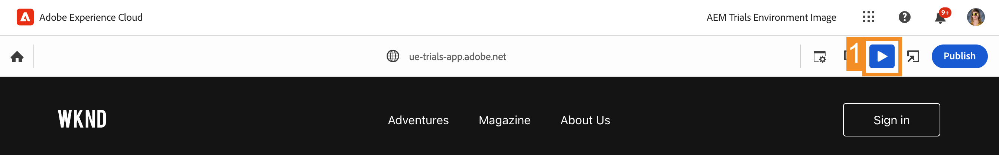

# 使用 Universal Editor 在上下文中编辑 {#editing-in-context}

>[!CONTEXTUALHELP]
>id="aemcloud_sites_trial_edit_inline_universal_editor"
>title="使用 Universal Editor 在上下文中编辑"
>abstract="了解 Headless 应用程序如何利用 Universal Editor 使作者能够轻而易举地作出减少分歧、符合上下文的编辑。"

>[!CONTEXTUALHELP]
>id="aemcloud_sites_trial_edit_inline_universal_editor_guide"
>title="启动 Universal Editor"
>abstract="在本指南中，您将探索 Universal Editor 及其如何使任何人在任何实施中都能编辑您的内容的方方面面，从而提升内容速度。  通过单击下方以在新选项卡中启动此模块，然后遵循本指南进行操作。"

>[!CONTEXTUALHELP]
>id="aemcloud_sites_trial_edit_inline_universal_editor_guide_footer"
>title="在本模块中，您已了解如何使用 Universal Editor 在上下文中和就地自定义内容。"
>abstract=""

## 在上下文中编辑文本 {#edit-text}

就地编辑和在上下文中编辑通常比结构化 Headless 内容编辑更有优势，如在前面的模块中看到的内容片段编辑器中的情况。

>[!NOTE]
>
>要在此试用版中使用 Universal Editor，您必须使用 Chrome 作为浏览器，并且不得处于无痕模式。这是试用版体验的限制，而不是 Universal Editor 的限制。

利用 Universal Editor，您可以敏捷地在上下文中编辑和就地编辑文本，从而实现简单直观的内容创作。

1. 双击选择最新文章的标题以编辑该文章。

   

1. 随后将选择该组件，如一个蓝色边框所示，该边框带有一个标签，指示它是文本组件。该边框中有一个光标，等待输入文本。将文本更改为 `Aloha Spirit in Lofoten`。

   

1. 选择该文本组件之外的地方，随后将保存您的更改。

Universal Editor 会在创作环境中自动保存您的更改。您仍然需要发布它们，以供读者查看，我们将在稍后的步骤中执行此操作。

## 在上下文中编辑媒体 {#edit-media}

您也可以使用 Universal Editor 交换图像，同时仍留在内容的上下文中。

1. 选择冲浪者的图像以选中它。

1. 在组件边栏中，您可以查看资源的详细信息。选择&#x200B;**特色图像**&#x200B;缩略图。

   

1. 在&#x200B;**选择资源**&#x200B;窗口中，向下滚动并选择 `surfer-wave-02.JPG` 图像以选择它。

1. 在&#x200B;**选择资源**&#x200B;窗口中选择&#x200B;**选择**。

   

图像将替换为选择的图像。

## 像读者一样体验您的内容 {#emulators}

通过 Universal Editor 可在内容的上下文中与内容交互，其中看到的内容如同投放到用户的设备。

1. 默认情况下，该编辑器将呈现内容的桌面版本。选择 Universal Editor 工具栏右上角的模拟器按钮以更改目标设备。

   

1. 由于读者使用的设备可能具有不同的纵横比，因此，编辑器提供了模拟模式以便查看页面呈现给用户的方式。例如，选择纵向模式下的移动设备选项。

   

1. 在编辑器中查看内容更改。模拟器图标也会发生变化以反映其所处的模式。选择模拟器菜单外部的任意位置以关闭它并与您的内容交互。

1. 使模拟器返回桌面模式。

您还可以指定模拟器的精确尺寸并旋转模拟的设备，以便在任何潜在的目标设备上查看您的内容。

## 预览和发布 {#preview}

由于您需要选择您的内容才能在编辑器中修改它，因此编辑器不允许您通过点按或单击而访问链接或与您的内容交互。可使用预览模式在发布之前像用户一样访问内容中的链接和体验内容。

1. 在 Universal Editor 工具栏中，选择&#x200B;**预览**。

1. 现在，选择主要文章的&#x200B;**展开**&#x200B;链接。

   

1. 浏览文章，然后使用&#x200B;**返回**&#x200B;链接以返回主页。

   

1. 现在，选择编辑器右上角的&#x200B;**发布**&#x200B;按钮以发布内容。

   

发布了您的内容。

## 编辑内容片段 {#editing-fragments}

当 Headless 内容的结构化编辑比就地编辑更有优势时，为了加快实现内容创作体验，Universal Editor 还允许您快速访问内容片段编辑器。

1. 通过点按 Universal Editor 工具栏上的&#x200B;**预览**&#x200B;按钮而关闭预览模式。

   

1. 在页面上进一步向下滚动到&#x200B;**冒险**&#x200B;部分。

1. 选择其中一个探险（例如&#x200B;**巴厘岛冲浪营**）以选中它。

   * 请注意所选组件的蓝色轮廓。在选择内容片段时，选项卡应显示该内容片段的名称。此示例中为&#x200B;**巴厘岛冲浪营**。
   * 由于通过 Universal Editor 可选择页面上的任何对象，因此也可单独选择内容片段的各个部分。选择插图中所示的位置以选择整个内容片段组件。

1. 随后&#x200B;**编辑**&#x200B;图标出现在组件边栏上。选择&#x200B;**编辑**&#x200B;图标以在新标签页上打开内容片段编辑器。

现在即可在新标签页上编辑在 Universal Editor 中选择的内容片段。
