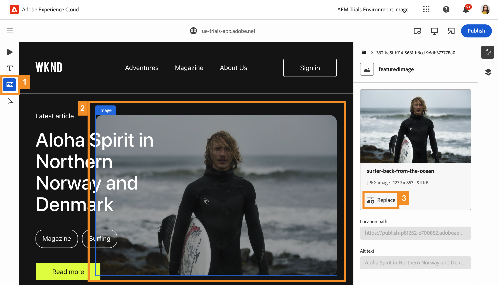

# 使用 Universal Editor 在上下文中编辑 {#editing-in-context}

>[!CONTEXTUALHELP]
>id="aemcloud_sites_trial_edit_inline_universal_editor"
>title="使用 Universal Editor 在上下文中编辑"
>abstract="了解 Headless 应用程序如何利用 Universal Editor 使作者能够轻而易举地作出减少分歧、符合上下文的编辑。"

>[!CONTEXTUALHELP]
>id="aemcloud_sites_trial_edit_inline_universal_editor_guide"
>title="启动 Universal Editor"
>abstract="在本指南中，我们将探索 Universal Editor 及其如何使任何人在任何实施中都能编辑您的内容的方方面面，从而提升内容速度。  通过单击下方而在新标签页中启动此模块，然后遵循本指南进行操作。"

>[!CONTEXTUALHELP]
>id="aemcloud_sites_trial_edit_inline_universal_editor_guide_footer"
>title="在本模块中，您已了解如何使用 Universal Editor 在上下文中和就地自定义内容。"
>abstract=""

## 在上下文中编辑文本 {#edit-text}

就地编辑和在上下文中编辑通常比结构化 Headless 内容编辑更有优势，如在前面的模块中看到的内容片段编辑器中的情况。

>[!NOTE]
>
>要在此试用版中使用通用编辑器，您必须将Chrome用作浏览器，而不是无痕模式。 这是试用版体验的限制，而不是 Universal Editor 的限制。

利用 Universal Editor，您可以敏捷地在上下文中编辑和就地编辑文本，从而实现简单直观的内容创作。

1. 默认情况下，应在&#x200B;**组件**&#x200B;模式下加载该编辑器。如果不能，请选择 **组件** 图标（位于编辑器左侧的模式边栏中）。

1. 双击最新文章的标题以进行编辑。

   

1. 随后将选择该组件，如一个蓝色边框所示，该边框带有一个标签，指示它是文本组件。该边框中有一个光标，等待输入文本。将文本更改为 `Aloha Spirit in Lofoten`。

   

1. 按Enter/Return键或选择文本组件外部，更改将自动保存。

Universal Editor 会在创作环境中自动保存您的更改。您仍然需要发布它们，以供读者查看，我们将在稍后的步骤中执行此操作。

## 在上下文中编辑媒体 {#edit-media}

您也可以使用 Universal Editor 交换图像，同时仍留在内容的上下文中。

1. 剩余时间 **组件** 模式，选择冲浪者的图像以将其选中。

1. 在组件边栏中，您可以查看资源的详细信息。选择 **特色图像** 缩略图。

   

1. 在 **选择资源** 窗口，向下滚动并选择 `surfer-wave-02.JPG` 图像以选择它。

1. 选择 **选择** 在 **选择资源** 窗口。

   

图像将替换为选择的图像。

## 像读者一样体验您的内容 {#emulators}

通过 Universal Editor 可在内容的上下文中与内容交互，其中看到的内容如同投放到用户的设备。

1. 默认情况下，该编辑器将呈现内容的桌面版本。选择编辑器右上角的模拟器按钮以更改目标设备。

   

1. Reader可能位于具有不同宽高比的不同设备上，因此编辑器会提供模拟模式以查看将向用户呈现页面的方式。 例如，选择纵向模式下的移动设备选项。

   

1. 在编辑器中查看内容更改。模拟器图标也会发生变化以反映其所处的模式。选择模拟器菜单之外的任意位置以关闭模拟器菜单并与内容交互。

1. 使模拟器返回桌面模式。

您还可以为模拟器指定确切的尺寸，并旋转模拟的设备以查看任何潜在目标设备上的内容。

## 预览和发布 {#preview}

由于您需要选择内容以在编辑器中将其选中，因此编辑器不允许您在内容处于编辑模式时通过点按或单击来关注链接或与内容交互。 利用预览模式，您可以访问内容中的链接并像用户在发布之前一样体验内容。

1. 在编辑器左侧的模式边栏中，选择 **预览**.

1. 现在选择 **了解更多** 主文章的链接。

   

1. 浏览文章，然后使用&#x200B;**返回**&#x200B;链接以返回主页。

   

1. 现在选择 **Publish** 按钮来发布您的内容。

   

发布了您的内容。

## 编辑内容片段 {#editing-fragments}

当 Headless 内容的结构化编辑比就地编辑更有优势时，为了加快实现内容创作体验，Universal Editor 还允许您快速访问内容片段编辑器。

1. 在页面上进一步向下滚动到&#x200B;**冒险**&#x200B;部分。

1. 在该编辑器左侧的模式边栏中，选择&#x200B;**组件**。这样即可在该编辑器中选择页面组件。

1. 选择以下冒险之一 **巴厘岛冲浪营** 以选择它。

   * 请注意所选组件的蓝色轮廓。在选择内容片段时，选项卡应显示该内容片段的名称。此示例中为&#x200B;**巴厘岛冲浪营**。
   * 由于通过 Universal Editor 可选择页面上的任何对象，因此也可单独选择内容片段的各个部分。选择图中所示的位置，以选择整个内容片段组件。

1. 随后&#x200B;**编辑**&#x200B;图标出现在组件边栏上。选择 **编辑** 图标，以在新选项卡上打开内容片段编辑器。

现在即可在新标签页上编辑在 Universal Editor 中选择的内容片段。
